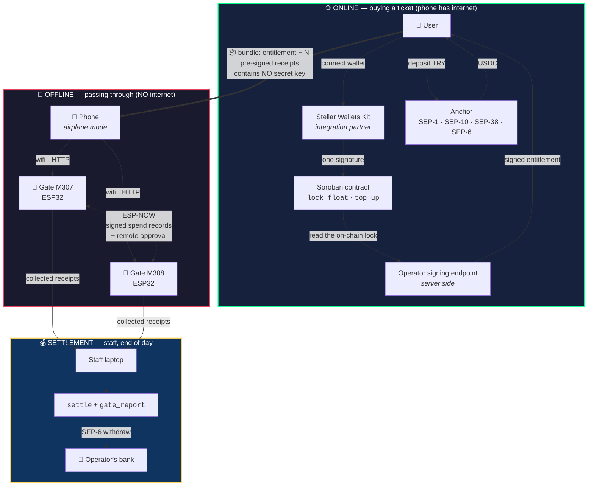

# OffGate

**Offline payment and access infrastructure · on Stellar**

`Rise In × Stellar Pro Hackathon 2026` · **Genesis Track**

[🇹🇷 Türkçe](README.md) · 🇬🇧 English

| | |
|---|---|
| **Live app** | https://offgate.vercel.app · English by default, TR in the top bar |
| **Contract (testnet)** | [`CAYBDH2A…NHWILA7AZH`](https://stellar.expert/explorer/testnet/contract/CAYBDH2AUVXOYJPRBE7MZ46ZOLW3O53PIDOKGWWOV4Z4PONHWILA7AZH) |
| **Hardware** | 2 × ESP32 — `M307` (Gate 1), `M308` (Gate 2) |
| **Network** | Stellar Testnet · no real money moves |

---

## The problem

A festival, a stadium, a metro station, a closed venue. Thousands of people
funnelling through one gate. And exactly then:

- The cellular network collapses — it is the first thing to die under load.
- The card terminal waits for online authorisation while the queue grows.
- Hardware costs hundreds of dollars per gate.

Every existing system shares one assumption: **the turnstile is online at the
moment of payment.** That assumption breaks under load, every time.

## The solution

OffGate removes the assumption. The turnstile **never connects to the
internet.** It holds no secret key. And yet it:

- proves **on its own** that the ticket was genuinely paid for,
- **prevents** the same receipt from being used twice,
- talks to its neighbour and can accept **another gate's ticket**,
- costs **one ESP32** (~5 USD) per gate.

The money side runs entirely on Stellar: the user deposits Turkish Lira,
receives USDC through an anchor, and locks it into a Soroban contract. The
operator settles the passes on chain and withdraws the revenue back to a bank
account in TRY.

**The loop is closed and has been run end to end on testnet:**
`500 TRY → 10.198 USDC → locked in contract → offline passes → receipts on chain → 596.99 TRY in the operator's bank account`

---

## Architecture



---

## The system rests on four keys

The shortest path to understanding it is this table:

| Key | Held by | What it does | Where it lives |
|---|---|---|---|
| **Wallet key** | The user | Locks money on chain — **once** | Freighter / Lobstr / Albedo |
| **Device key** | The user's browser | Signs pass receipts | `localStorage`, separate per wallet |
| **Operator key** | The server | Signs the entitlement | Vercel Secret · **never** reaches the browser |
| **Gate key** | Each ESP32 itself | Signs what it tells its neighbour | The ESP32's NVS |

**The turnstile contains no secret key.** Only the operator's *public* key is
embedded. Even if the device is opened and its flash is read, no forged ticket
can be produced.

---

## End-to-end flow

### 1 · Online — buying a ticket (one button)

The user picks how many passes they want. The amount follows by multiplication:
`4 × 100 TRY = 400 TRY`. Banknote logic — cash intuition, no fractions.

Behind that single button, in order:

| Step | What happens | Protocol |
|---|---|---|
| Gate chosen | The user picks **which** turnstile they will use | — |
| USDC trustline | Opened if missing | Horizon |
| Wallet authenticated | Proof of identity to the anchor | **SEP-10** |
| Rate locked | TRY/USDC rate fixed | **SEP-38** |
| Payment instruction | Bank reference code issued | **SEP-6** `deposit-exchange` |
| Bank transfer | The user wires the money | *(demo: `simulate-bank-transfer`)* |
| USDC received | The anchor pays out | Horizon |
| Locked on chain | Locked to the chosen gate | Soroban `lock_float` |
| Entitlement signed | The operator **reads the on-chain lock** and signs | Ed25519 |
| Receipts prepared | N receipts pre-signed | Ed25519 |

Output: a single base64 **bundle**. It contains the entitlement and N signed
receipts, and **no secret key whatsoever**.

### 2 · Offline — passing through

The user joins the gate's wifi (`OFFGATE-M307`, open). A captive portal opens
the payment page. The bundle is pasted once; every later pass is a single tap.

The gate verifies, in order — **all locally, no internet:**

1. Was the entitlement signed by the operator? *(against the embedded public key)*
2. Does the receipt belong to this entitlement? *(`ent_hash` match)*
3. Was the receipt signed by the user's device key?
4. Is the sequence number within the granted allowance?
5. **Has this receipt already been spent?** *(the ledger in NVS)*

If all pass: **the receipt is burned first, then the gate opens.** That order is
not incidental.

### 3 · Settlement — end of day

Staff pull the receipts from the gate and write them on chain with `settle`;
the revenue moves to the operator. `gate_report` writes the gate's own counter
on chain as well — the two numbers come from **independent sources**, so the
operator cannot quietly under-report one of them.

---

## How double spending is prevented

This is the heart of the system. Three layers:

**1 · Sequence numbers.** Every receipt carries `seq = 1..N` and the signature
covers `seq`. You cannot copy a receipt and change its number — the signature
fails.

**2 · The gate's local ledger.** Every accepted `(ent_hash, seq)` pair is
written to NVS. It survives power loss. A repeated receipt is rejected in
**3 ms**.

**3 · Ledger sharing between gates.** A receipt accepted at one gate becomes
known to the other — signed, over direct radio.

> **The key insight:** what stops double spending is not the signature but
> **who owns the ledger.** The signature proves the ticket is genuine; only the
> ledger knows whether it has been spent.

---

## Gate-to-gate communication — ESP-NOW

The two turnstiles talk to each other **directly**. No router, no internet, no
pairing.

### Every gate now has an identity

On first boot it generates its own Ed25519 keypair and writes it to NVS. It
signs everything it says with that key. This is the first time the turnstile
*signs* anything — before, it only verified.

### Two kinds of message

**Announcement (one-way)** — broadcast whenever a pass is accepted:

```
"OFFGATE-GOSSIP-v1"(17) ‖ gate(16) ‖ ent_hash(32) ‖ seq(4) ‖ counter(4) ‖ ts(8)  = 81 bytes
+ signature(64) + public key(32)                                                  = 177 bytes
```

*"I am M307, I spent this pass of this ticket."* The neighbour verifies it and
writes it into its own ledger.

**Question / approval (two-way)** — when a user arrives at **M308 holding an
M307 ticket**:

```
domain(14) ‖ from(16) ‖ to(16) ‖ ent_hash(32) ‖ seq(4) ‖ nonce(8) ‖ verdict(1)  = 91 bytes
+ signature(64) + public key(32)                                                 = 187 bytes
```

M308 can verify the ticket **entirely on its own** — operator signature, device
signature, sequence bounds, all of it. The one thing it cannot know is: *has
this receipt been spent?* That ledger lives at M307. So it asks:

1. M308 → M307: *"would you burn this receipt for me?"* **(signed)**
2. M307 checks its ledger. If free, it **burns it first, then** returns a signed approval.
3. M308 verifies the approval: is the signature M307's · is the nonce the one I sent · do the receipt and sequence match.
4. If everything holds, the gate opens.

### Why that order

**Burn first, approve second** is the only correct order. The reverse would let
the user run to M307 with the same receipt while the approval is still in
flight, passing two gates on one receipt.

It has a cost: if the reply is lost, the receipt is burned but no pass was
granted — the user loses one pass. One of the two has to be chosen, and
**double spending is the more expensive failure.**

### Silence is refusal

If M307 does not answer, M308 does not open. If M307 has never been heard, M308
refuses up front (`home_gate_unheard`). **When the network breaks, the system
closes rather than opens.**

### The security asymmetry

| Message | Worst outcome | Trust model |
|---|---|---|
| Announcement | One extra **refusal** | Trust on first use is enough |
| Question | One pass is **consumed** | Only from an already-known neighbour |

An announcement can never grant anyone a pass, so it can be loose. A question
burns a receipt, so it must be strict.

### Measured performance — real hardware, real signatures

| Step | Time |
|---|---|
| Ed25519 verification (one) | **98 ms** |
| Cross-gate approval round trip | **327 ms** |
| Pass at its own gate (end to end) | **165–263 ms** |
| Pass at another gate (end to end) | **495–711 ms** |

### Verified scenario matrix

A genuine 3-pass ticket issued for M307, run against two physical ESP32s:

| # | Scenario | Expected | Result |
|---|---|---|---|
| 1 | Receipt #1 → **M308** (foreign gate) | M307 approves, gate opens | ✅ `remote:true` · 332 ms approval |
| 2 | Receipt #1 → **M307** (its own gate) | Must already be burned | ✅ `already_spent` |
| 3 | Receipt #2 → **M307** | Normal pass | ✅ 165 ms |
| 4 | Receipt #2 → **M308** | Must know it from the announcement | ✅ `already_spent` · 3 ms |
| 5 | Receipt #3 → **M308** | Remote approval, accepted | ✅ 495 ms |
| 6 | Receipt #3 → **M308** again | Local ledger stops it | ✅ `already_spent` · 3 ms |

**Row 2 is the critical one.** The same receipt was refused at its own gate,
which proves M307 really burned it before approving. Double spending is closed.

---

## Change, and the reward for carrying data

When you pass through a turnstile, the gate hands you a **signed collection
voucher**: *"I am M308, I charged 80 TRY against this receipt."* That single
signature solves three problems at once.

### 1 · Change

The ticket's ceiling is in the **user's** signature; the amount actually
charged is in the **gate's**. Use a 100 TRY allowance at an 80 TRY gate and
the remaining 20 TRY stays in your balance.

The two signatures pin each other down:

| What the gate cannot do | Why |
|---|---|
| Overcharge | The ceiling is in the user's signature; the contract refuses |
| Under-report | The operator receives the money — it is against the gate's interest |

This turns the system from a turnstile into **closed-venue spending**: each
gate can set its own price.

### 2 · Paying whoever carries the data

`settle` now needs **no authorisation.** Each document verifies itself, so it
does not matter who carries it. Whoever does gets back **80% of the 5%
service fee**.

Settlement is therefore performed by **users**, not the operator — out of
self-interest, for free. The gate's data reaches the chain on its own.

**Why Stellar:** claiming the reward requires a transaction, and that
transaction costs **$0.00001**. On Ethereum the gas would exceed the reward
and the mechanism would be pointless. The reward is also funded by **fees,
not inflation**: no token, no dilution, self-funding.

### 3 · Safe refunds — and the end of cancellation

`refund` used to return the entire balance. A user could walk through the
gate and take a refund before the receipts reached the chain, making **those
passes free.**

Now outstanding signed passes are reserved. What keeps this fair to the user
is the reward itself: carrying their own receipt dissolves the reservation
and releases the money **in the same transaction**.

> **The way to get a refund is to carry the data.** Cancellation ceases to
> exist as a separate operation.

### The economics

The real marginal cost of running the system is the **anchor spread, ~1%**
(measured: `price` 48.785 vs `total_price` 49.029). Chain fees come to **under
$5 for a thousand users**.

| | Fee | Rebate | Net if you carry | Net if you don't |
|---|---|---|---|---|
| OffGate | 5% | 80% | **1%** | 5% |
| Card terminal (TR) | 1.5–2.5% | — | — | — |
| Festival cashless | 2–4% + wristband | — | — | — |

For a carrier the net cost equals the anchor spread exactly: **carry the data
and the system is free**. The margin comes from those who do not — the same
people who leave the operator to do the settling.

### Verified on chain — real hardware, real money

A ticket issued for M307, used at the 80 TRY gate M308
([transaction](https://stellar.expert/explorer/testnet/tx/44a7e31c76e19dc9b0ee06864c7e9919f5ceffe7150bd4131a6a4e89a588aaa6)):

| | Result |
|---|---|
| To the operator | **1.6398456 USDC** — 80 TRY, not 100 |
| Rebate to the user | **+0.0655938 USDC** |
| Change left in balance | **0.4099615 USDC** = 20 TRY |
| **Refundable amount** | **0 → 0.4468581 USDC** |

That last row is the heart of it: before carrying the data the user could
withdraw nothing; carrying it released the lock.

---

---

## A fallback profile for anchor outages

The hackathon anchor (`tr-mock-anchor.fly.dev`) stopped paying out twice. We
measured it: **every SEP endpoint returns 200**, the order opens, the amount is
computed, the anchor itself says *"TRY received; paying USDC on Stellar"* — and
the USDC never arrives. 85 polls, 5.5 minutes, stuck at `pending_anchor`.

The protocol layer is healthy; the **payout worker is dead**. Nothing our code
touches, but it stops the demo completely.

### Two profiles

| | Anchor | Asset | Contract |
|---|---|---|---|
| **`live`** *(default)* | Real anchor, SEP-1/10/38/6 | USDC | `CAYBDH2A…` |
| `local` | None — our own issuer | `TUSDC` | `CB6AUNVO…` |

The **Anchor / Fallback** switch in the top bar moves between them.

**Not one line of the live anchor path changed.** The fallback uses a separate
contract and a separate asset; unless it is switched on, none of its code runs.
The integration claim applies to the `live` profile only.

### Honesty

The fallback is **not an anchor impersonation** and is not presented as one: the
top bar lights up "Fallback" and the flow steps read *"skipped in fallback
mode"*. Its only purpose is to show that the chain, the gates, the change logic
and the data-carrying reward still work while the anchor is down.

In both profiles the signature is verified against the on-chain lock (K-9) —
nothing was loosened in the fallback. The gate firmware does not change at all;
a gate never knows which contract is behind it, it only checks the operator
signature.

## Required declarations

### Integration partner — Stellar Wallets Kit

[`@creit.tech/stellar-wallets-kit`](https://github.com/Creit-Tech/Stellar-Wallets-Kit) ·
in one file, inside the product's core flow:

**File:** [`web/src/lib/signer.ts`](web/src/lib/signer.ts)

| Line | Call | What it does |
|---|---|---|
| 14–19 | `import { StellarWalletsKit }` + Freighter / Albedo / Lobstr / Rabet / Hana modules | Five wallets behind one interface |
| 38 | `StellarWalletsKit.init({...})` | Network and module setup |
| 53 | `StellarWalletsKit.authModal()` | The user picks their wallet |
| 59 | `StellarWalletsKit.signTransaction(xdr, {...})` | Signs the `lock_float` / `top_up` transaction |

**Core, not an add-on:** that signature is the only way a user can lock money on
chain. Without Wallets Kit the flow stops at step one.

### Stellar Skill files used — by path

| File | Source | Where it was used |
|---|---|---|
| `SKILL.md` | [`yigitcangokmen/stellar-hackathon-turkiye`](https://github.com/yigitcangokmen/stellar-hackathon-turkiye/blob/main/SKILL.md) | Mock anchor integration: SEP-1 discovery, SEP-10 session, SEP-38 rate lock, SEP-6 `deposit-exchange` and `withdraw` endpoints, `simulate-bank-transfer`. Implemented in [`web/src/lib/anchor.ts`](web/src/lib/anchor.ts), [`scripts/01-anchor-flow.mjs`](scripts/01-anchor-flow.mjs), [`scripts/03-withdraw.mjs`](scripts/03-withdraw.mjs) |

### Deployed artifacts

| Field | Value |
|---|---|
| **Contract ID** | [`CAYBDH2AUVXOYJPRBE7MZ46ZOLW3O53PIDOKGWWOV4Z4PONHWILA7AZH`](https://stellar.expert/explorer/testnet/contract/CAYBDH2AUVXOYJPRBE7MZ46ZOLW3O53PIDOKGWWOV4Z4PONHWILA7AZH) |
| **Frontend** | https://offgate.vercel.app |
| Event · gates | `FEST26` · `M307`, `M308` |
| admin | [`GDE7PTP7…EGLG7HJ`](https://stellar.expert/explorer/testnet/account/GDE7PTP774PCYBE5N6QCPG4QKGYCCSOUWUPDISBBKPKI3CDIUEGLG7HJ) |
| operator | [`GDICV4EQ…23YJGITG4`](https://stellar.expert/explorer/testnet/account/GDICV4EQQZENJLJT4G6P7D3GMDC3CTMVFH3VH3X5WSXLR3723YJGITG4) |
| USDC (classic) | `USDC:GBBD47IF6LWK7P7MDEVSCWR7DPUWV3NY3DTQEVFL4NAT4AQH3ZLLFLA5` |
| USDC (SAC) | `CBIELTK6YBZJU5UP2WWQEUCYKLPU6AUNZ2BQ4WWFEIE3USCIHMXQDAMA` |
| Anchor | `tr-mock-anchor.fly.dev` |
| Operator public key *(embedded in the ESP32, not secret)* | `d02af0908648d4ad33e1bcff8f6660c5b14d9529f753eefdb4aeb8effade1264` |

**Transaction hashes** (all testnet):

| Operation | Hash |
|---|---|
| Contract deploy | [`c4b51658…395b51`](https://stellar.expert/explorer/testnet/tx/c4b5165818731dfddd387bfcf8004b1581792549f0c6abd478434a5816395b51) |
| SEP-6 deposit payout | [`1f0b02e9…3cec19`](https://stellar.expert/explorer/testnet/tx/1f0b02e9bcb876874bd016358eef6b15ad4f67ff9a9294d62e38525ed83cec19) |
| `lock_float` | [`360e2752…28c5e1`](https://stellar.expert/explorer/testnet/tx/360e2752e000a634d6d11b23928c642bf5b00fb85bd0073edcbc77d87628c5e1) |
| `settle` | [`b895867a…3e46855`](https://stellar.expert/explorer/testnet/tx/b895867afacc364b9adf25ffc0744ef1d152bf4e27cb87ce4f495efd93e46855) |
| `gate_report` | [`0cb88626…61a7c007`](https://stellar.expert/explorer/testnet/tx/0cb88626f200784309d14a1d1e61d95e85c1927933a48847ec0d07f961a7c007) |
| SEP-6 withdraw payment | [`4e4accc0…4453593`](https://stellar.expert/explorer/testnet/tx/4e4accc0fec4864438a53806cd3d7a3befdd5e05f41aff3a96a05c0c04453593) |
| Trustline (user) | [`868be52e…a87900`](https://stellar.expert/explorer/testnet/tx/868be52eb7246184e6000e6b0b1ca11bc1a3357be05591ee92f16de3c9a87900) |
| Trustline (operator) | [`5fa149dd…be36b3`](https://stellar.expert/explorer/testnet/tx/5fa149ddcc31454269552882713954763c2efa77010132915964ab1e8ebe36b3) |

Full list with the output of every step: [`docs/DEPLOYMENTS.md`](docs/DEPLOYMENTS.md)

---

## Design decisions

Nine structural problems that had to be solved during the hackathon. Each one
was the kind that kills a demo at three in the morning.

### K-1 · Freighter cannot sign offline → device key delegation

The Freighter extension will not sign raw bytes on a phone in airplane mode.
The flow would die at the gate.

**Decision:** the browser generates its own Ed25519 **device key**, and
`lock_float` writes it on chain. Receipts are signed by the device key. The
wallet is used **exactly once**, to lock the money. The wallet's main key never
touches the offline side of the phone.

### K-2 · `localStorage` is origin-bound → the pre-signed receipt book

The app runs on `https://offgate.vercel.app`; the gate page on
`http://192.168.4.1`. **Different origins.** The gate page cannot read an
entitlement stored by Vercel.

**Decision:** while still online, the user pre-signs **all** `N` receipts. The
entitlement plus N receipts go into a single base64 bundle. The browser does no
cryptography at the gate. **Traveller's cheque logic.**

### K-3 · The demo figures fell below the withdrawal limit

A 50 TRY deposit with a 5 TRY fare gives 3 passes = 0.31 USDC. The anchor's
`min_offramp_usdc` is 1.0 USDC — the withdrawal step would never work.

**Decision:** a 100 TRY fare, banknote logic. 3 passes = 300 TRY ≈ 6.18 USDC.
Both directions stay above the limits.

### K-4 · Canonical messages — fixed bytes, not JSON

**Four platforms** must produce the same bytes: Soroban (Rust), Node, the
browser (TypeScript) and the ESP32 (C++). JSON guarantees neither field order
nor whitespace.

**Decision:** fixed-length canonical messages.

| Message | Length | Layout |
|---|---|---|
| Entitlement | 138 bytes | `"OFFGATE-ENT-v1"(14) ‖ user(32) ‖ device_pk(32) ‖ event(16) ‖ gate(16) ‖ fare(8) ‖ rate(8) ‖ max_uses(4) ‖ expires(8)` |
| Receipt | 67 bytes | `"OFFGATE-RCPT-v1"(15) ‖ ent_hash(32) ‖ seq(4) ‖ fare(8) ‖ ts(8)` |
| Announcement | 81 bytes | *(above)* |
| Question/approval | 91 bytes | *(above)* |

Test vector: [`docs/test-vector.md`](docs/test-vector.md). Enforced on the Rust
side by `canonical_message_matches_javascript_vector` and on the ESP32 by a
**self-test that runs at boot**.

### K-5 · Gate assignment on chain

Load balancing and the binding of double-spend protection to a single gate must
be auditable. The contract refuses to lock to a gate whose load exceeds the
least-loaded gate by more than `GATE_LOAD_TOLERANCE = 2`. The UI **shows this
rule in advance** — a saturated gate is disabled and labelled "currently full",
so the user never sends a request that would be rejected.

### K-6 · Vite + React, not Next.js

No SSR or polyfill risk, three-second builds.

### K-7 · No camera, no QR

Browsers will not open the camera on an insecure origin
(`http://192.168.4.1`). This is a browser restriction, not an architectural
limit — see K-8.

### K-8 · The transport layer is replaceable

> Receipt verification operates on a **fixed 67-byte** canonical message defined
> independently of transport. The gate firmware does not know where the bytes
> came from; today they arrive over local wifi as an HTTP POST, and the same
> bytes could be carried by a QR code, a BLE characteristic or NFC without any
> change. Verification, the `seq` check and the `settle` path stay identical.

This claim is not rhetorical: the same `process_pay` function is invoked from
**both HTTP and the serial port**. The test path cannot diverge from the field
path.

### K-9 · The pass allowance cannot come from the client

**The hole found:** in the original ordering, the operator signed whatever
`max_uses` the client sent, without question. The gate never sees the balance —
it only checks the signature. A user sending `max_uses: 999` from the browser
would have received **999 passes.**

**The fix:** the order was reversed. `lock_float` first (on chain), then the
signature. The operator **rebuilds the entitlement from the on-chain lock** and
refuses to sign at all (HTTP 409) if the digest it produces does not match the
on-chain `ent_hash` exactly.

Verified in production:
```
POST /api/sign-entitlement  {"user":"GCWN…","expires":…,"maxUses":999}
→ {"max_uses": 6}          ← the client's number was ignored
```

---

## Security model — the honest list

### Protected

| Attack | How it is stopped |
|---|---|
| Forging a ticket | Operator signature; the secret key lives on the server, never on the ESP32 |
| Replaying a copied receipt | The gate's NVS ledger — refused in 3 ms |
| Using one receipt at two gates | Signed cross-gate question/approval; **burn first, approve second** |
| Inflating the pass allowance | K-9 — the operator verifies against the chain |
| Tampering with the fare | `fare_try` is inside the signed message |
| Changing the sequence number | `seq` is inside the signed message |
| Using another gate's ticket | The ticket is bound to a `gate`; a foreign gate must ask permission |
| The operator under-reporting revenue | `gate_report` carries the gate's **own** signature; the operator cannot write the number |
| Passing through and then clawing the money back | Outstanding signed passes are reserved during `refund` |
| A gate overcharging | The ceiling lives in the user's signature |
| Replaying an old declaration | The counter only moves forward |
| Opening the device to steal keys | There is no secret key on the ESP32 — only the operator's *public* key |
| A forged neighbouring gate | Questions are accepted only from known neighbours, Ed25519-signed, with a nonce |

### Not protected — known limits

**The bundle is a bearer instrument.** Whoever copies it copies the passes.
Replay is blocked, but *who* is using it cannot be verified. The cause is
architectural: the device key lives on the `offgate.vercel.app` origin and the
gate page on `192.168.4.1` — the browser forbids crossing between them. A PIN
was considered and rejected: at roughly 30 bits of entropy it is breakable
offline. **Fix:** a native mobile app (which, per K-8, needs no firmware
change).

**A neighbouring gate can verify a ticket's validity but not whether it has
been spent.** If the network partitions, the gate fails closed (it refuses),
so what is lost is availability, not safety. **Fix:** connect gates to more
than one neighbour; the protocol is ready for four.

**The turnstile cannot enforce `expires`.** It has no clock. Expiry is
currently checked only at the signing endpoint (48-hour ceiling). **Fix:** an
RTC module, or time synchronisation from the staff phone.

**A neighbour's key is pinned on first hearing** (trust on first use). Adequate
for a closed demo network. **Fix:** register gate public keys on chain through
`register_gate` and distribute them from there.

**The receipt ledger lives in NVS, and NVS is 20 KB.** Once it is full,
receipts cannot be stored. This used to happen **silently** — the gate would
open and that pass's money could never be written on chain. Now: if it cannot
be written, **the pass is not granted** (`ledger_full`), and the loss is
visible as the `lost` field on `/health`.

---

## Test evidence

### Contract — 46/46 passing

```sh
cargo test -p offgate
```

With real Ed25519 signatures (`ed25519-dalek`, dev-dependency only). Highlights:

| Test | What it proves |
|---|---|
| `lock_float_requires_user_auth` | An unsigned call panics |
| `lock_without_gates_fails_and_moves_no_money` | A failed assignment moves no money |
| `settle_is_idempotent_for_repeated_batches` | Re-submission is harmless |
| `settle_rejects_replayed_sequence_number` | Replay is blocked |
| `settle_rejects_forged_signature` | A forged signature stops the batch |
| `settle_rejects_tampered_amount` | Fare tampering fails the signature |
| `settle_skips_receipts_from_another_gate` | Receipts are bound to one gate |
| `settle_releases_gate_slot_when_ticket_is_used_up` | An exhausted ticket frees its gate slot |
| `top_up_never_grants_more_passes_than_the_money_covers` | Top-ups cannot inflate the allowance |
| `refund_keeps_spent_receipts_unusable_after_relock` | Old receipts stay dead after a refund |
| `stats_reveal_underreporting_gate` | Under-reporting is visible in the audit |
| `canonical_message_matches_javascript_vector` | Rust and JS agree byte for byte |
| `gate_belongs_to_exactly_one_event` | Gate counters are unambiguous |

### Hardware — self-test at boot

Every ESP32 checks its canonical format against the test vector on boot:

```
OffGate — canonical format self-test
  ✓ receipt canonical bytes (67) correct
  ✓ Ed25519 verification passed (98 ms)
  ✓ corrupted signature rejected
  ✓ entitlement canonical bytes (138) correct
  ✓ SHA-256 ent_hash correct
OffGate gate ready
  gate     : M307
  internet : NONE — verification is entirely local
  self-test: PASSED
  identity : e93599c7ca65ed301bea1872a41c869d8e01add6c53eae3e6609cf6d6dd0ea33
  neighbours: on (ESP-NOW, channel 1)
```

If this test fails, the gate is **not speaking the same language** as the
contract and the web app, and the reason is visible immediately.

| Measurement | Value |
|---|---|
| RAM | 15.1% (49 KB / 320 KB) |
| Flash | 63.8% (836 KB / 1.3 MB) |
| Hardware cost | ~5 USD per gate |

---

## Setup — from scratch

### Requirements

- Rust 1.84+ · `rustup target add wasm32v1-none`
- [Stellar CLI](https://developers.stellar.org/docs/build/smart-contracts/getting-started/setup)
- Node 20+
- PlatformIO *(only for the hardware)*

### 1 · Contract

```sh
git clone https://github.com/hyrlhc/offgate && cd offgate
cp .env.example .env          # then fill in your own keys

cargo test -p offgate         # 46 tests
stellar contract build        # -> target/wasm32v1-none/release/offgate.wasm
```

To deploy your own:

```sh
node scripts/00-setup-accounts.mjs    # create admin/operator/user + Friendbot + trustlines
stellar contract deploy --wasm target/wasm32v1-none/release/offgate.wasm \
  --source-account admin --network testnet
# Put the resulting ID in the contractId field of web/shared/deployment.js — that is the ONLY place.
```

### 2 · Web app

```sh
cd web && npm install
npm run dev                   # reads OPERATOR_SECRET from the root .env
```

> **`OPERATOR_SECRET` must never carry the `VITE_` prefix.** Every `VITE_`
> variable is shipped to the browser. The operator's secret key belongs on the
> server only (Vercel Secret / root `.env`).

### 3 · Gate hardware

```sh
cd firmware/offgate-gate
pio run -e gate1 -t upload    # Gate 1 -> M307
pio run -e gate2 -t upload    # Gate 2 -> M308
pio device monitor            # self-test + identity + neighbour status
```

The operator public key embedded in the firmware lives in
[`src/main.cpp`](firmware/offgate-gate/src/main.cpp) and **must match**
`OPERATOR_PK_HEX` in `.env`.

### 4 · Operator tasks

```sh
node scripts/status.mjs                           # anchor + chain + audit dashboard
node scripts/02-settle.mjs --from receipts.json   # write receipts on chain
node scripts/03-withdraw.mjs                      # withdraw revenue as TRY
```

### Gate console

The gate can also be driven over the serial port — the **same** `process_pay`
function, the same cryptography:

```
PAY {json}   processes a payment bundle (identical to HTTP /pay)
PEERS        identity and known neighbours
RESET        clears the counter and the spent-receipt ledger
```

---

## Repository layout

```
contracts/offgate/src/lib.rs   Soroban contract — lock_float, top_up, settle, refund, audit
contracts/offgate/src/test.rs  46 host tests with real Ed25519 signatures

web/shared/deployment.js       The SINGLE source of deployment constants
web/src/lib/signer.ts          Stellar Wallets Kit — integration partner
web/src/lib/anchor.ts          SEP-1 / SEP-10 / SEP-38 / SEP-6
web/src/lib/contract.ts        Soroban calls
web/src/lib/receipts.ts        Canonical format + receipt book + device key
web/src/lib/flow.ts            The chain behind the single button
web/src/TopUpFlow.tsx          Banknote UI + gate picker
web/src/Audit.tsx              Audit screen — declared vs on-chain
web/api/sign-entitlement.js    Operator signing endpoint (server side, K-9)

firmware/offgate-gate/src/offgate.h   Canonical format + Ed25519 verification
firmware/offgate-gate/src/mesh.h      ESP-NOW — announcements + question/approval
firmware/offgate-gate/src/main.cpp    Gate logic, ledger, captive portal
firmware/offgate-gate/src/selftest.h  Format proof that runs at boot

scripts/                       Operator and setup tasks (Node)
docs/                          Architecture, flow walkthrough, artifacts, test vector
```

---

## Documentation

| File | Contents |
|---|---|
| [`docs/BASIT-AKIS.md`](docs/BASIT-AKIS.md) | **Plain end-to-end walkthrough of the system (Turkish) — start here** |
| [`docs/OFFGATE-BUILD-PLAN.md`](docs/OFFGATE-BUILD-PLAN.md) | Architecture, glossary, anchor reference |
| [`docs/OFFGATE-PACKAGES.md`](docs/OFFGATE-PACKAGES.md) | Package-by-package build plan and decision records |
| [`docs/DEPLOYMENTS.md`](docs/DEPLOYMENTS.md) | Contract ID, accounts, transaction hash for every step |
| [`docs/test-vector.md`](docs/test-vector.md) | Canonical signature format, cross-platform test vector |

---

## Roadmap

**Near term**
- Native mobile app — removes the bearer-instrument problem and opens BLE/NFC transport (K-8)
- Tighten `refund` — subtract outstanding signed passes from the refundable amount
- Write gate public keys on chain via `register_gate` — removes trust on first use
- Add an RTC to the turnstile — makes `expires` enforceable at the gate

**Medium term**
- Users carrying gate data to the chain and earning rewards — the gates already produce signed reports
- Integration with a production anchor (replacing the mock)
- Multi-gate mesh — two gates today, the protocol is ready for four neighbours

**Next step:** an application to the Stellar Community Fund (SCF). The
real-world case is concrete: festival and stadium operators in Türkiye cannot
move to turnstile payments because of per-gate hardware cost and network
dependency.

---

## Honest notes

- **Testnet.** No real money moves.
- **`simulate-bank-transfer` exists only on the mock anchor.** In production the
  user writes the reference code in the wire transfer description and the anchor
  matches the payment to a Stellar account. The rest of the flow — SEP-1
  discovery, the SEP-10 session, the SEP-38 rate lock, SEP-6
  `deposit-exchange` and `withdraw` — is **standard and real**; switching
  anchors changes only the home domain.
- **No endpoint is hardcoded.** Everything is discovered through SEP-1
  (`/.well-known/stellar.toml`).
- **There is no mock data.** Every measurement, hash and screen output here was
  taken from the running system.
