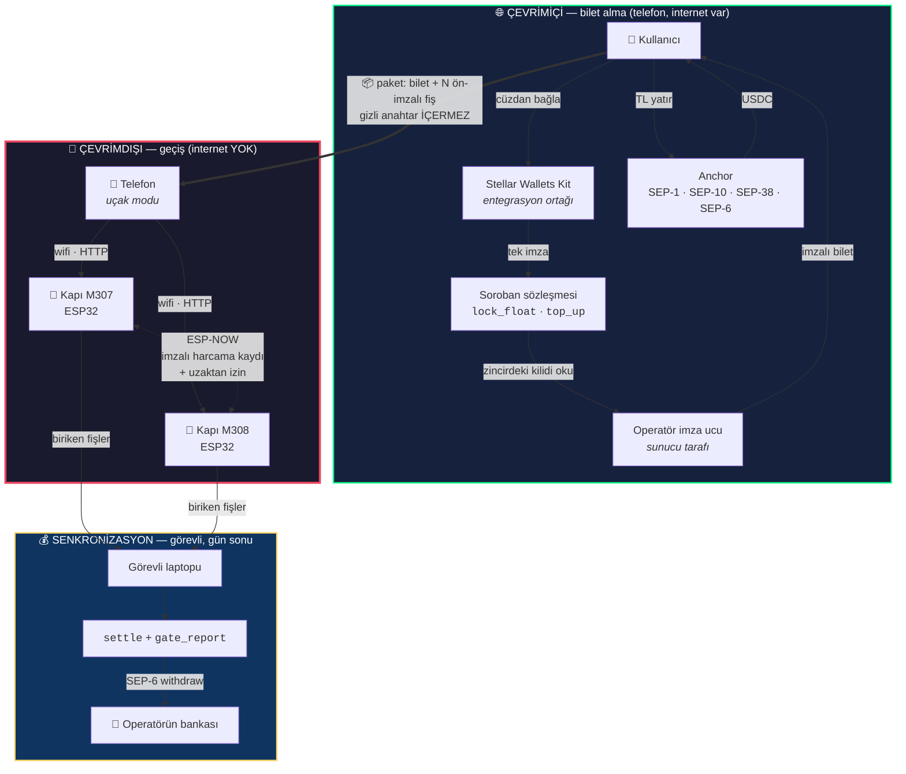

# OffGate

**İnternetsiz geçiş ve ödeme altyapısı · Stellar üzerinde**

`Rise In × Stellar Pro Hackathon 2026` · **Genesis Track**

🇹🇷 Türkçe · [🇬🇧 English](README.en.md)

| | |
|---|---|
| **Canlı uygulama** | https://offgate.vercel.app |
| **Sözleşme (testnet)** | [`CAYBDH2A…NHWILA7AZH`](https://stellar.expert/explorer/testnet/contract/CAYBDH2AUVXOYJPRBE7MZ46ZOLW3O53PIDOKGWWOV4Z4PONHWILA7AZH) |
| **Donanım** | 2 × ESP32 — `M307` (Kapı 1), `M308` (Kapı 2) |
| **Ağ** | Stellar Testnet · gerçek para hareketi yoktur |

---

## Problem

Festival, stadyum, metro, kapalı etkinlik alanı. Binlerce kişi, tek bir
kapıdan geçmeye çalışıyor. Ve tam o anda:

- Hücresel ağ çöküyor — yoğunlukta ilk ölen şey budur.
- POS cihazı çevrimiçi onay bekliyor, kuyruk büyüyor.
- Kapı başına maliyet yüzlerce dolar.

Mevcut sistemlerin ortak varsayımı şu: **turnike ödeme anında internete
bağlıdır.** Bu varsayım yoğunlukta her seferinde kırılıyor.

## Çözüm

OffGate bu varsayımı kaldırıyor. Turnike **internete hiç bağlanmıyor.**
İçinde hiçbir gizli anahtar yok. Yine de:

- Biletin gerçekten ödenmiş olduğunu **kendi başına** kanıtlıyor,
- Aynı fişin ikinci kez kullanılmasını **engelliyor**,
- Yan kapıyla konuşup **başka kapının biletini** kabul edebiliyor,
- Kapı başına maliyeti **bir ESP32** (~5 USD).

Para tarafı tamamen Stellar üzerinde: kullanıcı TL yatırır, anchor üzerinden
USDC alır, Soroban sözleşmesine kilitler. Organizatör geçişleri zincire yazıp
hasılatı TL olarak bankasına çeker.

**Tam döngü kapalıdır ve testnet'te uçtan uca çalıştırılmıştır:**
`500 TRY → 10.198 USDC → sözleşmede kilitli → internetsiz geçişler → fişler zincire → 596.99 TRY operatörün banka hesabında`

---

## Mimari



---

## Sistem dört anahtar üzerine kurulu

Her şeyi anlamanın en kısa yolu bu tabloyu okumak:

| Anahtar | Kimde | Ne yapar | Nerede saklanır |
|---|---|---|---|
| **Cüzdan anahtarı** | Kullanıcı | Parayı zincire kilitler — **bir kez** | Freighter / Lobstr / Albedo |
| **Cihaz anahtarı** | Kullanıcının tarayıcısı | Geçiş fişlerini imzalar | `localStorage`, cüzdan başına ayrı |
| **Operatör anahtarı** | Sunucu | Bileti imzalar | Vercel Secret · tarayıcıya **hiç inmez** |
| **Kapı anahtarı** | Her ESP32'nin kendisi | Komşuya söylediğini imzalar | ESP32'nin NVS'i |

**Turnikenin içinde hiçbir gizli anahtar yoktur.** Yalnızca operatörün *açık*
anahtarı gömülüdür. Cihaz sökülüp flash'ı okunsa bile sahte bilet üretilemez.

---

## Uçtan uca akış

### 1 · Çevrimiçi — bilet alma (tek düğme)

Kullanıcı kaç geçiş istediğini seçer. Tutar çarpımla çıkar: `4 × 100 TL = 400 TL`.
Banknot mantığı — nakit sezgisi, kesir yok.

Arkasında sırayla:

| Adım | Ne oluyor | Protokol |
|---|---|---|
| Kapı seçildi | Kullanıcı hangi turnikeden gireceğini **kendisi** seçer | — |
| USDC güven hattı | Yoksa açılır | Horizon |
| Cüzdan doğrulandı | Anchor'a kimlik kanıtı | **SEP-10** |
| Kur kilitlendi | TL/USDC kuru sabitlenir | **SEP-38** |
| Ödeme talimatı | Banka referans kodu alınır | **SEP-6** `deposit-exchange` |
| Banka transferi | Kullanıcı EFT yapar | *(demoda `simulate-bank-transfer`)* |
| USDC hesaba geçti | Anchor ödemeyi yapar | Horizon |
| Zincire kilitlendi | Seçilen kapıya kilit | Soroban `lock_float` |
| Bilet imzalandı | Operatör **zincirdeki kilidi okuyup** imzalar | Ed25519 |
| Fişler hazırlandı | N adet fiş önceden imzalanır | Ed25519 |

Çıktı: tek bir base64 **paket**. İçinde bilet + N adet imzalı fiş var,
**hiçbir gizli anahtar yok**.

### 2 · Çevrimdışı — geçiş

Kullanıcı kapının wifi'sine bağlanır (`OFFGATE-M307`, şifresiz). Captive
portal ödeme sayfasını açar. Paket bir kez yapıştırılır, sonraki geçişler tek tuş.

Kapı sırayla şunları doğrular — **hepsi yerel, internet yok:**

1. Bilet operatör tarafından mı imzalanmış? *(gömülü açık anahtarla)*
2. Fiş bu bilete mi ait? *(`ent_hash` eşleşmesi)*
3. Fişi kullanıcının cihaz anahtarı mı imzalamış?
4. Sıra numarası hak sınırında mı?
5. **Bu fiş daha önce harcanmış mı?** *(NVS'teki defter)*

Hepsi geçerse: **önce fiş yakılır, sonra kapı açılır.** Bu sıra tesadüf değil.

### 3 · Senkronizasyon — gün sonu

Görevli kapıdan fişleri çeker, `settle` ile zincire yazar, hasılat operatöre
geçer. `gate_report` ile kapının kendi sayacı da zincire yazılır — iki sayı
**bağımsız kaynaklardan** gelir, operatör yalnızca birini eksiltemez.

---

## Çifte harcama nasıl engelleniyor

Bu sistemin kalbi. Üç katman var:

**1 · Sıra numarası.** Her fiş `seq = 1..N` taşır ve imza `seq`'i kapsar.
Fişi kopyalayıp `seq`'i değiştiremezsin — imza düşer.

**2 · Kapının yerel defteri.** Kabul edilen her `(ent_hash, seq)` çifti NVS'e
yazılır. Elektrik kesilse bile kalır. Aynı fiş ikinci kez gelirse **3 ms**
içinde reddedilir.

**3 · Kapılar arası defter paylaşımı.** Bir kapının kabul ettiği fişi diğer
kapı da öğrenir — imzalı, doğrudan radyo üzerinden.

> **Kritik nokta:** Çifte harcamayı durduran şey imza değil, **deftere kimin
> sahip olduğu.** İmza biletin gerçek olduğunu kanıtlar; harcanmış olup
> olmadığını yalnızca defter bilir.

---

## Kapılar arası iletişim — ESP-NOW

İki turnike birbirine **doğrudan** konuşur. Router yok, internet yok, eşleşme yok.

### Her kapının kendi kimliği var

İlk açılışta Ed25519 anahtar çiftini üretir, NVS'e yazar. Söylediği her şeyi
bu anahtarla imzalar. Turnikenin ilk kez bir şey *imzalaması* — önceden
yalnızca doğruluyordu.

### İki tür mesaj

**Duyuru (tek yönlü)** — bir geçiş kabul edilince yayılır:

```
"OFFGATE-GOSSIP-v1"(17) ‖ kapı(16) ‖ ent_hash(32) ‖ seq(4) ‖ sayaç(4) ‖ ts(8)  = 81 bayt
+ imza(64) + açık anahtar(32)                                                   = 177 bayt
```

*"Ben M307'yim, şu biletin şu geçişini harcadım."* Komşu doğrular, defterine yazar.

**Soru / onay (çift yönlü)** — kullanıcı **M307 biletiyle M308'e gelirse**:

```
domain(14) ‖ soran(16) ‖ sorulan(16) ‖ ent_hash(32) ‖ seq(4) ‖ nonce(8) ‖ karar(1)  = 91 bayt
+ imza(64) + açık anahtar(32)                                                        = 187 bayt
```

M308 bileti **kendi başına** doğrulayabilir — operatör imzası, cihaz imzası,
sıra sınırı hepsi elinde. Doğrulayamadığı tek şey: *bu fiş harcandı mı?*
Çünkü o defter M307'de. Bu yüzden sorar:

1. M308 → M307: *"şu fişi benim için yakar mısın?"* **(imzalı)**
2. M307 defterine bakar. Boşsa **önce yakar, sonra** imzalı onay döner.
3. M308 onayı doğrular: imza M307'nin mi · nonce benim sorduğum mu · fiş ve sıra tutuyor mu.
4. Hepsi tamamsa kapı açılır.

### Neden bu sıra

**Önce yak, sonra onayla** tek doğru sıradır. Tersi olsaydı onay yoldayken
kullanıcı aynı fişle M307'ye koşabilir, iki kapıdan tek fişle geçerdi.

Bedeli var: cevap kaybolursa fiş yanmış ama geçiş olmamış olur — kullanıcı bir
hak kaybeder. İkisinden birini seçmek zorundayız ve **çifte harcama daha
pahalıdır.**

### Sessizlik reddir

M307 cevap vermezse M308 geçirmez. M307 hiç duyulmuyorsa baştan reddeder
(`home_gate_unheard`). **Ağ koptuğunda sistem kapanır, açılmaz.**

### Güvenlik asimetrisi

| Mesaj | En kötü sonucu | Güven modeli |
|---|---|---|
| Duyuru | Fazladan bir **ret** | İlk duyuşta güven yeterli |
| Soru | Bir hak **eksilir** | Yalnızca önceden tanınan komşudan |

Duyuru kimseye geçiş kazandıramaz, o yüzden gevşek. Soru fiş yakar, o yüzden sıkı.

### Ölçülen performans — gerçek donanım, gerçek imzalar

| Adım | Süre |
|---|---|
| Ed25519 doğrulama (tek) | **98 ms** |
| Kapılar arası onay gidiş-dönüş | **327 ms** |
| Kendi kapısında geçiş (uçtan uca) | **165–263 ms** |
| Başka kapıdan geçiş (uçtan uca) | **495–711 ms** |

### Doğrulanan senaryo matrisi

M307 için alınmış 3 geçişlik gerçek bir bilet, iki fiziksel ESP32 üzerinde:

| # | Senaryo | Beklenen | Sonuç |
|---|---|---|---|
| 1 | Fiş #1 → **M308** (yabancı kapı) | M307 onay verir, geçiş açılır | ✅ `remote:true` · 332 ms onay |
| 2 | Fiş #1 → **M307** (kendi kapısı) | Yanmış olmalı | ✅ `already_spent` |
| 3 | Fiş #2 → **M307** | Normal geçiş | ✅ 165 ms |
| 4 | Fiş #2 → **M308** | Duyurudan biliyor olmalı | ✅ `already_spent` · 3 ms |
| 5 | Fiş #3 → **M308** | Uzaktan izin, kabul | ✅ 495 ms |
| 6 | Fiş #3 → **M308** tekrar | Yerel defter durdurur | ✅ `already_spent` · 3 ms |

**2. satır kritiktir.** Aynı fiş kendi kapısında reddedildi — demek ki M307
onay vermeden önce fişi gerçekten yakmış. Çifte harcama kapalı.

---

## Para üstü ve veri taşıma ödülü

Turnikeden geçtiğinde kapı sana **imzalı bir tahsilat belgesi** veriyor:
*"Ben M308'im, şu fişten 80 TL tahsil ettim."* Bu tek imza üç problemi
birden çözüyor.

### 1 · Para üstü

Biletin üst sınırı **kullanıcının** imzasında, fiilen tahsil edilen tutar
**kapının** imzasında. 100 TL'lik hakla 80 TL'lik kapıdan geçersen aradaki
20 TL bakiyende kalır.

İki imza birbirini kıstırıyor:

| Kapı ne yapamaz | Neden |
|---|---|
| Fazla tahsil etmek | Üst sınır kullanıcının imzasında; sözleşme reddeder |
| Eksik beyan etmek | Parayı operatör alıyor — kapının işine gelmez |

Bu, sistemi turnikeden **kapalı alan harcamasına** dönüştürüyor: her kapı
kendi fiyatını koyabilir.

### 2 · Veriyi taşıyana ödül

`settle` artık **izin gerektirmiyor.** Belge kendi kendini doğruladığı için
veriyi kimin taşıdığının önemi yok. Taşıyana, aldığımız **%5 hizmet
bedelinin %80'i** geri ödeniyor.

Yani senkronizasyonu operatör değil **kullanıcılar** yapıyor — kendi çıkarları
için, bedavaya. Kapı verisi zincire kendiliğinden ulaşıyor.

**Neden Stellar:** ödül talebi bir işlem gerektiriyor ve o işlem
**$0.00001**. Ethereum'da gas ödülden büyük olurdu ve mekanizma anlamsızlaşırdı.
Ayrıca ödül enflasyondan değil **ücretten** finanse ediliyor: token yok,
seyreltme yok, kendi kendini finanse ediyor.

### 3 · Güvenli iade — ve iptalin kalkması

Eskiden `refund` bütün bakiyeyi veriyordu. Kullanıcı kapıdan geçip, fişler
zincire yazılmadan önce iade alabilir ve **o geçişler bedava kalırdı.**

Artık açıkta kalan imzalı haklar rezerve ediliyor. Kullanıcıyı mağdur
etmeyen şey de ödül: fişini kendisi taşıyınca rezerv çözülüyor ve para
**aynı işlemde** serbest kalıyor.

> **İade almanın yolu veriyi taşımaktan geçiyor.** İptal diye ayrı bir işlem
> kalmıyor.

### Ekonomi

Sistemi işletmenin gerçek marjinal maliyeti **anchor makası kadar: ~%1**
(ölçüldü: `price` 48.785 vs `total_price` 49.029). Zincir ücretleri 1000
kullanıcıda **5 doların altında**.

| | Ücret | İade | Taşıyana net | Taşımayana net |
|---|---|---|---|---|
| OffGate | %5 | %80 | **%1** | %5 |
| POS komisyonu (TR) | %1.5–2.5 | — | — | — |
| Festival cashless | %2–4 + bileklik | — | — | — |

Taşıyan için net maliyet **tam olarak anchor makasına eşit**: veriyi
taşırsan sistem sana bedava. Marj, taşımayanlardan geliyor — ki senkronizasyon
işini operatöre çıkaranlar onlar.

### Zincirde doğrulandı — gerçek donanım, gerçek para

M307 için alınmış bilet, 80 TL'lik M308 kapısından kullanıldı
([işlem](https://stellar.expert/explorer/testnet/tx/44a7e31c76e19dc9b0ee06864c7e9919f5ceffe7150bd4131a6a4e89a588aaa6)):

| | Sonuç |
|---|---|
| Operatöre geçen | **1.6398456 USDC** — 80 TL, 100 değil |
| Kullanıcıya dönen teminat | **+0.0655938 USDC** |
| Bakiyede kalan para üstü | **0.4099615 USDC** = 20 TL |
| **İade edilebilir tutar** | **0 → 0.4468581 USDC** |

Son satır mekanizmanın kalbi: veriyi taşımadan önce kullanıcı hiçbir şey
çekemiyordu, taşıyınca kilit çözüldü.

---

## Zorunlu beyanlar

### Entegrasyon ortağı — Stellar Wallets Kit

[`@creit.tech/stellar-wallets-kit`](https://github.com/Creit-Tech/Stellar-Wallets-Kit) ·
tek dosyada, ürünün çekirdek akışında:

**Dosya:** [`web/src/lib/signer.ts`](web/src/lib/signer.ts)

| Satır | Çağrı | Ne yapıyor |
|---|---|---|
| 14–19 | `import { StellarWalletsKit }` + Freighter / Albedo / Lobstr / Rabet / Hana modülleri | Beş cüzdanı tek arayüzle bağlar |
| 38 | `StellarWalletsKit.init({...})` | Ağ ve modül kurulumu |
| 53 | `StellarWalletsKit.authModal()` | Kullanıcı cüzdanını seçer |
| 59 | `StellarWalletsKit.signTransaction(xdr, {...})` | `lock_float` / `top_up` işlemini imzalar |

**Eklenti değil, çekirdek:** Kullanıcının parayı zincire kilitlemesinin tek
yolu bu imzadır. Wallets Kit olmadan akış ilk adımda durur.

### Kullanılan Stellar Skill dosyaları — dosya yoluyla

| Dosya | Kaynak | Nerede kullanıldı |
|---|---|---|
| `SKILL.md` | [`yigitcangokmen/stellar-hackathon-turkiye`](https://github.com/yigitcangokmen/stellar-hackathon-turkiye/blob/main/SKILL.md) | Mock anchor entegrasyonu: SEP-1 keşfi, SEP-10 oturumu, SEP-38 kur kilidi, SEP-6 `deposit-exchange` ve `withdraw` uçları, `simulate-bank-transfer`. Uygulaması: [`web/src/lib/anchor.ts`](web/src/lib/anchor.ts), [`scripts/01-anchor-flow.mjs`](scripts/01-anchor-flow.mjs), [`scripts/03-withdraw.mjs`](scripts/03-withdraw.mjs) |

### Dağıtılmış artefaktlar

| Alan | Değer |
|---|---|
| **Contract ID** | [`CAYBDH2AUVXOYJPRBE7MZ46ZOLW3O53PIDOKGWWOV4Z4PONHWILA7AZH`](https://stellar.expert/explorer/testnet/contract/CAYBDH2AUVXOYJPRBE7MZ46ZOLW3O53PIDOKGWWOV4Z4PONHWILA7AZH) |
| **Frontend** | https://offgate.vercel.app |
| Etkinlik · kapılar | `FEST26` · `M307`, `M308` |
| admin | [`GDE7PTP7…EGLG7HJ`](https://stellar.expert/explorer/testnet/account/GDE7PTP774PCYBE5N6QCPG4QKGYCCSOUWUPDISBBKPKI3CDIUEGLG7HJ) |
| operator | [`GDICV4EQ…23YJGITG4`](https://stellar.expert/explorer/testnet/account/GDICV4EQQZENJLJT4G6P7D3GMDC3CTMVFH3VH3X5WSXLR3723YJGITG4) |
| USDC (klasik) | `USDC:GBBD47IF6LWK7P7MDEVSCWR7DPUWV3NY3DTQEVFL4NAT4AQH3ZLLFLA5` |
| USDC (SAC) | `CBIELTK6YBZJU5UP2WWQEUCYKLPU6AUNZ2BQ4WWFEIE3USCIHMXQDAMA` |
| Anchor | `tr-mock-anchor.fly.dev` |
| Operatör açık anahtarı *(ESP32'ye gömülü, gizli değil)* | `d02af0908648d4ad33e1bcff8f6660c5b14d9529f753eefdb4aeb8effade1264` |

**İşlem hash'leri** (hepsi testnet):

| İşlem | Hash |
|---|---|
| Sözleşme deploy | [`c4b51658…395b51`](https://stellar.expert/explorer/testnet/tx/c4b5165818731dfddd387bfcf8004b1581792549f0c6abd478434a5816395b51) |
| SEP-6 deposit ödemesi | [`1f0b02e9…3cec19`](https://stellar.expert/explorer/testnet/tx/1f0b02e9bcb876874bd016358eef6b15ad4f67ff9a9294d62e38525ed83cec19) |
| `lock_float` | [`360e2752…28c5e1`](https://stellar.expert/explorer/testnet/tx/360e2752e000a634d6d11b23928c642bf5b00fb85bd0073edcbc77d87628c5e1) |
| `settle` | [`b895867a…3e46855`](https://stellar.expert/explorer/testnet/tx/b895867afacc364b9adf25ffc0744ef1d152bf4e27cb87ce4f495efd93e46855) |
| `gate_report` | [`0cb88626…61a7c007`](https://stellar.expert/explorer/testnet/tx/0cb88626f200784309d14a1d1e61d95e85c1927933a48847ec0d07f961a7c007) |
| SEP-6 withdraw ödemesi | [`4e4accc0…4453593`](https://stellar.expert/explorer/testnet/tx/4e4accc0fec4864438a53806cd3d7a3befdd5e05f41aff3a96a05c0c04453593) |
| Trustline (user) | [`868be52e…a87900`](https://stellar.expert/explorer/testnet/tx/868be52eb7246184e6000e6b0b1ca11bc1a3357be05591ee92f16de3c9a87900) |
| Trustline (operator) | [`5fa149dd…be36b3`](https://stellar.expert/explorer/testnet/tx/5fa149ddcc31454269552882713954763c2efa77010132915964ab1e8ebe36b3) |

Tam liste ve her adımın çıktısı: [`docs/DEPLOYMENTS.md`](docs/DEPLOYMENTS.md)

---

## Tasarım kararları

Hackathon boyunca çözülmesi gereken dokuz yapısal problem. Her biri demoyu
gece yarısı patlatacak türdendi.

### K-1 · Freighter çevrimdışı imza atamaz → cihaz anahtarı devri

Freighter uzantısı telefonda uçak modunda ham bayt imzalamaz. Akış kapıda ölürdü.

**Karar:** Tarayıcı kendi Ed25519 **cihaz anahtarını** üretir, `lock_float`
bunu zincire yazar. Fişleri cihaz anahtarı imzalar. Cüzdan yalnızca **bir kez**,
parayı kilitlemek için kullanılır. Cüzdanın ana anahtarı telefonun çevrimdışı
tarafına hiç inmez.

### K-2 · `localStorage` origin'e bağlıdır → ön-imzalı fiş defteri

Uygulama `https://offgate.vercel.app`'te, kapı sayfası `http://192.168.4.1`'de.
**Ayrı origin.** Vercel'de saklanan bileti kapı sayfası okuyamaz.

**Karar:** Kullanıcı daha çevrimiçiyken `N` fişin **tamamını** önceden imzalar.
Bilet + N fiş tek bir base64 pakete girer. Kapıda tarayıcı hiç kripto yapmaz.
**Seyahat çeki mantığı.**

### K-3 · Demo rakamları withdraw limitinin altında kalıyordu

50 TL yükleme / 5 TL bilet ile 3 geçiş = 0.31 USDC. Anchor'ın `min_offramp_usdc`
limiti 1.0 USDC — withdraw adımı hiç çalışmazdı.

**Karar:** 100 TL geçiş ücreti, banknot mantığı. 3 geçiş = 300 TL ≈ 6.18 USDC.
Her iki yön de limitlerin üstünde.

### K-4 · Kanonik mesaj — sabit bayt, JSON değil

Aynı baytı **dört platform** üretmek zorunda: Soroban (Rust), Node, tarayıcı
(TypeScript), ESP32 (C++). JSON'da alan sırası ve boşluk garanti değildir.

**Karar:** Sabit uzunlukta kanonik mesaj.

| Mesaj | Uzunluk | Biçim |
|---|---|---|
| Entitlement | 138 bayt | `"OFFGATE-ENT-v1"(14) ‖ user(32) ‖ device_pk(32) ‖ event(16) ‖ gate(16) ‖ fare(8) ‖ rate(8) ‖ max_uses(4) ‖ expires(8)` |
| Fiş | 67 bayt | `"OFFGATE-RCPT-v1"(15) ‖ ent_hash(32) ‖ seq(4) ‖ fare(8) ‖ ts(8)` |
| Duyuru | 81 bayt | *(yukarıda)* |
| Soru/onay | 91 bayt | *(yukarıda)* |

Test vektörü: [`docs/test-vector.md`](docs/test-vector.md). Rust tarafında
`canonical_message_matches_javascript_vector` testi, ESP32 tarafında **açılışta
çalışan öz-test** bunu zorluyor.

### K-5 · Kapı ataması zincirde

Yük dengeleme ve çifte harcamanın tek kapıya bağlanması denetlenebilir olmalı.
Sözleşme, en boş kapıdan `GATE_LOAD_TOLERANCE = 2`'den fazla dolu bir kapıya
kilit açılmasına izin vermez. Arayüz bu kuralı **önceden gösterir** — dolu kapı
"şu an dolu" yazıp devre dışı kalır, kullanıcı reddedilecek isteği hiç göndermez.

### K-6 · Vite + React, Next.js değil

SSR/polyfill riski yok, 3 saniyede derleniyor.

### K-7 · Kamera/QR yok

Tarayıcılar güvenli olmayan origin'de (`http://192.168.4.1`) kamerayı açmaz.
Bu bir mimari sınır değil, tarayıcı kısıtı — bkz. K-8.

### K-8 · Taşıma katmanı değiştirilebilir

> Fiş doğrulaması, taşıma biçiminden bağımsız tanımlanmış **sabit 67 baytlık**
> kanonik mesaj üzerinde çalışır. Kapı firmware'i baytların nereden geldiğini
> bilmez; bugün yerel wifi üzerinden HTTP POST ile geliyor, aynı baytlar
> değişiklik gerektirmeden QR, BLE veya NFC üzerinden de taşınabilir.
> Doğrulama, `seq` kontrolü ve `settle` yolu aynı kalır.

Bu iddia boş değil: aynı `process_pay` fonksiyonu **hem HTTP hem seri port**
üzerinden çağrılıyor. Test yolu ile saha yolu ayrışamaz.

### K-9 · Geçiş hakkı istemciden alınamaz

**Bulunan açık:** İlk kurguda operatör, istemcinin gönderdiği `max_uses`'i
sorgulamadan imzalıyordu. Kapı bakiyeyi hiç görmez — yalnızca imzaya bakar.
Kullanıcı tarayıcıda `max_uses: 999` gönderse **999 geçiş hakkı kazanırdı.**

**Düzeltme:** Sıra tersine çevrildi. Önce `lock_float` (zincir), sonra imza.
Operatör entitlement'ı **zincirdeki kilitten yeniden kurar** ve ürettiği özet
zincirdeki `ent_hash` ile birebir tutmuyorsa imzayı **hiç vermez** (HTTP 409).

Üretimde doğrulandı:
```
POST /api/sign-entitlement  {"user":"GCWN…","expires":…,"maxUses":999}
→ {"max_uses": 6}          ← istemcinin sayısı yok sayıldı
```

---

## Güvenlik modeli — dürüst liste

### Korunan

| Saldırı | Nasıl durduruluyor |
|---|---|
| Sahte bilet üretme | Operatör imzası; gizli anahtar sunucuda, ESP32'de yok |
| Fişi kopyalayıp tekrar kullanma | Kapının NVS defteri — 3 ms'de ret |
| İki kapıdan aynı fişle geçme | Kapılar arası imzalı soru/onay; **önce yak sonra onayla** |
| Geçiş hakkını şişirme | K-9 — operatör zincirden doğrular |
| Ücreti oynatma | `fare_try` imzalı mesajın içinde |
| Sıra numarasını değiştirme | `seq` imzalı mesajın içinde |
| Başka kapının biletini kullanma | Bilet `gate`'e bağlı; yabancı kapı izin almak zorunda |
| Operatörün hasılatı eksik beyan etmesi | `gate_report` kapının **kendi** imzasıyla; operatör sayıyı yazamaz |
| Kapıdan geçip parayı geri çekmek | Açık imzalı haklar `refund`ta rezerve edilir |
| Kapının fazla tahsil etmesi | Üst sınır kullanıcının imzasında |
| Eski beyanı tekrar oynatmak | Sayaç yalnızca ileri gider |
| Cihazı söküp anahtar çalma | ESP32'de gizli anahtar yok — yalnızca operatörün *açık* anahtarı |
| Sahte komşu kapı | Soru yalnızca tanınan komşudan, Ed25519 imzalı, nonce'lu |

### Korunmayan — bilinen sınırlar

**Paket hamiline yazılıdır.** Paketi kopyalayan geçiş hakkını da kopyalar. Fiş
tekrarı engelli ama *kimin* kullandığı doğrulanamıyor. Sebep mimari: cihaz
anahtarı `offgate.vercel.app` origin'inde, kapı sayfası `192.168.4.1`'de —
tarayıcı aradaki geçişe izin vermiyor. PIN denendi, ~30 bit entropi ile
çevrimdışı kırılabilir olduğu için reddedildi. **Çözüm:** native mobil
uygulama (K-8 ile firmware değişikliği gerektirmez).

**Komşu kapı biletin geçerliliğini tek başına doğrular ama harcanmışlığını
doğrulayamaz.** Ağ bölünürse kapı fail-closed davranır (geçirmez), yani
güvenlik değil erişilebilirlik kaybı olur. **Çözüm:** kapıların birden fazla
komşuya bağlanması; protokol dört komşuya kadar hazır.

**Turnike `expires` alanını zorlayamıyor.** Saati yok. Süre kontrolü şu an
yalnızca imza ucunda (48 saat üst sınır). **Çözüm:** RTC modülü veya görevli
telefonundan saat senkronizasyonu.

**Komşu anahtarı ilk duyuşta sabitleniyor** (trust-on-first-use). Kapalı demo
ağı için yeterli. **Çözüm:** kapı açık anahtarlarını `register_gate` ile
sözleşmeye yazıp oradan dağıtmak.

**Fiş defteri NVS'te ve NVS 20 KB.** Dolduğunda fiş saklanamaz. Eskiden bu
**sessizce** oluyordu — geçiş veriliyor, o geçişin parası zincire hiç
yazılamıyordu. Artık: yazılamıyorsa **geçiş de verilmiyor** (`ledger_full`) ve
kayıp `/health` ucunda `lost` alanında görünüyor.

---

## Test kanıtı

### Sözleşme — 46/46 geçiyor

```sh
cargo test -p offgate
```

Gerçek Ed25519 imzalarıyla (`ed25519-dalek`, yalnızca dev-dependency). Öne çıkanlar:

| Test | Ne kanıtlıyor |
|---|---|
| `lock_float_requires_user_auth` | İmzasız çağrı panikler |
| `lock_without_gates_fails_and_moves_no_money` | Başarısız atamada para hareket etmez |
| `settle_is_idempotent_for_repeated_batches` | Mükerrer gönderim zararsız |
| `settle_rejects_replayed_sequence_number` | Tekrar saldırısı engelli |
| `settle_rejects_forged_signature` | Sahte imza batch'i durduruyor |
| `settle_rejects_tampered_amount` | Ücret oynatma imzada düşüyor |
| `settle_skips_receipts_from_another_gate` | Fiş tek kapıya bağlı |
| `settle_releases_gate_slot_when_ticket_is_used_up` | Tükenen bilet kapı yerini bırakır |
| `top_up_never_grants_more_passes_than_the_money_covers` | Ek yükleme hak şişiremez |
| `refund_keeps_spent_receipts_unusable_after_relock` | İade sonrası eski fişler ölü |
| `stats_reveal_underreporting_gate` | Eksik beyan denetimde görünüyor |
| `canonical_message_matches_javascript_vector` | Rust ve JS bayt-bayt aynı |
| `gate_belongs_to_exactly_one_event` | Kapı sayaçları tek anlamlı |

### Donanım — açılışta öz-test

Her ESP32 açılışta kanonik formatı test vektörüne karşı doğrular:

```
OffGate — kanonik format öz-testi
  ✓ fiş kanonik baytları (67) doğru
  ✓ Ed25519 doğrulaması geçti (98 ms)
  ✓ bozuk imza reddedildi
  ✓ entitlement kanonik baytları (138) doğru
  ✓ SHA-256 ent_hash doğru
OffGate kapı hazır
  kapı     : M307
  internet : YOK — doğrulama tamamen yerel
  öz-test  : GEÇTİ
  kimlik   : e93599c7ca65ed301bea1872a41c869d8e01add6c53eae3e6609cf6d6dd0ea33
  komşuluk : açık (ESP-NOW, kanal 1)
```

Bu test geçmezse kapı, sözleşme ve web uygulamasıyla **aynı dili konuşmuyor**
demektir ve sebebi hemen görülür.

| Ölçüm | Değer |
|---|---|
| RAM | %15.1 (49 KB / 320 KB) |
| Flash | %63.8 (836 KB / 1.3 MB) |
| Donanım maliyeti | ~5 USD / kapı |

---

## Kurulum — sıfırdan

### Gereksinimler

- Rust 1.84+ · `rustup target add wasm32v1-none`
- [Stellar CLI](https://developers.stellar.org/docs/build/smart-contracts/getting-started/setup)
- Node 20+
- PlatformIO *(yalnızca donanım için)*

### 1 · Sözleşme

```sh
git clone https://github.com/hyrlhc/offgate && cd offgate
cp .env.example .env          # sonra kendi anahtarlarını doldur

cargo test -p offgate         # 46 test
stellar contract build        # -> target/wasm32v1-none/release/offgate.wasm
```

Kendi dağıtımını yapmak istersen:

```sh
node scripts/00-setup-accounts.mjs    # admin/operator/user üret + Friendbot + trustline
stellar contract deploy --wasm target/wasm32v1-none/release/offgate.wasm \
  --source-account admin --network testnet
# Çıkan ID'yi web/shared/deployment.js içindeki contractId alanına yaz — TEK yer orası.
```

### 2 · Web uygulaması

```sh
cd web && npm install
npm run dev                   # OPERATOR_SECRET'i kök .env'den okur
```

> **`OPERATOR_SECRET` asla `VITE_` önekli olmamalı.** `VITE_` önekli her
> değişken tarayıcıya iner. Operatörün gizli anahtarı yalnızca sunucu
> tarafında (Vercel Secret / kök `.env`) durur.

### 3 · Kapı donanımı

```sh
cd firmware/offgate-gate
pio run -e gate1 -t upload    # Kapı 1 -> M307
pio run -e gate2 -t upload    # Kapı 2 -> M308
pio device monitor            # öz-test + kimlik + komşuluk durumu
```

Firmware'e gömülü operatör açık anahtarı [`src/main.cpp`](firmware/offgate-gate/src/main.cpp)
içindedir ve `.env` dosyasındaki `OPERATOR_PK_HEX` ile **aynı olmak zorundadır**.

### 4 · Operatör işleri

```sh
node scripts/status.mjs                       # anchor + zincir + denetim panosu
node scripts/02-settle.mjs --from receipts.json   # fişleri zincire yaz
node scripts/03-withdraw.mjs                  # hasılatı TL olarak çek
```

### Kapı konsolu

Kapı seri porttan da sürülebilir — **aynı** `process_pay` fonksiyonu, aynı kripto:

```
PAY {json}   ödeme paketini işler (HTTP /pay ile aynı fonksiyon)
PEERS        kimlik ve tanınan komşular
RESET        sayacı ve harcanmış fişleri sıfırlar
```

---

## Repo yerleşimi

```
contracts/offgate/src/lib.rs   Soroban sözleşmesi — lock_float, top_up, settle, refund, denetim
contracts/offgate/src/test.rs  46 host testi, gerçek Ed25519 imzalarıyla

web/shared/deployment.js       Dağıtım sabitlerinin TEK kaynağı
web/src/lib/signer.ts          Stellar Wallets Kit — entegrasyon ortağı
web/src/lib/anchor.ts          SEP-1 / SEP-10 / SEP-38 / SEP-6
web/src/lib/contract.ts        Soroban çağrıları
web/src/lib/receipts.ts        Kanonik biçim + fiş defteri + cihaz anahtarı
web/src/lib/flow.ts            Tek düğmenin arkasındaki zincir
web/src/TopUpFlow.tsx          Banknot arayüzü + kapı seçici
web/src/Audit.tsx              Denetim ekranı — beyan vs zincir
web/api/sign-entitlement.js    Operatör imza ucu (sunucu tarafı, K-9)

firmware/offgate-gate/src/offgate.h   Kanonik biçim + Ed25519 doğrulama
firmware/offgate-gate/src/mesh.h      ESP-NOW — duyuru + soru/onay
firmware/offgate-gate/src/main.cpp    Kapı mantığı, defter, captive portal
firmware/offgate-gate/src/selftest.h  Açılışta çalışan format kanıtı

scripts/                       Operatör ve kurulum işleri (Node)
docs/                          Mimari, akış anlatımı, artefaktlar, test vektörü
```

---

## Dokümanlar

| Dosya | İçerik |
|---|---|
| [`docs/BASIT-AKIS.md`](docs/BASIT-AKIS.md) | **Sistemin uçtan uca sade anlatımı — buradan başla** |
| [`docs/OFFGATE-BUILD-PLAN.md`](docs/OFFGATE-BUILD-PLAN.md) | Mimari, teknik sözlük, anchor referansı |
| [`docs/OFFGATE-PACKAGES.md`](docs/OFFGATE-PACKAGES.md) | Paket paket geliştirme planı ve karar kayıtları |
| [`docs/DEPLOYMENTS.md`](docs/DEPLOYMENTS.md) | Contract ID, hesaplar, her adımın işlem hash'i |
| [`docs/test-vector.md`](docs/test-vector.md) | Kanonik imza biçimi, platformlar arası test vektörü |

---

## Yol haritası

**Yakın vade**
- Native mobil uygulama — paketin hamiline yazılı olmasını çözer, BLE/NFC taşıma açar (K-8)
- `refund` sıkılaştırması — açıkta kalan imzalı hakları iade edilebilir tutardan düşmek
- Kapı açık anahtarlarını `register_gate` ile zincire yazmak — TOFU'yu kaldırır
- Turnikeye RTC — `expires` kapıda zorlanabilir hale gelir

**Orta vade**
- Kullanıcıların kapı verisini zincire taşıyıp ödül kazanması — kapılar zaten imzalı rapor üretebiliyor
- Gerçek anchor entegrasyonu (mock yerine)
- Çok kapılı mesh — şu an iki kapı, protokol dört komşuya kadar hazır

**Sonraki adım:** Stellar Community Fund (SCF) başvurusu. Ürünün gerçek dünya
karşılığı net: Türkiye'de festival ve stadyum operatörleri, kapı başına donanım
maliyeti ve ağ bağımlılığı yüzünden turnikeli ödemeye geçemiyor.

---

## Dürüst notlar

- **Testnet.** Gerçek para hareketi yoktur.
- **`simulate-bank-transfer` yalnızca mock anchor'a özgüdür.** Gerçek hayatta
  kullanıcı EFT açıklamasına referans kodunu yazar, anchor ödemeyi Stellar
  hesabıyla eşleştirir. Akışın geri kalanı — SEP-1 keşfi, SEP-10 oturumu,
  SEP-38 kur kilidi, SEP-6 `deposit-exchange` ve `withdraw` — **standart ve
  gerçektir**, anchor değiştirildiğinde tek değişen şey home domain'dir.
- **Hiçbir endpoint kodda sabit değildir.** Hepsi SEP-1
  (`/.well-known/stellar.toml`) üzerinden keşfedilir.
- **Mock veri yoktur.** Buradaki her ölçüm, her hash ve her ekran çıktısı
  çalışan sistemden alınmıştır.
