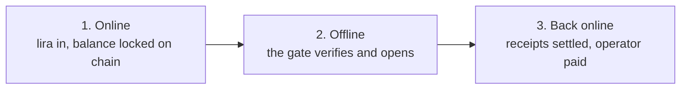

# OffGate

Offline payment and access control on Stellar. A turnstile with no internet
connection and no secret key verifies that a ticket was paid for, refuses a
receipt that has already been used, and settles the revenue on chain when
connectivity returns. Hardware cost per gate is one ESP32.

Built for the Rise In x Stellar Pro Hackathon 2026, Genesis track.

[Türkçe](README.tr.md)

| | |
|---|---|
| Live application | https://offgate.vercel.app (English by default, TR switch in the top bar) |
| Contract | [`CAYBDH2AUVXOYJPRBE7MZ46ZOLW3O53PIDOKGWWOV4Z4PONHWILA7AZH`](https://stellar.expert/explorer/testnet/contract/CAYBDH2AUVXOYJPRBE7MZ46ZOLW3O53PIDOKGWWOV4Z4PONHWILA7AZH) |
| Network | Stellar Testnet |
| Hardware | 2 x ESP32, gates `M307` and `M308` |
| Source | https://github.com/hyrlhc/offgate |

---

## The problem

Paid access points, such as festival entrances, stadium gates and transit
turnstiles, authorise payments online. The terminal contacts a server, the
server answers, the gate opens. Three consequences follow.

First, the moment of highest demand is the moment the network is least
available. Cell sites saturate when several thousand people stand in the same
place. The gate that must work hardest is the one most likely to be offline.

Second, latency is paid per person. An online authorisation round trip of a few
hundred milliseconds is invisible to one user and becomes a queue at a thousand.

Third, hardware cost per gate is high enough that operators install few gates,
which concentrates the queue further.

There is also an accounting consequence. When the network fails, venues fall
back to cash. Revenue then depends on what the operator declares, and the
declaration cannot be checked against an independent record.

## The approach

OffGate removes the online authorisation step. The user's balance is locked in a
Soroban contract before they arrive. The contract records who locked it, which
gate it is bound to, the fare, and the exchange rate at the time of locking. The
operator signs a statement of that lock with an Ed25519 key. The user's browser
pre-signs one receipt per pass while still online.

At the gate, the user transfers a bundle containing the signed statement and the
receipts. The gate verifies two signatures against keys it already holds, checks
its local ledger for reuse, and opens. No network is involved.

The firmware contains no secret key. It holds only the operator's public key, so
opening the device and reading its flash does not allow forging a ticket.

When connectivity returns, receipts are written on chain, the revenue moves to
the operator, and the operator withdraws it as Turkish lira through the anchor.
The full loop has been executed on testnet:

```
500 TRY -> 10.198 USDC -> locked in contract -> offline passes
       -> receipts on chain -> 596.99 TRY in the operator's bank account
```

---

## How it works, in three stages



**Online.** The user deposits lira through the anchor, receives USDC, and locks
it in the contract. The lock records the gate, the fare and the exchange rate.
The operator signs a statement of that lock. The browser pre-signs one receipt
per pass. All of this happens before the user reaches the venue.

**Offline.** The user joins the gate's own wifi and sends the signed package.
The gate checks the operator's signature, checks the user's signature, checks
its own ledger for reuse, and opens. It has no internet connection and no secret
key of its own.

**Back online.** Receipts are written to the contract, the money moves to the
operator, and the operator withdraws it as lira. Users can submit their own
receipts and are paid a share of the fee for doing so.

Two gates in the same venue also talk to each other over radio, so a ticket
bought for one gate can be used at the other without either of them going
online.

---

## Trust model

Four Ed25519 keys, each held in one place.

| Key | Held by | Signs | Storage |
|---|---|---|---|
| Wallet key | User | The `lock_float` transaction, once | Freighter, Lobstr, Albedo, Rabet or Hana |
| Device key | User's browser | Pass receipts | `localStorage`, one per wallet address |
| Operator key | Server | The entitlement | Vercel secret, never sent to the browser |
| Gate key | Each ESP32 | Collection vouchers, spend records, counter declarations | ESP32 NVS, generated on first boot |

The gate holds the operator's public key only. It verifies; it holds nothing
that would let it issue.

The device key exists because a browser wallet extension cannot sign raw bytes
on a phone in airplane mode. `lock_float` writes the device public key on chain,
which delegates receipt signing to it. The wallet's own key never reaches the
offline side of the phone.

---

## How the signatures chain together

A Soroban contract cannot sign anything. It holds no private key. What the
contract does is *commit* a digest; the operator signs, and only signs a
document that matches what the chain already committed. The steps below trace
one ticket from purchase to settlement and name the key involved at each point.

### Who the operator is

The operator is the event organiser: the party that installs the gates and
receives the revenue. It is not the contract, not the browser and not the gate.

In this repository it is a single server-side endpoint,
[`web/api/sign-entitlement.js`](web/api/sign-entitlement.js), running as a
Vercel serverless function. The Ed25519 private key it signs with is held there
as a secret and is never sent to the browser.

The contract stores two separate things about the operator, and they are
different keys with different jobs:

| On chain | What it is | Used for |
|---|---|---|
| `operator()` | A Stellar account address | Where `settle` sends the revenue |
| `operator_pk()` | A raw Ed25519 public key | What the gates verify entitlement signatures against |

The same public key is compiled into the gate firmware, so a gate can verify
without any connection, and an auditor can compare the two.

### Step 1. The user commits the ticket digest on chain

The browser builds the entitlement: the user's public key, the device public
key, the event, the chosen gate, the fare, the locked rate, the number of passes
and the expiry. These are laid out as 138 fixed bytes and hashed with SHA-256.

`lock_float` is called with that digest, together with the gate, fare, rate and
device key as separate arguments. The call carries `require_auth`, so the user's
own wallet signature authorises it. The contract moves the USDC in and stores
all of it.

At this point the chain holds a commitment: *this wallet locked this much, for
this gate, at this rate, and the ticket it intends to use hashes to this value.*

### Step 2. The operator signs only what the chain already committed

The operator endpoint ignores everything the client sends except the wallet
address and the requested expiry. It reads the account back from the contract,
rebuilds the 138 bytes **from the on-chain values**, and hashes them.

If that hash does not equal the `ent_hash` stored on chain, it refuses with HTTP
409 and signs nothing.

If it matches, it signs those 138 bytes with the operator's Ed25519 key.

This ordering is what closes the obvious hole. In an earlier version the
operator signed whatever the client sent, so a user editing `max_uses` in the
browser would have received a signature for 999 passes. Now the allowance is
computed by the contract from the locked balance, and the signature is only ever
issued over bytes the chain already agreed to.

### Step 3. The gate verifies the operator signature, offline

The firmware has the operator's public key compiled into it. It is a public key,
so reading the flash reveals nothing useful.

The gate rebuilds the same 138 bytes from the fields in the bundle and verifies
the operator's signature over them. If a single field was altered in transit,
the bytes differ and the signature fails.

It then computes `ent_hash = SHA-256(those bytes)` itself. It does not trust the
hash from the bundle; it derives it.

The contract also publishes the operator public key through `operator_pk()`, so
anyone can check that the key burned into a gate is the key the contract
declares. The gate does not need the chain to verify, but an auditor can use the
chain to verify the gate.

### Step 4. The gate verifies the user's receipt

The receipt is 67 fixed bytes: a version prefix, the `ent_hash`, the sequence
number, the fare and a timestamp. It is signed by the device key.

Two checks bind it:

- The `ent_hash` in the receipt must equal the one the gate just derived. A receipt therefore belongs to exactly one entitlement.
- The signature must verify against the device public key **that is inside the operator-signed entitlement**. The device key is not taken from the receipt or from any field the user could edit independently; it is carried inside bytes the operator signed.

Then the sequence number is checked against the allowance, and the pair
`(ent_hash, seq)` is checked against the gate's own ledger of spent receipts.

### Step 5. The gate signs what it actually charged

After accepting, the gate signs a 67-byte voucher naming the same `ent_hash` and
sequence number and the amount it took. It uses its own key, generated on first
boot and never leaving the device. The public half is registered on chain
through `register_gate`.

### Step 6. The contract re-checks everything at settlement

`settle` does not take anyone's word for it:

- The gate that submitted must be registered to the same event as the ticket.
- `acct.ent_hash` on chain must equal the receipt's `ent_hash`. This is what replaces re-verifying the operator signature: the digest was committed in step 1 under the user's own authorisation, so matching it is equivalent and cheaper.
- The receipt signature is verified against `acct.device_pk`, read from the chain, not from the submission.
- The voucher signature is verified against the gate public key registered on chain.
- The charged amount must not exceed the fare the user signed for.
- `(ent_hash, seq)` must not already be marked spent on chain.

Only then does the money move.

### Why nobody else can issue a ticket

Everything needed to build the 138 bytes is public. The contract is readable by
anyone, `account_of` returns the gate, fare, rate, device key and digest, and
SHA-256 is a public function. Anyone can recompute the same digest and get the
same 32 bytes.

That was never the secret. The digest is a link between three places, not a
password.

What cannot be reproduced is the signature over those bytes. Producing it
requires the operator's Ed25519 private key, which exists in one place on one
server. The gate carries only the matching public key and accepts nothing that
fails against it.

So copying the chain data gives you a correct digest and no signature, and the
gate refuses. Reading the firmware gives you a public key, which verifies
signatures and cannot create them.

### How the gate knows the data came from the chain

It does not, directly. The gate never contacts the chain, so it has no ledger
state and no proof it could check. Verifying the operator signature tells it
exactly one thing: the operator vouched for these bytes.

What carries the chain guarantee is the digest itself. The same 32-byte value
appears in three places:

- On chain, written by `lock_float` under the user's own wallet signature
- As the hash of the 138 bytes the operator signed
- Inside every receipt, covered by the device key signature

The operator issues a signature only when the second matches the first. The
contract accepts a receipt only when the third matches the first. The gate sits
between them and checks the second against the third.

The consequence is what makes this safe. A ticket that was never locked on chain
can still be signed by the operator and will still open a gate, but the receipts
it produces can never be settled, because `settle` reads `acct.ent_hash` from
the chain and finds nothing to match. The gate can be fooled; the money cannot
move.

The only party able to produce such a ticket is the operator, who would be
opening gates and collecting nothing.

An auditor can check the whole path from outside. `operator_pk()` publishes the
operator public key on chain, so the key compiled into a gate can be compared
against what the contract declares. `account_of(user)` returns the committed
digest, so any issued ticket can be recomputed and matched.

### What each party can and cannot do

| Question | Answer |
|---|---|
| Can a user forge a ticket? | They would need the operator's private key. It is on the server and never sent to the browser. |
| Can a user inflate their pass count? | The allowance is computed by the contract from the locked balance. The operator rebuilds the entitlement from chain values and refuses to sign anything else. |
| Can a user edit the fare or the gate? | Both are inside the 138 signed bytes. Changing either invalidates the operator signature. |
| Can a user reuse a receipt? | `seq` is inside the signed bytes, and `(ent_hash, seq)` is recorded in the gate ledger and again on chain. |
| Can a user swap in a different device key? | The device key lives inside the operator-signed entitlement and is also stored on chain by `lock_float`. |
| Can someone extract keys from a gate? | The gate holds the operator's public key and its own key. The operator key is public. The gate key can only sign statements about what that gate collected, and it is rotatable through `set_gate_pk`. |
| Can a gate overcharge? | The ceiling is in the user's signature and the contract rejects a voucher above it. |
| Can a gate under-report? | It could, but the operator receives the amount, so a gate under-reporting only costs its own operator. |
| Can the operator hide revenue? | The gate signs its own counter declaration. `stats` puts that number next to the receipts actually settled; the operator cannot write the first one. |
| Can a stolen bundle be used? | Yes. This is the one open weakness and it is stated in the security section below. |

---

## Flow

### Buying a ticket, online

The user selects a number of passes. The amount is the number of passes times
the fare, plus a 5 percent deposit. For three passes at 100 TRY the total is
315.00 TRY.

| Step | Mechanism |
|---|---|
| Gate selection | The user chooses the gate; it becomes an argument to `lock_float` |
| USDC trustline | Opened through Horizon if absent |
| Authentication | SEP-10 challenge signed by the wallet |
| Rate lock | SEP-38 quote, using `total_price` |
| Deposit instruction | SEP-6 `deposit-exchange` with `quote_id` |
| Bank transfer | The user wires the amount with the reference code. In this demo the mock anchor's `simulate-bank-transfer` stands in |
| USDC received | Anchor payout, observed on Horizon |
| Lock | `lock_float` moves USDC into the contract and records gate, fare, rate, device key and entitlement digest |
| Entitlement signature | The operator reads the on-chain lock, rebuilds the entitlement from it, and signs |
| Receipt book | The browser signs N receipts, `seq` 1 to N |

The output is a base64 bundle holding the entitlement, the operator signature
and the receipts. It contains no secret key.

### Passing a gate, offline

The gate runs an open access point and a captive portal. The bundle is pasted
once; later passes are a single tap.

The gate checks, in order:

1. Is the entitlement signed by the operator, against the embedded public key
2. Does the receipt belong to this entitlement, by `ent_hash`
3. Is the receipt signed by the device key named in the entitlement
4. Is `seq` within the granted allowance
5. Has `(ent_hash, seq)` already been spent, against the NVS ledger

If all pass, the receipt is marked spent first and the gate opens second. The
gate then signs a collection voucher stating the amount it actually charged and
returns it to the phone.

### Settlement

`settle` is permissionless. Each receipt carries the user's signature, which
binds the ceiling, and the gate's signature, which binds the amount actually
charged. Anyone holding the data can submit it, so users submit their own and
are paid for doing so.

---

## Preventing double spend

Three layers, in order of cost.

**Sequence numbers.** Each receipt carries `seq` and the signature covers it.
Copying a receipt and editing the number invalidates the signature.

**The gate's local ledger.** Every accepted `(ent_hash, seq)` is written to NVS,
which survives power loss. A repeat is rejected in about 3 ms without any
signature work.

**Cross-gate ledger sharing.** A pass accepted at one gate is announced to its
neighbours over ESP-NOW, signed by the accepting gate's key.

What makes this work is not the signature but ownership of the ledger. A
signature proves a ticket is genuine. Only the ledger knows whether it has been
used.

If the ledger write fails, for example because NVS is full, the gate does not
open. This was a real defect: the return value of the NVS write was ignored, so
a full ledger silently allowed reuse. Both the spend marker and the receipt
store now check their writes, and unstorable receipts are counted and exposed on
`/health`.

---

## Gate-to-gate protocol

Two ESP32s communicate directly over ESP-NOW on a fixed channel. No router, no
internet, no pairing. Each gate generates its own keypair on first boot and
signs everything it says.

### Announcements, one way

When a gate accepts a pass it broadcasts a short signed record: which gate it
is, which receipt it just spent, and its running counter. Neighbours verify the
signature and write the same spend marker into their own ledgers. Nothing is
expected in reply.

### Questions and approvals, two way

When a user presents a ticket issued for another gate, the receiving gate sends
a signed question and waits for a signed answer. The question carries the
receipt in dispute and a random nonce; the answer carries the same nonce and a
verdict.

The receiving gate can verify the ticket itself. What it cannot know is whether
that receipt has been spent, because the ledger for it lives at the issuing
gate. So it asks. The issuing gate checks its ledger, burns the receipt, and
only then returns a signed approval.

Burning before approving is the only correct order. The reverse would leave a
window in which the user could present the same receipt at the issuing gate
while the approval is in flight. The cost of the correct order is that a lost
reply burns a pass without granting entry. Double spend is the more expensive
failure.

Silence is refusal. If the issuing gate does not answer, the pass is denied. If
it has never been heard from, the request is refused before any verification
work is done. A network partition closes the system rather than opening it.

### Asymmetry of trust

| Message | Worst case if accepted | Required trust |
|---|---|---|
| Announcement | One additional refusal | Trust on first use |
| Question | One pass consumed | Previously known neighbour only |

An announcement cannot grant anyone a pass, so it can be accepted loosely. A
question burns a receipt, so it is accepted only from a neighbour already in the
peer table.

### Measured on hardware

| Operation | Time |
|---|---|
| Ed25519 verification | 98 ms |
| Cross-gate approval round trip | 327-344 ms |
| Pass at the issuing gate, end to end | 165-263 ms |
| Pass at a neighbouring gate, end to end | 495-740 ms |
| Replay rejection | 3 ms |

### Verified scenarios

A genuine three-pass ticket issued for M307, run against both physical gates.

| Case | Expected | Result |
|---|---|---|
| Receipt 1 at M308 | M307 approves, gate opens | `remote: true`, 332 ms approval |
| Receipt 1 at M307 | Already burned | `already_spent` |
| Receipt 2 at M307 | Normal pass | 165 ms |
| Receipt 2 at M308 | Known from the announcement | `already_spent`, 3 ms |
| Receipt 3 at M308 | Remote approval, accepted | 495 ms |
| Receipt 3 at M308 again | Local ledger stops it | `already_spent`, 3 ms |

The second row is the one that matters. The same receipt was refused at its own
gate, which proves the issuing gate burned it before approving.

---

## Variable fare, change, and paying users to carry data

Each gate has its own fare. M307 charges 100 TRY, M308 charges 80 TRY. The
ticket's signature sets a ceiling; the gate's signature sets the amount actually
taken.

The gate signs a short record naming the receipt and the amount it took. The
contract deducts `charged_try`, not the ceiling. The difference stays in the
user's balance. The two signatures constrain each other: the gate cannot charge
above the ceiling because the contract rejects it, and it has no reason to
under-report because the operator receives the money.

`settle` requires no authorisation, because each document verifies itself. The
carrier is paid 80 percent of the 5 percent deposit, which is 4 percent of the
amount charged. Settlement therefore happens because users want their money
back, not because an operator runs a job.

Claiming the reward costs one Stellar transaction, under one cent. The reward is
funded from fees, not from issuance, so there is no token and no dilution.

### Refunds

`refund` used to return the entire balance. A user could pass several gates and
withdraw before the receipts reached the chain, making those passes free.

Outstanding signed passes are now reserved at full fare, because an offline gate
cannot tell the chain whether a signed pass was used. The reservation is
released as receipts arrive:

```
outstanding = granted - used
reserved    = outstanding * fare
refundable  = balance - reserved
```

Carrying your own receipts dissolves your own reservation in the same
transaction. The route to a refund runs through carrying the data, which is why
there is no separate cancellation operation.

### Economics

The marginal cost of operating the system is the anchor spread, measured at
about 1 percent (`price` 48.785078 against `total_price` 49.029003). Chain fees
for a thousand users come to under five dollars. Hardware amortises to a few
dollars per event.

| | Fee | Rebate | Net for a carrier | Net otherwise |
|---|---|---|---|---|
| OffGate | 5% | 80% | 1% | 5% |
| Card terminal, Turkey | 1.5-2.5% | - | - | - |
| Festival cashless systems | 2-4% plus per-wristband fee | - | - | - |

A carrier pays exactly the anchor spread. The margin comes from users who do not
carry, who are also the users whose receipts the operator must settle manually.

### Measured on chain

A ticket issued for M307, used at the 80 TRY gate M308
([transaction](https://stellar.expert/explorer/testnet/tx/44a7e31c76e19dc9b0ee06864c7e9919f5ceffe7150bd4131a6a4e89a588aaa6)).

| | Before | After |
|---|---|---|
| Operator USDC | 0.0000000 | 1.6398456 |
| User USDC | 1.8943720 | 1.9599658 |
| Balance held, the change | 2.0498071 | 0.4099615 |
| Deposit held | 0.1024904 | 0.0368966 |
| Refundable | 0.0000000 | 0.4468581 |

The operator received the 80 TRY equivalent, not 100. The refundable amount went
from zero to positive, because carrying the data closed the outstanding pass.

---

## Signed message formats

Four codebases produce the bytes that get signed: the contract in Rust, the
operator endpoint in Node, the browser in TypeScript, and the gate in C++. If
any of them laid out a field differently, signatures would fail in the field and
not on anyone's desk.

JSON does not guarantee field order or whitespace, so nothing signed here is
JSON. Every signed message is a fixed-length byte string with a version prefix,
big-endian integers and zero-padded identifiers.

| Message | Signed by | Size |
|---|---|---|
| Entitlement | Operator | 138 bytes |
| Receipt | User's device key | 67 bytes |
| Collection voucher | Gate | 67 bytes |
| Counter declaration | Gate | 27 bytes |
| Spend announcement | Gate | 81 bytes |
| Question, approval | Gate | 91 bytes |

The exact field order of each message, with a worked example and the expected
signature, is in [`docs/test-vector.md`](docs/test-vector.md).

Agreement is enforced by tests rather than by convention. On the Rust side,
`canonical_message_matches_javascript_vector` compares against that vector. On
the ESP32 a self-test runs at boot and prints the result to the serial port; if
it fails, the gate is not speaking the same language as the contract and the
reason is visible before anyone tries to use it.

---

## Stellar integration

### Integration partner: Stellar Wallets Kit

[`@creit.tech/stellar-wallets-kit`](https://github.com/Creit-Tech/Stellar-Wallets-Kit),
used in [`web/src/lib/signer.ts`](web/src/lib/signer.ts).

| Line | Call | Purpose |
|---|---|---|
| 14-19 | `import { StellarWalletsKit }` plus the Freighter, Albedo, Lobstr, Rabet and Hana modules | Five wallets behind one interface |
| 38 | `StellarWalletsKit.init` | Network and module configuration |
| 53 | `StellarWalletsKit.authModal` | Wallet selection |
| 59 | `StellarWalletsKit.signTransaction` | Signs `lock_float` and `top_up` |

This is not an add-on. The only way a user can lock a balance is that signature,
so the flow stops at the first step without it.

### Stellar Skill files used, by path

| File | Source | Where it is applied |
|---|---|---|
| `SKILL.md` | [`yigitcangokmen/stellar-hackathon-turkiye`](https://github.com/yigitcangokmen/stellar-hackathon-turkiye/blob/main/SKILL.md) | Mock anchor integration: SEP-1 discovery, SEP-10 session, SEP-38 rate lock, SEP-6 `deposit-exchange` and `withdraw`, `simulate-bank-transfer`. Implemented in [`web/src/lib/anchor.ts`](web/src/lib/anchor.ts), [`scripts/01-anchor-flow.mjs`](scripts/01-anchor-flow.mjs), [`scripts/03-withdraw.mjs`](scripts/03-withdraw.mjs) |

### Protocol usage

No endpoint is hardcoded. All are discovered through SEP-1 at
`/.well-known/stellar.toml`, so switching to another anchor changes the home
domain and nothing else.

- **SEP-1**: discovery of `WEB_AUTH_ENDPOINT`, `TRANSFER_SERVER`, `ANCHOR_QUOTE_SERVER`, `SIGNING_KEY` and the currency entry.
- **SEP-10**: authentication. The incoming challenge is checked against the anchor's `SIGNING_KEY` before signing, which prevents a man in the middle from harvesting a signature. A 401 triggers one session refresh.
- **SEP-38**: `quote`, using `total_price` rather than `price`. The spread is part of what the user pays; computing the fare from `price` silently loses one pass per several hundred lira.
- **SEP-6**: `deposit-exchange` with `quote_id`, not plain `deposit`, so the lira price of a pass is fixed at quote time. `destination_asset` is a bare code and `source_asset` is in SEP-38 form; using SEP-38 form for both returns 400.
- **SEP-6**: `withdraw` for the operator payout, with a mandatory memo. The script stops before sending if the anchor returns no memo.

### Soroban contract

28 public functions in
[`contracts/offgate/src/lib.rs`](contracts/offgate/src/lib.rs), 1023 lines.

| Function | Purpose |
|---|---|
| `init` | One-time configuration: admin, operator, token, operator public key |
| `register_gate` | Registers a gate and its Ed25519 public key to an event |
| `set_gate_pk` | Rotates a gate key, for hardware replacement |
| `lock_float` | Moves USDC in, records gate, fare, rate, device key and entitlement digest |
| `top_up` | Adds balance to an open ticket and issues a new entitlement |
| `next_grant` | Predicts the allowance a `top_up` would produce |
| `quote_total` | Total payable for N passes including the deposit |
| `settle` | Permissionless. Verifies both signatures, deducts the charged amount, pays the operator, refunds the deposit share |
| `gate_report` | Counter declaration verified against the gate's own signature |
| `refund` | Returns the free balance, reserving outstanding signed passes |
| `refundable_of` | What `refund` would return right now |
| `assign_gate`, `gate_load`, `gates_of`, `gate_pk_of`, `stats`, `declared_of`, `settled_of`, `account_of`, `uses_left`, `is_spent`, `float_of` | Reads used by the interface and the audit screen |

Patterns: `require_auth` on every function that moves user funds, `extend_ttl`
after every persistent write, `#[contractevent]` for events, and gate assignment
validated before any token transfer so that a rejected assignment moves no
money.

---

## Deployed artifacts

| Item | Value |
|---|---|
| Contract | [`CAYBDH2AUVXOYJPRBE7MZ46ZOLW3O53PIDOKGWWOV4Z4PONHWILA7AZH`](https://stellar.expert/explorer/testnet/contract/CAYBDH2AUVXOYJPRBE7MZ46ZOLW3O53PIDOKGWWOV4Z4PONHWILA7AZH) |
| Fallback contract | [`CB6AUNVOKLY4W23BHIR52V4F7H7SXCXW2B7CFK4KZVCQD6DOGKBMRXDI`](https://stellar.expert/explorer/testnet/contract/CB6AUNVOKLY4W23BHIR52V4F7H7SXCXW2B7CFK4KZVCQD6DOGKBMRXDI) |
| Frontend | https://offgate.vercel.app |
| Event | `FEST26` |
| Admin | [`GDE7PTP774PCYBE5N6QCPG4QKGYCCSOUWUPDISBBKPKI3CDIUEGLG7HJ`](https://stellar.expert/explorer/testnet/account/GDE7PTP774PCYBE5N6QCPG4QKGYCCSOUWUPDISBBKPKI3CDIUEGLG7HJ) |
| Operator | [`GDICV4EQQZENJLJT4G6P7D3GMDC3CTMVFH3VH3X5WSXLR3723YJGITG4`](https://stellar.expert/explorer/testnet/account/GDICV4EQQZENJLJT4G6P7D3GMDC3CTMVFH3VH3X5WSXLR3723YJGITG4) |
| USDC issuer | `GBBD47IF6LWK7P7MDEVSCWR7DPUWV3NY3DTQEVFL4NAT4AQH3ZLLFLA5` |
| USDC contract (SAC) | `CBIELTK6YBZJU5UP2WWQEUCYKLPU6AUNZ2BQ4WWFEIE3USCIHMXQDAMA` |
| Anchor | `tr-mock-anchor.fly.dev` |
| Operator public key, embedded in firmware | `d02af0908648d4ad33e1bcff8f6660c5b14d9529f753eefdb4aeb8effade1264` |
| Gate M307, fare 100 TRY | `65823a1302e0f2451807c7e2f69ca1387a15e3de4f97ac263bc844c0d42472e5` |
| Gate M308, fare 80 TRY | `80258f32995c7a6cbed5aac6d3f3fadd2a260418dde84f08c40cd7ab0ca3d9ab` |

Transactions on testnet:

| Operation | Hash |
|---|---|
| `settle` with a gate voucher | [`44a7e31c...a588aaa6`](https://stellar.expert/explorer/testnet/tx/44a7e31c76e19dc9b0ee06864c7e9919f5ceffe7150bd4131a6a4e89a588aaa6) |
| SEP-6 deposit payout | [`1f0b02e9...d83cec19`](https://stellar.expert/explorer/testnet/tx/1f0b02e9bcb876874bd016358eef6b15ad4f67ff9a9294d62e38525ed83cec19) |
| SEP-6 withdraw payment | [`4e4accc0...c0445359`](https://stellar.expert/explorer/testnet/tx/4e4accc0fec4864438a53806cd3d7a3befdd5e05f41aff3a96a05c0c04453593) |
| Trustline, user | [`868be52e...c9a87900`](https://stellar.expert/explorer/testnet/tx/868be52eb7246184e6000e6b0b1ca11bc1a3357be05591ee92f16de3c9a87900) |
| Trustline, operator | [`5fa149dd...8ebe36b3`](https://stellar.expert/explorer/testnet/tx/5fa149ddcc31454269552882713954763c2efa77010132915964ab1e8ebe36b3) |

Earlier deployments and the output of every step are recorded in
[`docs/DEPLOYMENTS.md`](docs/DEPLOYMENTS.md).

---

## Security model

### What is protected

| Attack | Mechanism |
|---|---|
| Forging a ticket | Operator signature; the secret key is server side and absent from the gate |
| Replaying a receipt | The gate's NVS ledger, rejected in 3 ms |
| Using one receipt at two gates | Signed cross-gate question and approval; the receipt is burned before the approval is sent |
| Inflating the allowance | The operator rebuilds the entitlement from the on-chain lock and refuses to sign if the digest does not match |
| Tampering with the fare | `fare_try` is inside the signed message |
| Editing the sequence number | `seq` is inside the signed message |
| A gate overcharging | The ceiling is in the user's signature and the contract enforces it |
| A gate under-reporting | The operator receives the amount, so under-reporting costs the operator's own device |
| Under-reporting revenue | `gate_report` carries the gate's own signature; the operator cannot write the number |
| Replaying an old declaration | The counter only moves forward |
| Withdrawing after passing offline | Outstanding signed passes are reserved during `refund` |
| Opening the device to extract keys | The ESP32 holds no secret key, only the operator's public key |
| Impersonating a neighbouring gate | Questions are accepted only from known neighbours, Ed25519 signed, with a nonce |

### What is not protected

**The bundle is a bearer instrument.** Whoever copies it can use it. Replay is
prevented, but possession is not tied to a person. The cause is architectural:
the device key lives on the `offgate.vercel.app` origin and the gate page on
`192.168.4.1`, and the browser does not allow data to cross between them. A PIN
was considered and rejected; at roughly 30 bits of entropy it is breakable
offline against a stolen bundle. The fix is a native mobile application, which
requires no firmware change because verification is transport independent.

**The turnstile cannot enforce `expires`.** It has no clock. Expiry is checked
only at the signing endpoint, which caps tickets at 48 hours. The fix is an RTC
module or time synchronisation from the staff device.

**A neighbour's key is pinned on first hearing.** Adequate for a closed network.
In production, gate public keys should be read from the contract, which already
stores them through `register_gate` and can rotate them through `set_gate_pk`.

**The receipt ledger is bounded by NVS, which is 20 KB.** When it fills,
receipts cannot be stored and passes are refused rather than silently lost. The
count is exposed on `/health`. An attempt to enlarge the partition put the
`esp32dev` bootloader into a reset loop and was reverted.

**A network partition denies cross-gate passes.** The system fails closed, so
the loss is availability rather than safety. Connecting each gate to more than
one neighbour reduces the exposure; the protocol supports four.

---

## Tests and measurements

### Contract

```sh
cargo test -p offgate
```

46 tests, all passing, using real Ed25519 signatures through `ed25519-dalek` as
a dev dependency. Test source is 1106 lines.

| Test | Property |
|---|---|
| `lock_float_requires_user_auth` | An unsigned call panics |
| `lock_without_gates_fails_and_moves_no_money` | A rejected gate assignment moves no funds |
| `settle_is_idempotent_for_repeated_batches` | Re-submission is harmless |
| `settle_rejects_replayed_sequence_number` | Replay is blocked |
| `settle_rejects_forged_signature` | A forged signature aborts the batch |
| `settle_rejects_tampered_amount` | Fare tampering fails verification |
| `settle_charges_only_what_the_gate_signed` | Change remains in the balance |
| `settle_rejects_a_charge_above_the_signed_fare` | A gate cannot overcharge |
| `settle_pays_back_the_service_fee_to_whoever_carries_the_data` | The rebate reaches the wallet |
| `rebate_never_exceeds_the_fee_that_was_collected` | The rebate is bounded |
| `anyone_can_carry_the_data_on_chain` | `settle` needs no authorisation |
| `settle_accepts_a_pass_taken_at_a_neighbouring_gate` | Cross-gate passes settle |
| `settle_rejects_a_voucher_signed_by_a_different_gate` | A voucher is bound to its gate |
| `refund_cannot_take_back_money_for_passes_used_offline` | The refund hole is closed |
| `settling_receipts_unlocks_what_refund_had_reserved` | Carrying data releases the reservation |
| `gate_report_requires_the_gate_signature` | The operator cannot write the declaration |
| `gate_report_ignores_a_replayed_older_counter` | The counter does not move backwards |
| `gate_key_can_be_rotated` | A replaced turnstile does not kill the gate |
| `stats_reveal_underreporting_gate` | Under-reporting is visible in the audit |
| `canonical_message_matches_javascript_vector` | Rust and JavaScript agree byte for byte |
| `gate_belongs_to_exactly_one_event` | Gate counters are unambiguous |

### Firmware

Self-test at boot, against the same vector:

```
OffGate - canonical format self-test
  receipt canonical bytes (67) correct
  Ed25519 verification passed (98 ms)
  corrupted signature rejected
  entitlement canonical bytes (138) correct
  SHA-256 ent_hash correct
OffGate gate ready
  gate      : M307
  fare      : 10000 kurus (100.00 TRY)
  internet  : none, verification is entirely local
  self-test : passed
  identity  : 65823a1302e0f2451807c7e2f69ca1387a15e3de4f97ac263bc844c0d42472e5
  neighbours: on (ESP-NOW, channel 1)
```

| Measurement | Value |
|---|---|
| RAM | 15.1 percent, 49.6 KB of 320 KB |
| Flash | 64.1 percent, 840 KB of 1.31 MB |
| Firmware source | 1635 lines of C++ across five files |
| Hardware cost | about 5 USD per gate |

---

## Build and run

Requirements: Rust 1.84 or newer with the `wasm32v1-none` target, the Stellar
CLI, Node 20 or newer, and PlatformIO for the hardware.

### Contract

```sh
git clone https://github.com/hyrlhc/offgate && cd offgate
cp .env.example .env

cargo test -p offgate
stellar contract build
```

To deploy your own instance:

```sh
node scripts/00-setup-accounts.mjs
stellar contract deploy --wasm target/wasm32v1-none/release/offgate.wasm \
  --source-account admin --network testnet
stellar contract invoke --id <ID> --source-account admin --network testnet -- init \
  --admin <ADMIN> --operator <OPERATOR> --usdc_token <SAC> --operator_pk <HEX>
stellar contract invoke --id <ID> --source-account admin --network testnet -- register_gate \
  --event FEST26 --gate M307 --gate_pk <GATE_PUBLIC_KEY_FROM_SERIAL>
```

The contract id belongs in `contractId` in
[`web/shared/deployment.js`](web/shared/deployment.js), which is the only place
it appears.

### Web application

```sh
cd web && npm install
npm run dev
```

`OPERATOR_SECRET` must never carry the `VITE_` prefix. Every `VITE_` variable is
shipped to the browser. The operator key belongs in the root `.env` during
development and in a Vercel secret in production.

### Gate firmware

```sh
cd firmware/offgate-gate
pio run -e gate1 -t upload
pio run -e gate2 -t upload
pio device monitor
```

The gate identity printed at boot must equal `gate_pk_of(gate)` on chain. If a
gate is reflashed onto different hardware, rotate the key with `set_gate_pk`.

The operator public key embedded in
[`firmware/offgate-gate/src/main.cpp`](firmware/offgate-gate/src/main.cpp) must
equal `OPERATOR_PK_HEX` in `.env`.

### Operator tasks

```sh
node scripts/status.mjs
node scripts/02-settle.mjs --from receipts.json
node scripts/03-withdraw.mjs
```

### Gate serial console

The gate accepts the same payload over the serial port as over HTTP, through the
same function, so the test path cannot diverge from the field path.

```
PAY {json}   process a payment bundle
PEERS        identity and known neighbours
RESET        clear the counter and the spent-receipt ledger
```

---

## Fallback profile

The hackathon anchor stopped paying out twice during development. Measured
behaviour: every SEP endpoint returns 200, the order opens, the amount is
computed, the anchor reports `TRY received; paying USDC on Stellar`, and no USDC
arrives. 85 status polls over 5.5 minutes with the transaction fixed at
`pending_anchor`. The protocol layer is healthy and the payout worker is not.

The application therefore carries two profiles, switched from the top bar.

| | Anchor | Asset | Contract |
|---|---|---|---|
| `live`, default | Real anchor, SEP-1, SEP-10, SEP-38, SEP-6 | USDC | `CAYBDH2A...` |
| `local` | None, our own issuer | `TUSDC` | `CB6AUNVO...` |

No line of the live anchor path changed. The fallback uses a separate contract
and a separate asset, and none of its code runs unless it is switched on. It is
not an anchor impersonation and is not presented as one: the top bar reads
`Fallback` and the flow steps read `skipped in fallback mode`. The integration
claim in this document applies to the `live` profile.

In both profiles the entitlement signature is verified against the on-chain
lock. The gate firmware is unchanged and unaware of which contract is behind it;
it only checks the operator signature.

---

## Repository layout

```
contracts/offgate/src/lib.rs    Soroban contract, 1023 lines
contracts/offgate/src/test.rs   46 host tests with real Ed25519 signatures

web/shared/deployment.js        Deployment constants, both profiles
web/src/lib/signer.ts           Stellar Wallets Kit, the integration partner
web/src/lib/anchor.ts           SEP-1, SEP-10, SEP-38, SEP-6
web/src/lib/contract.ts         Soroban invocations and ScVal encoding
web/src/lib/receipts.ts         Canonical formats, receipt book, device key
web/src/lib/carry.ts            Decoding and submitting gate data
web/src/lib/flow.ts             The sequence behind the single button
web/src/lib/i18n.ts             English and Turkish
web/src/TopUpFlow.tsx           Purchase interface
web/src/Carry.tsx               Carry gate data, collect the refund
web/src/Audit.tsx               Declared against on chain
web/api/sign-entitlement.js     Operator signing endpoint, server side
web/api/fallback-payout.js      Fallback profile payout, server side

firmware/offgate-gate/src/offgate.h    Canonical formats, Ed25519 verification
firmware/offgate-gate/src/mesh.h       ESP-NOW, gate identity, vouchers
firmware/offgate-gate/src/main.cpp     Gate logic, ledger, captive portal
firmware/offgate-gate/src/selftest.h   Boot-time format proof

scripts/                        Setup and operator tasks
docs/                           Architecture, walkthrough, artifacts, test vector
```

## Documentation

| File | Contents |
|---|---|
| [`docs/BASIT-AKIS.md`](docs/BASIT-AKIS.md) | End-to-end walkthrough in Turkish, the best starting point |
| [`docs/OFFGATE-BUILD-PLAN.md`](docs/OFFGATE-BUILD-PLAN.md) | Architecture, glossary, anchor reference |
| [`docs/OFFGATE-PACKAGES.md`](docs/OFFGATE-PACKAGES.md) | Build plan and decision records |
| [`docs/DEPLOYMENTS.md`](docs/DEPLOYMENTS.md) | Every deployment, account and transaction |
| [`docs/test-vector.md`](docs/test-vector.md) | Cross-platform signature test vector |

---

## Roadmap

Near term:

- Native mobile application, which removes the bearer-instrument property and opens BLE and NFC transport without firmware changes
- Gate public keys distributed from the contract rather than pinned on first hearing
- Real-time clock at the gate so that `expires` becomes enforceable locally
- More than two neighbours per gate

Medium term:

- Production anchor in place of the mock
- Users carrying gate declarations for a reward, extending the mechanism that already exists for receipts
- Compact binary receipt storage to raise the ledger ceiling

Next step: an application to the Stellar Community Fund. The case is specific.
Festival and stadium operators in Turkey do not move to turnstile payment
because of per-gate hardware cost and network dependency, and both are what this
design removes.

---

## Notes

- Testnet. No real funds move.
- `simulate-bank-transfer` exists only on the mock anchor. In production the user writes the reference code in the transfer description and the anchor matches the payment to a Stellar account. The rest of the flow is standard.
- No endpoint is hardcoded; all are discovered through SEP-1.
- Every measurement, hash and console output in this document was taken from the running system.
