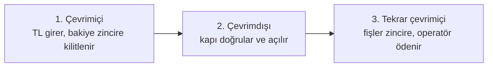

# OffGate

Stellar üzerinde internetsiz ödeme ve geçiş kontrolü. İnternete bağlı olmayan ve
içinde hiçbir gizli anahtar bulunmayan bir turnike, biletin gerçekten ödendiğini
doğrular, daha önce kullanılmış bir fişi reddeder ve bağlantı geri geldiğinde
hasılatı zincire yazar. Kapı başına donanım maliyeti bir ESP32.

Rise In x Stellar Pro Hackathon 2026, Genesis kategorisi için geliştirildi.

[English](README.md)

| | |
|---|---|
| Canlı uygulama | https://offgate.vercel.app (varsayılan İngilizce, üst çubukta TR anahtarı) |
| Sözleşme | [`CAYBDH2AUVXOYJPRBE7MZ46ZOLW3O53PIDOKGWWOV4Z4PONHWILA7AZH`](https://stellar.expert/explorer/testnet/contract/CAYBDH2AUVXOYJPRBE7MZ46ZOLW3O53PIDOKGWWOV4Z4PONHWILA7AZH) |
| Ağ | Stellar Testnet |
| Donanım | 2 adet ESP32, `M307` ve `M308` kapıları |
| Kaynak | https://github.com/hyrlhc/offgate |

---

## Problem

Festival girişi, stadyum kapısı, metro turnikesi gibi ücretli geçiş noktaları
ödemeyi çevrimiçi yetkilendirir. Cihaz sunucuya sorar, sunucu cevap verir, kapı
açılır. Bunun üç sonucu var.

Birincisi, talebin en yüksek olduğu an ağın en az erişilebilir olduğu andır.
Birkaç bin kişi aynı yerde toplandığında baz istasyonları doyar. En çok
çalışması gereken kapı, çevrimdışı kalma ihtimali en yüksek olan kapıdır.

İkincisi, gecikme kişi başına ödenir. Birkaç yüz milisaniyelik bir çevrimiçi
yetkilendirme tek kullanıcıda görünmez, bin kullanıcıda kuyruk olur.

Üçüncüsü, kapı başına donanım maliyeti operatörün az sayıda kapı kurmasına yol
açar, bu da kuyruğu daha da yoğunlaştırır.

Bir de muhasebe sonucu var. Ağ çöktüğünde mekân nakde döner. Hasılat o noktadan
sonra operatörün beyanına bağlıdır ve beyan bağımsız bir kayıtla
karşılaştırılamaz.

## Yaklaşım

OffGate çevrimiçi yetkilendirme adımını kaldırır. Kullanıcının bakiyesi, o daha
kapıya gelmeden bir Soroban sözleşmesine kilitlenir. Sözleşme kimin kilitlediğini,
hangi kapıya bağlı olduğunu, geçiş ücretini ve kilitleme anındaki kuru kaydeder.
Operatör bu kilidin beyanını Ed25519 anahtarıyla imzalar. Kullanıcının tarayıcısı
daha çevrimiçiyken her geçiş için bir fiş imzalar.

Kapıda kullanıcı, imzalı beyanı ve fişleri içeren bir paketi aktarır. Kapı,
elinde zaten bulunan anahtarlara karşı iki imzayı doğrular, kendi defterinde
tekrar kullanım olup olmadığına bakar ve açılır. Ağ hiç devreye girmez.

Firmware'de gizli anahtar yoktur. Yalnızca operatörün açık anahtarı gömülüdür;
cihazın sökülüp flash'ının okunması sahte bilet üretmeye yetmez.

Bağlantı geri geldiğinde fişler zincire yazılır, hasılat operatöre geçer ve
operatör bunu anchor üzerinden TL olarak çeker. Tam döngü testnet üzerinde
çalıştırıldı:

```
500 TRY -> 10.198 USDC -> sözleşmede kilitli -> internetsiz geçişler
       -> fişler zincire -> 596.99 TRY operatörün banka hesabında
```

---

## Üç aşamada nasıl çalışıyor



**Çevrimiçi.** Kullanıcı anchor üzerinden TL yatırır, USDC alır ve sözleşmeye
kilitler. Kilit; kapıyı, geçiş ücretini ve kuru kaydeder. Operatör bu kilidin
beyanını imzalar. Tarayıcı her geçiş için bir fiş önceden imzalar. Bunların
hepsi kullanıcı mekâna varmadan önce olur.

**Çevrimdışı.** Kullanıcı kapının kendi wifi'sine bağlanır ve imzalı paketi
gönderir. Kapı operatörün imzasını kontrol eder, kullanıcının imzasını kontrol
eder, kendi defterinde tekrar kullanım var mı bakar ve açılır. İnternet bağlantısı
da kendine ait gizli bir anahtarı da yoktur.

**Tekrar çevrimiçi.** Fişler sözleşmeye yazılır, para operatöre geçer, operatör
bunu TL olarak çeker. Kullanıcılar kendi fişlerini gönderebilir ve karşılığında
ücretin bir kısmını geri alır.

Aynı mekândaki iki kapı ayrıca telsizle birbiriyle konuşur; böylece bir kapı
için alınan bilet, ikisi de çevrimiçi olmadan diğer kapıda kullanılabilir.

---

## Güven modeli

Dört Ed25519 anahtarı, her biri tek bir yerde.

| Anahtar | Kimde | Ne imzalar | Nerede durur |
|---|---|---|---|
| Cüzdan anahtarı | Kullanıcı | `lock_float` işlemi, bir kez | Freighter, Lobstr, Albedo, Rabet veya Hana |
| Cihaz anahtarı | Kullanıcının tarayıcısı | Geçiş fişleri | `localStorage`, cüzdan adresi başına ayrı |
| Operatör anahtarı | Sunucu | Bilet | Vercel secret, tarayıcıya hiç inmez |
| Kapı anahtarı | Her ESP32'nin kendisi | Tahsilat belgesi, harcama kaydı, sayaç beyanı | ESP32 NVS, ilk açılışta üretilir |

Kapı yalnızca operatörün açık anahtarını tutar. Doğrular; bilet üretmesine
imkân verecek hiçbir şey taşımaz.

Cihaz anahtarı şu yüzden var: tarayıcı cüzdan eklentisi, uçak modundaki bir
telefonda ham bayt imzalayamaz. `lock_float` cihazın açık anahtarını zincire
yazar ve fiş imzalama yetkisini ona devreder. Cüzdanın kendi anahtarı telefonun
çevrimdışı tarafına hiç inmez.

---

## İmzalar birbirine nasıl bağlanıyor

Bir Soroban sözleşmesi hiçbir şey imzalayamaz. İçinde gizli anahtar yoktur.
Sözleşmenin yaptığı şey bir özeti *taahhüt etmektir*; imzayı operatör atar ve
yalnızca zincirin zaten taahhüt ettiği belgeyi imzalar. Aşağıdaki adımlar bir
bileti satın alınmasından senkronizasyonuna kadar izliyor ve her noktada hangi
anahtarın devrede olduğunu söylüyor.

### Adım 1. Kullanıcı bilet özetini zincire taahhüt eder

Tarayıcı bileti kurar: kullanıcının açık anahtarı, cihazın açık anahtarı,
etkinlik, seçilen kapı, geçiş ücreti, kilitlenen kur, geçiş sayısı ve son
kullanma zamanı. Bunlar sabit 138 bayt olarak dizilir ve SHA-256 ile hashlenir.

`lock_float` bu özetle çağrılır; kapı, ücret, kur ve cihaz anahtarı ayrı
argümanlar olarak gider. Çağrı `require_auth` taşır, yani kullanıcının kendi
cüzdan imzası onu yetkilendirir. Sözleşme USDC'yi içeri alır ve hepsini saklar.

Bu noktada zincirde bir taahhüt vardır: *bu cüzdan şu kadarını, şu kapı için, şu
kurdan kilitledi ve kullanmayı düşündüğü biletin özeti şu değerdir.*

### Adım 2. Operatör yalnızca zincirin taahhüt ettiğini imzalar

Operatör ucu, istemcinin gönderdiği hiçbir şeyi dikkate almaz; yalnızca cüzdan
adresini ve istenen süreyi alır. Hesabı sözleşmeden geri okur, 138 baytı
**zincirdeki değerlerden** yeniden kurar ve hashler.

Bu hash zincirde saklanan `ent_hash` ile eşit değilse HTTP 409 ile reddeder ve
hiçbir şey imzalamaz.

Eşitse, o 138 baytı operatörün Ed25519 anahtarıyla imzalar.

Bu sıra, işin en bariz açığını kapatan şeydir. Önceki bir sürümde operatör
istemcinin gönderdiğini sorgusuz imzalıyordu; tarayıcıda `max_uses` değerini
değiştiren bir kullanıcı 999 geçişlik imza alabilirdi. Artık geçiş hakkını
sözleşme kilitli bakiyeden hesaplıyor ve imza yalnızca zincirin zaten kabul
ettiği baytlar üzerine atılıyor.

### Adım 3. Kapı operatör imzasını çevrimdışı doğrular

Firmware'e operatörün açık anahtarı derlenerek gömülmüştür. Açık anahtar olduğu
için flash'ı okumak işe yarar hiçbir şey vermez.

Kapı, paketteki alanlardan aynı 138 baytı yeniden kurar ve operatörün imzasını
bunlara karşı doğrular. Tek bir alan yolda değiştirilmişse baytlar farklı olur ve
imza tutmaz.

Ardından `ent_hash = SHA-256(bu baytlar)` değerini kendisi hesaplar. Paketten
gelen hash'e güvenmez; kendisi türetir.

Sözleşme ayrıca operatörün açık anahtarını `operator_pk()` ile yayımlar; böylece
bir kapıya gömülü anahtarın, sözleşmenin beyan ettiği anahtar olduğu herkesçe
kontrol edilebilir. Kapının doğrulama yapmak için zincire ihtiyacı yoktur, ama
bir denetçi kapıyı zincir üzerinden doğrulayabilir.

### Adım 4. Kapı kullanıcının fişini doğrular

Fiş sabit 67 bayttır: sürüm öneki, `ent_hash`, sıra numarası, ücret ve zaman
damgası. Cihaz anahtarıyla imzalanmıştır.

İki kontrol onu bağlar:

- Fişteki `ent_hash`, kapının az önce türettiğiyle aynı olmak zorundadır. Bir fiş böylece tam olarak tek bir bilete aittir.
- İmza, **operatörün imzaladığı biletin içindeki** cihaz açık anahtarına karşı doğrulanmak zorundadır. Cihaz anahtarı fişten ya da kullanıcının ayrıca değiştirebileceği bir alandan alınmaz; operatörün imzaladığı baytların içinde taşınır.

Sonra sıra numarası hak sınırına karşı, `(ent_hash, seq)` çifti de kapının kendi
harcanmış fiş defterine karşı kontrol edilir.

### Adım 5. Kapı fiilen tahsil ettiğini imzalar

Kabulden sonra kapı, aynı `ent_hash` ve sıra numarasını ve aldığı tutarı
adlandıran 67 baytlık bir belge imzalar. Bunu ilk açılışta ürettiği ve cihazdan
hiç çıkmayan kendi anahtarıyla yapar. Açık tarafı `register_gate` ile zincire
kayıtlıdır.

### Adım 6. Sözleşme senkronizasyonda her şeyi yeniden kontrol eder

`settle` kimsenin sözüne güvenmez:

- Gönderen kapı, biletin ait olduğu etkinliğe kayıtlı olmak zorundadır.
- Zincirdeki `acct.ent_hash`, fişin `ent_hash` değerine eşit olmak zorundadır. Operatör imzasının yeniden doğrulanmasının yerini bu alır: özet, Adım 1'de kullanıcının kendi yetkisiyle taahhüt edilmişti, dolayısıyla eşleşmeyi kontrol etmek eşdeğer ve daha ucuzdur.
- Fiş imzası, gönderilen veriden değil zincirden okunan `acct.device_pk` değerine karşı doğrulanır.
- Belge imzası, zincire kayıtlı kapı açık anahtarına karşı doğrulanır.
- Tahsil edilen tutar, kullanıcının imzaladığı ücreti aşamaz.
- `(ent_hash, seq)` zincirde zaten harcanmış işaretli olmamalıdır.

Ancak bunların hepsi geçerse para hareket eder.

### Kapı, verinin zincirden geldiğini nasıl anlıyor

Doğrudan anlamıyor. Kapı zincirle hiç temas etmez; elinde defter durumu da
kontrol edebileceği bir kanıt da yoktur. Operatör imzasını doğrulamak ona tek
bir şey söyler: operatör bu baytlara kefil oldu.

Zincir güvencesini taşıyan şey özetin kendisidir. Aynı 32 baytlık değer üç yerde
birden bulunur:

- Zincirde, `lock_float` tarafından kullanıcının kendi cüzdan imzasıyla yazılmış
- Operatörün imzaladığı 138 baytın hash'i olarak
- Her fişin içinde, cihaz anahtarı imzasının kapsamında

Operatör imzayı yalnızca ikincisi birinciyle eşleştiğinde verir. Sözleşme fişi
yalnızca üçüncüsü birinciyle eşleştiğinde kabul eder. Kapı ikisinin arasında
durur ve ikinciyi üçüncüye karşı kontrol eder.

Bunu güvenli kılan sonuç şudur. Zincirde hiç kilitlenmemiş bir bilet yine de
operatör tarafından imzalanabilir ve yine de bir kapıyı açar; ama ürettiği
fişler hiçbir zaman settle edilemez, çünkü `settle` zincirden `acct.ent_hash`
değerini okur ve eşleşecek bir şey bulamaz. Kapı kandırılabilir; para hareket
edemez.

Böyle bir bileti üretebilecek tek taraf operatördür ve bunu yaptığında kapıları
açıp karşılığında hiçbir şey almamış olur.

Bir denetçi bütün yolu dışarıdan kontrol edebilir. `operator_pk()` operatörün
açık anahtarını zincirde yayımlar; böylece bir kapıya derlenmiş anahtar,
sözleşmenin beyan ettiğiyle karşılaştırılabilir. `account_of(user)` taahhüt
edilen özeti döndürür; böylece düzenlenmiş her bilet yeniden hesaplanıp
eşleştirilebilir.

### Hangi taraf ne yapabilir, ne yapamaz

| Soru | Cevap |
|---|---|
| Kullanıcı sahte bilet üretebilir mi? | Operatörün gizli anahtarı gerekir. O anahtar sunucuda durur ve tarayıcıya hiç gönderilmez. |
| Kullanıcı geçiş sayısını şişirebilir mi? | Geçiş hakkını sözleşme kilitli bakiyeden hesaplar. Operatör bileti zincirdeki değerlerden yeniden kurar ve başka bir şeyi imzalamayı reddeder. |
| Kullanıcı ücreti ya da kapıyı değiştirebilir mi? | İkisi de imzalanan 138 baytın içindedir. Birini değiştirmek operatör imzasını geçersiz kılar. |
| Kullanıcı fişi tekrar kullanabilir mi? | `seq` imzalanan baytların içindedir ve `(ent_hash, seq)` hem kapı defterine hem zincire yazılır. |
| Kullanıcı başka bir cihaz anahtarı koyabilir mi? | Cihaz anahtarı operatörün imzaladığı biletin içindedir ve ayrıca `lock_float` tarafından zincire yazılır. |
| Kapıdan anahtar çıkarılabilir mi? | Kapıda operatörün açık anahtarı ve kapının kendi anahtarı vardır. Operatör anahtarı zaten açıktır. Kapı anahtarı yalnızca o kapının ne tahsil ettiğine dair beyan imzalayabilir ve `set_gate_pk` ile döndürülebilir. |
| Kapı fazla tahsil edebilir mi? | Üst sınır kullanıcının imzasındadır ve sözleşme bunun üstündeki belgeyi reddeder. |
| Kapı eksik beyan edebilir mi? | Edebilir, ama tutarı operatör alır; eksik beyan yalnızca kendi operatörüne zarar verir. |
| Operatör hasılatı gizleyebilir mi? | Kapı kendi sayaç beyanını kendisi imzalar. `stats` bu sayıyı fiilen settle edilen fişlerin yanına koyar; operatör birincisini yazamaz. |
| Çalınmış bir paket kullanılabilir mi? | Evet. Bu tek açık zayıflıktır ve aşağıdaki güvenlik bölümünde belirtilmiştir. |

---

## Akış

### Bilet alma, çevrimiçi

Kullanıcı kaç geçiş istediğini seçer. Tutar, geçiş sayısı çarpı ücret, üstüne
yüzde 5 teminat. 100 TL'lik üç geçiş için toplam 315.00 TL.

| Adım | Mekanizma |
|---|---|
| Kapı seçimi | Kullanıcı kapıyı seçer; seçim `lock_float`ın argümanı olur |
| USDC güven hattı | Yoksa Horizon üzerinden açılır |
| Kimlik doğrulama | Cüzdanın imzaladığı SEP-10 challenge |
| Kur kilidi | SEP-38 quote, `total_price` kullanılarak |
| Yatırma talimatı | `quote_id` ile SEP-6 `deposit-exchange` |
| Banka transferi | Kullanıcı referans koduyla havale eder. Bu demoda mock anchor'ın `simulate-bank-transfer` ucu bunun yerine geçer |
| USDC alındı | Anchor ödemesi, Horizon üzerinden izlenir |
| Kilit | `lock_float` USDC'yi sözleşmeye alır; kapıyı, ücreti, kuru, cihaz anahtarını ve bilet özetini kaydeder |
| Bilet imzası | Operatör zincirdeki kilidi okur, bileti ondan yeniden kurar ve imzalar |
| Fiş defteri | Tarayıcı N fişi imzalar, `seq` 1'den N'e |

Çıktı, bileti, operatör imzasını ve fişleri taşıyan tek bir base64 paket. İçinde
hiçbir gizli anahtar yok.

### Kapıdan geçiş, çevrimdışı

Kapı şifresiz bir erişim noktası ve captive portal çalıştırır. Paket bir kez
yapıştırılır, sonraki geçişler tek dokunuş.

Kapı sırayla kontrol eder:

1. Bilet operatör tarafından mı imzalanmış, gömülü açık anahtara karşı
2. Fiş bu bilete mi ait, `ent_hash` üzerinden
3. Fiş, biletin işaret ettiği cihaz anahtarıyla mı imzalanmış
4. `seq` verilen hak sınırı içinde mi
5. `(ent_hash, seq)` daha önce harcanmış mı, NVS defterine karşı

Hepsi geçerse önce fiş harcanmış işaretlenir, sonra kapı açılır. Ardından kapı,
fiilen tahsil ettiği tutarı beyan eden bir tahsilat belgesi imzalayıp telefona
geri verir.

### Senkronizasyon

`settle` izin gerektirmez. Her fiş hem kullanıcının imzasını taşır, ki bu üst
sınırı bağlar, hem de kapının imzasını, ki bu fiilen tahsil edilen tutarı bağlar.
Veriyi elinde tutan herkes gönderebilir; bu yüzden kullanıcılar kendi verilerini
gönderir ve karşılığını alır.

---

## Çifte harcamanın engellenmesi

Üç katman, maliyet sırasına göre.

**Sıra numaraları.** Her fiş `seq` taşır ve imza bunu kapsar. Fişi kopyalayıp
numarasını değiştirmek imzayı geçersiz kılar.

**Kapının yerel defteri.** Kabul edilen her `(ent_hash, seq)` çifti NVS'e
yazılır ve elektrik kesintisinden etkilenmez. Tekrar, hiç imza işi yapılmadan
yaklaşık 3 ms içinde reddedilir.

**Kapılar arası defter paylaşımı.** Bir kapının kabul ettiği geçiş, kabul eden
kapının anahtarıyla imzalanarak komşulara ESP-NOW üzerinden duyurulur.

Bunu çalıştıran şey imza değil, defterin kime ait olduğudur. İmza biletin gerçek
olduğunu kanıtlar. Kullanılıp kullanılmadığını yalnızca defter bilir.

Defter yazımı başarısız olursa, örneğin NVS dolduğunda, kapı açılmaz. Bu gerçek
bir kusurdu: NVS yazımının dönüş değeri yoksayılıyordu, dolayısıyla dolu bir
defter tekrar kullanıma sessizce izin veriyordu. Artık hem harcama işareti hem
fiş kaydı yazımını kontrol ediyor; saklanamayan fişler sayılıyor ve `/health`
ucunda görünüyor.

---

## Kapılar arası protokol

İki ESP32, sabit bir kanalda ESP-NOW üzerinden doğrudan haberleşir. Router yok,
internet yok, eşleşme yok. Her kapı ilk açılışta kendi anahtar çiftini üretir ve
söylediği her şeyi imzalar.

### Duyuru, tek yönlü

Bir kapı geçişi kabul ettiğinde kısa ve imzalı bir kayıt yayar: hangi kapı
olduğu, hangi fişi harcadığı ve o anki sayacı. Komşular imzayı doğrular ve aynı
harcama işaretini kendi defterlerine yazar. Cevap beklenmez.

### Soru ve onay, çift yönlü

Kullanıcı başka bir kapı için düzenlenmiş bilet sunduğunda, karşılayan kapı
imzalı bir soru gönderir ve imzalı cevabı bekler. Soru, tartışmalı fişi ve
rastgele bir nonce taşır; cevap aynı nonce'u ve kararı taşır.

Karşılayan kapı bileti kendi başına doğrulayabilir. Bilemeyeceği tek şey o fişin
harcanıp harcanmadığıdır, çünkü o defter bileti düzenleyen kapıdadır. Bu yüzden
sorar. Düzenleyen kapı defterine bakar, fişi yakar ve ancak ondan sonra imzalı
onayı döndürür.

Önce yakıp sonra onaylamak tek doğru sıradır. Tersi, onay yoldayken kullanıcının
aynı fişi düzenleyen kapıda sunabileceği bir pencere bırakırdı. Doğru sıranın
bedeli, kaybolan bir cevabın geçiş vermeden bir hakkı yakmasıdır. Çifte harcama
daha pahalı bir hatadır.

Sessizlik reddir. Düzenleyen kapı cevap vermezse geçiş verilmez. Hiç
duyulmamışsa istek, herhangi bir doğrulama işi yapılmadan reddedilir. Ağ
bölünmesi sistemi açmaz, kapatır.

### Güven asimetrisi

| Mesaj | Kabul edilirse en kötü sonuç | Gereken güven |
|---|---|---|
| Duyuru | Fazladan bir ret | İlk duyuşta güven yeterli |
| Soru | Bir hak tüketilir | Yalnızca önceden tanınan komşu |

Duyuru kimseye geçiş kazandıramaz, bu yüzden gevşek kabul edilebilir. Soru bir
fiş yakar, bu yüzden yalnızca komşu tablosunda zaten bulunan bir kapıdan kabul
edilir.

### Donanımda ölçülen

| İşlem | Süre |
|---|---|
| Ed25519 doğrulama | 98 ms |
| Kapılar arası onay gidiş-dönüş | 327-344 ms |
| Kendi kapısında geçiş, uçtan uca | 165-263 ms |
| Komşu kapıda geçiş, uçtan uca | 495-740 ms |
| Tekrar reddi | 3 ms |

### Doğrulanan senaryolar

M307 için düzenlenmiş gerçek bir üç geçişlik bilet, iki fiziksel kapı üzerinde.

| Durum | Beklenen | Sonuç |
|---|---|---|
| Fiş 1, M308'de | M307 onaylar, kapı açılır | `remote: true`, 332 ms onay |
| Fiş 1, M307'de | Yanmış olmalı | `already_spent` |
| Fiş 2, M307'de | Normal geçiş | 165 ms |
| Fiş 2, M308'de | Duyurudan biliyor olmalı | `already_spent`, 3 ms |
| Fiş 3, M308'de | Uzaktan onay, kabul | 495 ms |
| Fiş 3, M308'de tekrar | Yerel defter durdurur | `already_spent`, 3 ms |

Önemli olan ikinci satır. Aynı fiş kendi kapısında reddedildi; bu, düzenleyen
kapının onay vermeden önce fişi gerçekten yaktığını kanıtlar.

---

## Değişken ücret, para üstü ve veri taşıyana ödeme

Her kapının kendi ücreti var. M307 100 TL, M308 80 TL tahsil ediyor. Biletin
imzası bir üst sınır koyar; kapının imzası fiilen alınan tutarı belirler.

Kapı, fişi ve aldığı tutarı adlandıran kısa bir kayıt imzalıyor. Sözleşme üst
sınırı değil, `charged_try` değerini düşer. Fark kullanıcının
bakiyesinde kalır. İki imza birbirini kısıtlar: kapı üst sınırın üzerinde tahsil
edemez çünkü sözleşme reddeder, eksik beyan etmesi de işine gelmez çünkü parayı
operatör alır.

`settle` yetkilendirme gerektirmez, çünkü her belge kendi kendini doğrular.
Taşıyana, yüzde 5'lik teminatın yüzde 80'i ödenir; bu, tahsil edilen tutarın
yüzde 4'üdür. Senkronizasyon böylece bir operatörün iş çalıştırmasıyla değil,
kullanıcıların parasını geri istemesiyle gerçekleşir.

Ödülü almak bir Stellar işlemi kadar, yani bir sentin altında maliyet taşır. Ödül
ihraçtan değil ücretten finanse edilir; token yok, seyreltme yok.

### İade

`refund` eskiden bakiyenin tamamını geri veriyordu. Kullanıcı birkaç kapıdan
geçip, fişler zincire ulaşmadan önce parasını çekebiliyor ve o geçişler bedava
kalıyordu.

Artık imzalanmış ve açıkta kalan haklar tam ücret üzerinden rezerve ediliyor,
çünkü çevrimdışı bir kapı, imzalı bir hakkın kullanılıp kullanılmadığını zincire
söyleyemez. Rezerv, fişler geldikçe çözülür:

```
acikta_kalan = granted - used
rezerve      = acikta_kalan * ucret
iade         = bakiye - rezerve
```

Kendi fişini taşımak, kendi rezervini aynı işlemde çözer. İadeye giden yol
veriyi taşımaktan geçtiği için ayrı bir iptal işlemi yok.

### Ekonomi

Sistemi işletmenin marjinal maliyeti anchor makasıdır; ölçülen değer yaklaşık
yüzde 1 (`price` 48.785078, `total_price` 49.029003). Bin kullanıcı için zincir
ücretleri beş doların altında kalır. Donanım etkinlik başına birkaç dolara
amorti olur.

| | Ücret | İade | Taşıyan için net | Taşımayan için net |
|---|---|---|---|---|
| OffGate | %5 | %80 | %1 | %5 |
| POS komisyonu, Türkiye | %1.5-2.5 | - | - | - |
| Festival cashless sistemleri | %2-4 artı bileklik ücreti | - | - | - |

Taşıyan tam olarak anchor makasını öder. Marj, taşımayan kullanıcılardan gelir;
onlar zaten fişlerini operatörün elle senkronize etmesi gereken kullanıcılardır.

### Zincirde ölçülen

M307 için düzenlenmiş bir bilet, 80 TL'lik M308 kapısında kullanıldı
([işlem](https://stellar.expert/explorer/testnet/tx/44a7e31c76e19dc9b0ee06864c7e9919f5ceffe7150bd4131a6a4e89a588aaa6)).

| | Önce | Sonra |
|---|---|---|
| Operatör USDC | 0.0000000 | 1.6398456 |
| Kullanıcı USDC | 1.8943720 | 1.9599658 |
| Bakiyede kalan, para üstü | 2.0498071 | 0.4099615 |
| Tutulan teminat | 0.1024904 | 0.0368966 |
| İade edilebilir | 0.0000000 | 0.4468581 |

Operatör 80 TL karşılığını aldı, 100 değil. İade edilebilir tutar sıfırdan
pozitife çıktı, çünkü veriyi taşımak açık kalan hakkı kapattı.

---

## İmzalanan mesaj biçimleri

İmzalanan baytları dört ayrı kod tabanı üretiyor: Rust'ta sözleşme, Node'da
operatör ucu, TypeScript'te tarayıcı, C++'ta kapı. Herhangi biri bir alanı
farklı yerleştirse, imzalar masa başında değil sahada tutmazdı.

JSON ne alan sırasını ne boşluğu garanti ettiği için burada imzalanan hiçbir şey
JSON değil. İmzalanan her mesaj, sürüm öneki taşıyan, tam sayıları big endian ve
kimlikleri sıfırla doldurulmuş sabit uzunlukta bir bayt dizisi.

| Mesaj | Kim imzalar | Boyut |
|---|---|---|
| Bilet | Operatör | 138 bayt |
| Fiş | Kullanıcının cihaz anahtarı | 67 bayt |
| Tahsilat belgesi | Kapı | 67 bayt |
| Sayaç beyanı | Kapı | 27 bayt |
| Harcama duyurusu | Kapı | 81 bayt |
| Soru, onay | Kapı | 91 bayt |

Her mesajın tam alan sırası, çalışılmış bir örnek ve beklenen imzayla birlikte
[`docs/test-vector.md`](docs/test-vector.md) içinde.

Uyum, gelenekle değil testlerle zorlanıyor. Rust tarafında
`canonical_message_matches_javascript_vector` bu vektörle karşılaştırma yapıyor.
ESP32'de açılışta bir öz-test çalışıp sonucu seri porta basıyor; geçmezse kapı
sözleşmeyle aynı dili konuşmuyor demektir ve sebebi daha kimse kullanmaya
çalışmadan görülür.

---

## Stellar entegrasyonu

### Entegrasyon ortağı: Stellar Wallets Kit

[`@creit.tech/stellar-wallets-kit`](https://github.com/Creit-Tech/Stellar-Wallets-Kit),
[`web/src/lib/signer.ts`](web/src/lib/signer.ts) içinde kullanılıyor.

| Satır | Çağrı | İşlevi |
|---|---|---|
| 14-19 | `import { StellarWalletsKit}` ve Freighter, Albedo, Lobstr, Rabet, Hana modülleri | Beş cüzdan tek arayüz arkasında |
| 38 | `StellarWalletsKit.init` | Ağ ve modül yapılandırması |
| 53 | `StellarWalletsKit.authModal` | Cüzdan seçimi |
| 59 | `StellarWalletsKit.signTransaction` | `lock_float` ve `top_up` işlemlerini imzalar |

Bu bir eklenti değil. Kullanıcının bakiye kilitlemesinin tek yolu bu imzadır;
o olmadan akış ilk adımda durur.

### Kullanılan Stellar Skill dosyaları, dosya yoluyla

| Dosya | Kaynak | Nerede uygulandı |
|---|---|---|
| `SKILL.md` | [`yigitcangokmen/stellar-hackathon-turkiye`](https://github.com/yigitcangokmen/stellar-hackathon-turkiye/blob/main/SKILL.md) | Mock anchor entegrasyonu: SEP-1 keşfi, SEP-10 oturumu, SEP-38 kur kilidi, SEP-6 `deposit-exchange` ve `withdraw`, `simulate-bank-transfer`. Uygulaması: [`web/src/lib/anchor.ts`](web/src/lib/anchor.ts), [`scripts/01-anchor-flow.mjs`](scripts/01-anchor-flow.mjs), [`scripts/03-withdraw.mjs`](scripts/03-withdraw.mjs) |

### Protokol kullanımı

Hiçbir uç kodda sabit değil. Hepsi SEP-1 üzerinden
`/.well-known/stellar.toml`'dan keşfediliyor; başka bir anchor'a geçmek için
yalnızca home domain değişir.

- **SEP-1**: `WEB_AUTH_ENDPOINT`, `TRANSFER_SERVER`, `ANCHOR_QUOTE_SERVER`, `SIGNING_KEY` ve para birimi kaydının keşfi.
- **SEP-10**: kimlik doğrulama. Gelen challenge, imzalanmadan önce anchor'ın `SIGNING_KEY`'ine karşı kontrol ediliyor; bu, ortadaki adamın imza toplamasını engeller. 401 durumunda oturum bir kez yenilenir.
- **SEP-38**: `quote`, `price` yerine `total_price` kullanılarak. Makas kullanıcının fiilen ödediğinin parçasıdır; ücreti `price` üzerinden hesaplamak birkaç yüz lirada sessizce bir geçiş kaybettirir.
- **SEP-6**: düz `deposit` değil, `quote_id` ile `deposit-exchange`. Böylece bir geçişin TL fiyatı quote anında sabitlenir. `destination_asset` düz kod, `source_asset` SEP-38 biçimindedir; ikisinde de SEP-38 biçimi kullanılırsa anchor 400 döner.
- **SEP-6**: operatör ödemesi için `withdraw`, memo zorunlu tutularak. Anchor memo döndürmezse script ödemeyi göndermeden durur.

### Soroban sözleşmesi

[`contracts/offgate/src/lib.rs`](contracts/offgate/src/lib.rs) içinde 28 açık
fonksiyon, 1023 satır.

| Fonksiyon | İşlevi |
|---|---|
| `init` | Tek seferlik yapılandırma: admin, operatör, token, operatör açık anahtarı |
| `register_gate` | Bir kapıyı ve Ed25519 açık anahtarını etkinliğe kaydeder |
| `set_gate_pk` | Kapı anahtarını döndürür, donanım değişimi için |
| `lock_float` | USDC'yi içeri alır; kapıyı, ücreti, kuru, cihaz anahtarını ve bilet özetini kaydeder |
| `top_up` | Açık bilete bakiye ekler ve yeni bir bilet yürürlüğe koyar |
| `next_grant` | `top_up`ın vereceği hakkı önceden söyler |
| `quote_total` | N geçiş için teminat dahil ödenecek toplam |
| `settle` | İzin gerektirmez. İki imzayı doğrular, tahsil edilen tutarı düşer, operatöre öder, teminat payını iade eder |
| `gate_report` | Kapının kendi imzasına karşı doğrulanan sayaç beyanı |
| `refund` | Serbest bakiyeyi iade eder, açıkta kalan imzalı hakları rezerve tutar |
| `refundable_of` | `refund` şu an çağrılsa ne döneceği |
| `assign_gate`, `gate_load`, `gates_of`, `gate_pk_of`, `stats`, `declared_of`, `settled_of`, `account_of`, `uses_left`, `is_spent`, `float_of` | Arayüzün ve denetim ekranının kullandığı okumalar |

Kalıplar: kullanıcı parası hareket ettiren her fonksiyonda `require_auth`, her
kalıcı yazımdan sonra `extend_ttl`, olaylar için `#[contractevent]`, ve kapı
atamasının her token transferinden önce doğrulanması; böylece reddedilen bir
atamada hiç para hareket etmez.

---

## Yayınlanmış artefaktlar

| Alan | Değer |
|---|---|
| Sözleşme | [`CAYBDH2AUVXOYJPRBE7MZ46ZOLW3O53PIDOKGWWOV4Z4PONHWILA7AZH`](https://stellar.expert/explorer/testnet/contract/CAYBDH2AUVXOYJPRBE7MZ46ZOLW3O53PIDOKGWWOV4Z4PONHWILA7AZH) |
| Yedek sözleşme | [`CB6AUNVOKLY4W23BHIR52V4F7H7SXCXW2B7CFK4KZVCQD6DOGKBMRXDI`](https://stellar.expert/explorer/testnet/contract/CB6AUNVOKLY4W23BHIR52V4F7H7SXCXW2B7CFK4KZVCQD6DOGKBMRXDI) |
| Frontend | https://offgate.vercel.app |
| Etkinlik | `FEST26` |
| Admin | [`GDE7PTP774PCYBE5N6QCPG4QKGYCCSOUWUPDISBBKPKI3CDIUEGLG7HJ`](https://stellar.expert/explorer/testnet/account/GDE7PTP774PCYBE5N6QCPG4QKGYCCSOUWUPDISBBKPKI3CDIUEGLG7HJ) |
| Operatör | [`GDICV4EQQZENJLJT4G6P7D3GMDC3CTMVFH3VH3X5WSXLR3723YJGITG4`](https://stellar.expert/explorer/testnet/account/GDICV4EQQZENJLJT4G6P7D3GMDC3CTMVFH3VH3X5WSXLR3723YJGITG4) |
| USDC ihraççısı | `GBBD47IF6LWK7P7MDEVSCWR7DPUWV3NY3DTQEVFL4NAT4AQH3ZLLFLA5` |
| USDC sözleşmesi (SAC) | `CBIELTK6YBZJU5UP2WWQEUCYKLPU6AUNZ2BQ4WWFEIE3USCIHMXQDAMA` |
| Anchor | `tr-mock-anchor.fly.dev` |
| Firmware'e gömülü operatör açık anahtarı | `d02af0908648d4ad33e1bcff8f6660c5b14d9529f753eefdb4aeb8effade1264` |
| Kapı M307, ücret 100 TL | `65823a1302e0f2451807c7e2f69ca1387a15e3de4f97ac263bc844c0d42472e5` |
| Kapı M308, ücret 80 TL | `80258f32995c7a6cbed5aac6d3f3fadd2a260418dde84f08c40cd7ab0ca3d9ab` |

Testnet işlemleri:

| İşlem | Hash |
|---|---|
| Kapı belgeli `settle` | [`44a7e31c...a588aaa6`](https://stellar.expert/explorer/testnet/tx/44a7e31c76e19dc9b0ee06864c7e9919f5ceffe7150bd4131a6a4e89a588aaa6) |
| SEP-6 yatırma ödemesi | [`1f0b02e9...d83cec19`](https://stellar.expert/explorer/testnet/tx/1f0b02e9bcb876874bd016358eef6b15ad4f67ff9a9294d62e38525ed83cec19) |
| SEP-6 çekme ödemesi | [`4e4accc0...c0445359`](https://stellar.expert/explorer/testnet/tx/4e4accc0fec4864438a53806cd3d7a3befdd5e05f41aff3a96a05c0c04453593) |
| Güven hattı, kullanıcı | [`868be52e...c9a87900`](https://stellar.expert/explorer/testnet/tx/868be52eb7246184e6000e6b0b1ca11bc1a3357be05591ee92f16de3c9a87900) |
| Güven hattı, operatör | [`5fa149dd...8ebe36b3`](https://stellar.expert/explorer/testnet/tx/5fa149ddcc31454269552882713954763c2efa77010132915964ab1e8ebe36b3) |

Önceki dağıtımlar ve her adımın çıktısı
[`docs/DEPLOYMENTS.md`](docs/DEPLOYMENTS.md) içinde kayıtlı.

---

## Güvenlik modeli

### Korunan

| Saldırı | Mekanizma |
|---|---|
| Sahte bilet üretme | Operatör imzası; gizli anahtar sunucu tarafında ve kapıda hiç yok |
| Fişi tekrar kullanma | Kapının NVS defteri, 3 ms'de ret |
| Bir fişi iki kapıda kullanma | İmzalı kapılar arası soru ve onay; fiş, onay gönderilmeden önce yakılır |
| Geçiş hakkını şişirme | Operatör bileti zincirdeki kilitten yeniden kurar ve özet tutmazsa hiç imzalamaz |
| Ücreti oynatma | `fare_try` imzalı mesajın içinde |
| Sıra numarasını değiştirme | `seq` imzalı mesajın içinde |
| Kapının fazla tahsil etmesi | Üst sınır kullanıcının imzasında ve sözleşme bunu zorluyor |
| Kapının eksik beyan etmesi | Tutarı operatör alıyor; eksik beyan operatörün kendi cihazına zarar verir |
| Hasılatı eksik beyan etme | `gate_report` kapının kendi imzasını taşır; operatör sayıyı yazamaz |
| Eski beyanı tekrar oynatma | Sayaç yalnızca ileri gider |
| Çevrimdışı geçip parayı çekme | Açıkta kalan imzalı haklar `refund` sırasında rezerve edilir |
| Cihazı sökerek anahtar çıkarma | ESP32'de gizli anahtar yok, yalnızca operatörün açık anahtarı var |
| Komşu kapıyı taklit etme | Sorular yalnızca tanınan komşulardan, Ed25519 imzalı ve nonce'lu kabul edilir |

### Korunmayan

**Paket hamiline yazılıdır.** Kopyalayan kullanabilir. Tekrar engelleniyor ama
sahiplik bir kişiye bağlanmıyor. Sebep mimari: cihaz anahtarı
`offgate.vercel.app` origin'inde, kapı sayfası `192.168.4.1`'de ve tarayıcı
ikisi arasında veri geçişine izin vermiyor. PIN değerlendirildi ve reddedildi;
yaklaşık 30 bit entropiyle çalınmış bir pakete karşı çevrimdışı kırılabilir.
Çözüm, native bir mobil uygulama; doğrulama taşımadan bağımsız olduğu için
firmware değişikliği gerektirmiyor.

**Turnike `expires` alanını zorlayamıyor.** Saati yok. Süre yalnızca imza ucunda
kontrol ediliyor ve biletler 48 saatle sınırlanıyor. Çözüm bir RTC modülü veya
görevli cihazından saat senkronizasyonu.

**Komşunun anahtarı ilk duyuşta sabitleniyor.** Kapalı bir ağ için yeterli.
Üretimde kapı açık anahtarları sözleşmeden okunmalı; sözleşme bunları zaten
`register_gate` ile saklıyor ve `set_gate_pk` ile döndürebiliyor.

**Fiş defteri NVS ile sınırlı ve NVS 20 KB.** Dolduğunda fişler saklanamaz ve
geçişler sessizce kaybolmak yerine reddedilir. Sayı `/health` ucunda görünür.
Bölümü büyütme denemesi `esp32dev` önyükleyicisini reset döngüsüne soktu ve geri
alındı.

**Ağ bölünmesi kapılar arası geçişi engeller.** Sistem kapanarak arızalanır,
yani kaybedilen şey güvenlik değil erişilebilirliktir. Her kapıyı birden fazla
komşuya bağlamak riski azaltır; protokol dört komşuyu destekliyor.

---

## Testler ve ölçümler

### Sözleşme

```sh
cargo test -p offgate
```

46 test, hepsi geçiyor; `ed25519-dalek` dev-dependency olarak kullanılarak
gerçek Ed25519 imzalarıyla. Test kaynağı 1106 satır.

| Test | Kanıtladığı |
|---|---|
| `lock_float_requires_user_auth` | İmzasız çağrı panikler |
| `lock_without_gates_fails_and_moves_no_money` | Reddedilen kapı atamasında para hareket etmez |
| `settle_is_idempotent_for_repeated_batches` | Mükerrer gönderim zararsız |
| `settle_rejects_replayed_sequence_number` | Tekrar engelleniyor |
| `settle_rejects_forged_signature` | Sahte imza batch'i durduruyor |
| `settle_rejects_tampered_amount` | Ücret oynatma doğrulamada düşüyor |
| `settle_charges_only_what_the_gate_signed` | Para üstü bakiyede kalıyor |
| `settle_rejects_a_charge_above_the_signed_fare` | Kapı fazla tahsil edemez |
| `settle_pays_back_the_service_fee_to_whoever_carries_the_data` | İade cüzdana ulaşıyor |
| `rebate_never_exceeds_the_fee_that_was_collected` | İade sınırlı |
| `anyone_can_carry_the_data_on_chain` | `settle` yetkilendirme gerektirmiyor |
| `settle_accepts_a_pass_taken_at_a_neighbouring_gate` | Komşu kapı geçişleri settle ediliyor |
| `settle_rejects_a_voucher_signed_by_a_different_gate` | Belge kendi kapısına bağlı |
| `refund_cannot_take_back_money_for_passes_used_offline` | İade açığı kapandı |
| `settling_receipts_unlocks_what_refund_had_reserved` | Veriyi taşımak rezervi çözüyor |
| `gate_report_requires_the_gate_signature` | Operatör beyanı yazamaz |
| `gate_report_ignores_a_replayed_older_counter` | Sayaç geri gitmiyor |
| `gate_key_can_be_rotated` | Değiştirilen turnike kapıyı öldürmüyor |
| `stats_reveal_underreporting_gate` | Eksik beyan denetimde görünüyor |
| `canonical_message_matches_javascript_vector` | Rust ve JavaScript bayt bayt aynı |
| `gate_belongs_to_exactly_one_event` | Kapı sayaçları tek anlamlı |

### Firmware

Açılışta, aynı vektöre karşı öz-test:

```
OffGate - kanonik format oz-testi
  fis kanonik baytlari (67) dogru
  Ed25519 dogrulamasi gecti (98 ms)
  bozuk imza reddedildi
  entitlement kanonik baytlari (138) dogru
  SHA-256 ent_hash dogru
OffGate kapi hazir
  kapi     : M307
  ucret    : 10000 kurus (100.00 TL)
  internet : YOK, dogrulama tamamen yerel
  oz-test  : GECTI
  kimlik   : 65823a1302e0f2451807c7e2f69ca1387a15e3de4f97ac263bc844c0d42472e5
  komsuluk : acik (ESP-NOW, kanal 1)
```

| Ölçüm | Değer |
|---|---|
| RAM | Yüzde 15.1, 320 KB'nin 49.6 KB'si |
| Flash | Yüzde 64.1, 1.31 MB'nin 840 KB'si |
| Firmware kaynağı | Beş dosyada 1635 satır C++ |
| Donanım maliyeti | Kapı başına yaklaşık 5 USD |

---

## Kurulum ve çalıştırma

Gereksinimler: `wasm32v1-none` hedefiyle Rust 1.84 veya üzeri, Stellar CLI,
Node 20 veya üzeri, donanım için PlatformIO.

### Sözleşme

```sh
git clone https://github.com/hyrlhc/offgate && cd offgate
cp .env.example .env

cargo test -p offgate
stellar contract build
```

Kendi dağıtımınızı yapmak için:

```sh
node scripts/00-setup-accounts.mjs
stellar contract deploy --wasm target/wasm32v1-none/release/offgate.wasm \
  --source-account admin --network testnet
stellar contract invoke --id <ID> --source-account admin --network testnet -- init \
  --admin <ADMIN> --operator <OPERATOR> --usdc_token <SAC> --operator_pk <HEX>
stellar contract invoke --id <ID> --source-account admin --network testnet -- register_gate \
  --event FEST26 --gate M307 --gate_pk <KAPININ_SERI_PORTTAKI_ACIK_ANAHTARI>
```

Sözleşme kimliği [`web/shared/deployment.js`](web/shared/deployment.js) içindeki
`contractId` alanına yazılır; başka hiçbir yerde geçmez.

### Web uygulaması

```sh
cd web && npm install
npm run dev
```

`OPERATOR_SECRET` asla `VITE_` önekli olmamalı. `VITE_` önekli her değişken
tarayıcıya iner. Operatör anahtarı geliştirmede kök `.env` dosyasında, üretimde
Vercel secret olarak durur.

### Kapı firmware'i

```sh
cd firmware/offgate-gate
pio run -e gate1 -t upload
pio run -e gate2 -t upload
pio device monitor
```

Açılışta basılan kapı kimliği, zincirdeki `gate_pk_of(gate)` ile aynı olmalı.
Kapı farklı bir donanıma yüklenirse anahtar `set_gate_pk` ile döndürülmeli.

[`firmware/offgate-gate/src/main.cpp`](firmware/offgate-gate/src/main.cpp)
içine gömülü operatör açık anahtarı `.env` dosyasındaki `OPERATOR_PK_HEX` ile
aynı olmak zorunda.

### Operatör işleri

```sh
node scripts/status.mjs
node scripts/02-settle.mjs --from receipts.json
node scripts/03-withdraw.mjs
```

### Kapı seri konsolu

Kapı aynı yükü seri porttan da HTTP'den de aynı fonksiyona veriyor; böylece test
yolu saha yolundan ayrışamıyor.

```
PAY {json}   odeme paketini isler
PEERS        kimlik ve taninan komsular
RESET        sayaci ve harcanmis fis defterini temizler
```

---

## Yedek profil

Hackathon anchor'ı geliştirme sırasında iki kez ödeme yapmayı bıraktı. Ölçülen
davranış: bütün SEP uçları 200 dönüyor, sipariş açılıyor, tutar hesaplanıyor,
anchor `TRY received; paying USDC on Stellar` diyor ve hiç USDC gelmiyor. 5.5
dakikada 85 durum sorgusu, işlem `pending_anchor`da sabit. Protokol katmanı
sağlıklı, ödeme işçisi değil.

Bu yüzden uygulama iki profil taşıyor, üst çubuktan değiştiriliyor.

| | Anchor | Varlık | Sözleşme |
|---|---|---|---|
| `live`, varsayılan | Gerçek anchor, SEP-1, SEP-10, SEP-38, SEP-6 | USDC | `CAYBDH2A...` |
| `local` | Yok, kendi ihraççımız | `TUSDC` | `CB6AUNVO...` |

Gerçek anchor yolunun tek satırı değişmedi. Yedek ayrı bir sözleşme ve ayrı bir
varlık kullanıyor; açılmadığı sürece tek satırı çalışmıyor. Bir anchor taklidi
değil ve öyle sunulmuyor: üst çubukta `Fallback` yazıyor, akış adımlarında
`skipped in fallback mode` görünüyor. Bu belgedeki entegrasyon iddiası `live`
profil içindir.

Her iki profilde de bilet imzası zincirdeki kilide karşı doğrulanıyor. Kapı
firmware'i değişmiyor ve arkada hangi sözleşmenin olduğunu bilmiyor; yalnızca
operatör imzasına bakıyor.

---

## Depo yerleşimi

```
contracts/offgate/src/lib.rs    Soroban sözleşmesi, 1023 satır
contracts/offgate/src/test.rs   46 host testi, gerçek Ed25519 imzalarıyla

web/shared/deployment.js        Dağıtım sabitleri, iki profil
web/src/lib/signer.ts           Stellar Wallets Kit, entegrasyon ortağı
web/src/lib/anchor.ts           SEP-1, SEP-10, SEP-38, SEP-6
web/src/lib/contract.ts         Soroban çağrıları ve ScVal kodlaması
web/src/lib/receipts.ts         Kanonik biçimler, fiş defteri, cihaz anahtarı
web/src/lib/carry.ts            Kapı verisini çözme ve zincire yazma
web/src/lib/flow.ts             Tek düğmenin arkasındaki sıra
web/src/lib/i18n.ts             İngilizce ve Türkçe
web/src/TopUpFlow.tsx           Satın alma arayüzü
web/src/Carry.tsx               Kapı verisini taşı, iadeyi al
web/src/Audit.tsx               Beyan ile zincir yan yana
web/api/sign-entitlement.js     Operatör imza ucu, sunucu tarafı
web/api/fallback-payout.js      Yedek profil ödemesi, sunucu tarafı

firmware/offgate-gate/src/offgate.h    Kanonik biçimler, Ed25519 doğrulama
firmware/offgate-gate/src/mesh.h       ESP-NOW, kapı kimliği, belgeler
firmware/offgate-gate/src/main.cpp     Kapı mantığı, defter, captive portal
firmware/offgate-gate/src/selftest.h   Açılışta çalışan biçim kanıtı

scripts/                        Kurulum ve operatör işleri
docs/                           Mimari, anlatım, artefaktlar, test vektörü
```

## Dokümanlar

| Dosya | İçerik |
|---|---|
| [`docs/BASIT-AKIS.md`](docs/BASIT-AKIS.md) | Sistemin uçtan uca sade anlatımı, başlamak için en iyi yer |
| [`docs/OFFGATE-BUILD-PLAN.md`](docs/OFFGATE-BUILD-PLAN.md) | Mimari, teknik sözlük, anchor referansı |
| [`docs/OFFGATE-PACKAGES.md`](docs/OFFGATE-PACKAGES.md) | Geliştirme planı ve karar kayıtları |
| [`docs/DEPLOYMENTS.md`](docs/DEPLOYMENTS.md) | Her dağıtım, hesap ve işlem |
| [`docs/test-vector.md`](docs/test-vector.md) | Platformlar arası imza test vektörü |

---

## Yol haritası

Yakın vade:

- Native mobil uygulama; hamiline yazılı olma sorununu ortadan kaldırır ve firmware değişikliği olmadan BLE ile NFC taşımayı açar
- Kapı açık anahtarlarının ilk duyuşta sabitlenmek yerine sözleşmeden dağıtılması
- Kapıda gerçek zaman saati, böylece `expires` yerel olarak zorlanabilir hale gelir
- Kapı başına ikiden fazla komşu

Orta vade:

- Mock yerine üretim anchor'ı
- Kullanıcıların kapı beyanlarını da ödül karşılığı taşıması; fişler için zaten var olan mekanizmanın genişletilmesi
- Defter tavanını yükseltmek için fişlerin ikili biçimde saklanması

Sonraki adım: Stellar Community Fund başvurusu. Gerekçe somut. Türkiye'de
festival ve stadyum operatörleri turnikeli ödemeye geçmiyor, çünkü kapı başına
donanım maliyeti ve ağ bağımlılığı var; bu tasarımın kaldırdığı iki şey de bunlar.

---

## Notlar

- Testnet. Gerçek para hareketi yoktur.
- `simulate-bank-transfer` yalnızca mock anchor'da vardır. Üretimde kullanıcı referans kodunu havale açıklamasına yazar ve anchor ödemeyi Stellar hesabıyla eşleştirir. Akışın geri kalanı standarttır.
- Hiçbir uç kodda sabit değildir; hepsi SEP-1 üzerinden keşfedilir.
- Bu belgedeki her ölçüm, hash ve konsol çıktısı çalışan sistemden alınmıştır.
