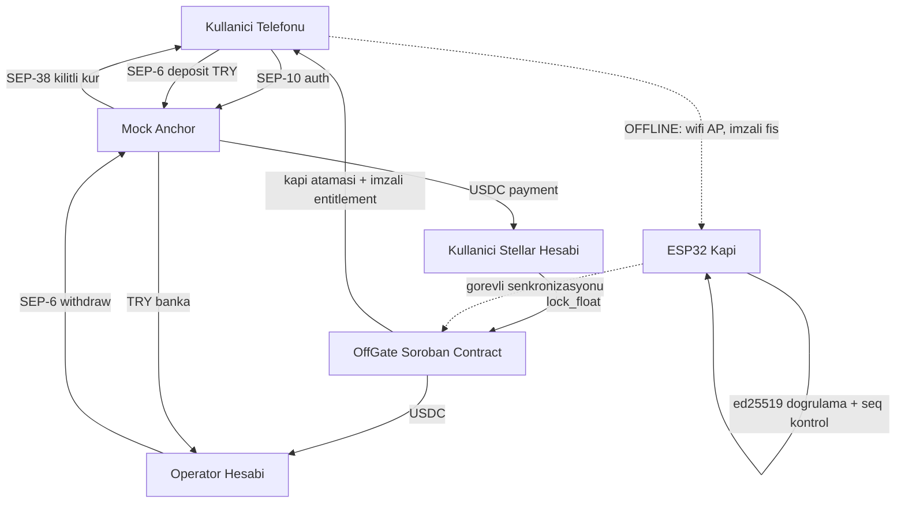

# OFFGATE — Uçtan Uca Geliştirme Planı

**Rise In x Stellar Pro Hackathon 2026** · 19-20 Eylül · Grand Pera, Beyoğlu
**Track:** Genesis (açık başvuru, 4 kişiye kadar takım, $7.500 ödül havuzu)
**Durum:** Tek kişi, 1 adet ESP32, 1 ödünç telefon

Bu doküman uçakta internetsiz okunmak için yazıldı. Gerekli tüm anahtarlar, endpoint'ler ve kod parçaları içine kopyalandı. Sonunda agent'a yapıştıracağın hazır prompt var.

---

## 0. ÖNCE BUNLARI OKU — planı değiştiren üç şey

### 0.1. Süre 36 saat değil, ~20 saat

Ajandaya göre gerçek kodlama pencerelerin:

| Ne zaman | Süre | Not |
|---|---|---|
| Gün 1, 11:30-13:30 | 2 sa | Anchor workshop'undan hemen sonra |
| Gün 1, 15:00-16:00 | 1 sa | Mentor idea validation (kod değil, fikir doğrulama) |
| Gün 1, 16:00-18:30 | 2.5 sa | Hacking |
| Gün 1, 19:30 → Gün 2 sabah | ~10 sa | Gece açık hacking, uyku bunun içinden çıkacak |
| Gün 2, 10:00-12:00 | 2 sa | Son dokunuş |
| **Gün 2, 12:00** | — | **SUBMISSION DEADLINE** |

Demo Day 13:00-14:30'da ama **kod 12:00'de donuyor**. Yani elindeki net kodlama süresi uyku dahil ~20 saat. Planı buna göre kurdum. 12:00'den sonra yapacağın tek şey sunum provası.

### 0.2. Zorunlu bir gereksinim var, mevcut planında eksikti

Jüri üç şeyi zorunlu tutuyor, ikisini zaten karşılıyorsun:

1. **Integration** — "Eligible Integration Partners" listesindeki bir Stellar protokolüne entegre olmak. **Bu sende YOK.** Eksikse diskalifiye riski var.
2. **Anchor / Local Payments** — kullanıcı gerçek TRY koyup kullanılabilir bakiye alabilmeli, veya tersi. Sende var.
3. **Core Feature** — entegrasyon ürünün iş mantığının parçası olmalı, eklenti değil. Sende var.

**Çözüm (30 dakikalık iş):** Listedeki **Stellar Wallets Kit**'i kullan. Cüzdan bağlama toolkit'i, tek satırla Freighter ve diğer cüzdanları bağlıyor. Zaten cüzdan bağlaman gerekiyordu, kendi kodunu yazmak yerine bunu kullan ve README'de "Integration partner: Stellar Wallets Kit" diye belirt. Bedava puan.

İkinci bir entegrasyon istersen mock anchor'ın kuru zaten **Reflector oracle**'dan geliyor, bunu da yazabilirsin ama asıl olan Wallets Kit.

### 0.3. Jürinin puan tablosu

Altı kriter var, ağırlıkları eşit değil:

1. **Anlamlı fikir & gerçek dünya etkisi** — problem net mi, kimin işine yarıyor
2. **Teknik uygulama** — testnet'e deploy edilmiş, **mock'lanmamış, hardcode edilmemiş** gerçek işlevsellik; ana akışlar uçtan uca kırılmadan çalışıyor; Soroban auth ve storage kalıpları düzgün
3. **Ekosistem uyumu** — *"Anchor ve yerel ödeme entegrasyonları bu kategoride en yüksek ağırlığa sahiptir"*
4. **Kullanıcı deneyimi** — kripto bilmeyen birine bile sezgisel gelmeli
5. **Traction & devamlılık** — etkinlikte gerçek kullanıcıdan geri bildirim aldın mı, yol haritası var mı, sonraki adım (SCF/InstAwards) belli mi
6. **Sunum & dokümantasyon** — README ve demo net mi, kurulum talimatları eksiksiz mi

Buradan çıkan aksiyonlar:
- "Hardcode etme" uyarısı ciddi. Sahte veriyle demo yaparsan teknik puanı kaybedersin.
- Etkinlikte 5-10 kişiye ürünü kullandır ve isimlerini/geri bildirimlerini README'ye yaz. Kriter 5'in yarısı bu.
- **Kullandığın Stellar Skill dosyalarını dosya yoluyla README'de belirtmek zorunlu.** (örn. `SKILL.md` — yigitcangokmen/stellar-hackathon-turkiye)
- Mermaid mimari diyagramı Scale track'te zorunlu, Genesis'te değil; ama "mimari dokümante edilmiş mi" kriteri var, 10 dakikalık iş, yap.

---

## 1. TEKNİK SÖZLÜK

Geliştirirken karşına çıkacak her terim. Bir kere oku, sonra referans olarak kullan.

### Stellar temelleri

**Stellar** — Hızlı ve ucuz ödeme odaklı blokzincir. İşlem ücreti kuruşun altında, onay süresi ~5 saniye.

**Testnet** — Gerçek para olmayan test ağı. Hackathon tamamen burada. `Test SDF Network ; September 2015` bu ağın kimlik cümlesi (network passphrase), kodda geçecek.

**Account (hesap)** — Stellar'daki adres. `G` ile başlar, 56 karakter. Örnek: `GBBD47IF...`

**Keypair (anahtar çifti)** — Bir hesabın iki parçası:
- **Public key** (`G...`): adresin, herkese verebilirsin
- **Secret key** (`S...`): imza atmaya yarayan gizli anahtarın, kimseye verme

**Friendbot** — Testnet'te hesabına bedava XLM yollayan servis. `https://friendbot.stellar.org?addr=G...`

**XLM (Lumen)** — Stellar'ın kendi parası. İşlem ücreti ödemek için lazım.

**Trustline (güven hattı)** — Stellar'da bir tokenı alabilmek için önce "bu tokenı kabul ediyorum" demen gerekir. Bu işleme trustline açmak denir. **Açmazsan USDC gelmez, deposit `pending_trust` durumunda takılır.** En sık yapılan hata bu, projenin ilk adımlarından biri olmalı.

**Asset** — Stellar üzerindeki token. İki parçayla tanımlanır: kod (`USDC`) ve issuer (onu basan hesabın adresi).

**Issuer** — Tokenı basan hesap. Mock anchor'ın USDC issuer'ı: `GBBD47IF6LWK7P7MDEVSCWR7DPUWV3NY3DTQEVFL4NAT4AQH3ZLLFLA5`

**Operation / Transaction** — Operation tek bir iş (ödeme yap, trustline aç). Transaction bir veya daha fazla operation'ı paketleyip imzalayıp ağa gönderdiğin şey.

**Memo** — İşleme iliştirilen kısa not. Anchor'a para gönderirken "bu ödeme şu işleme ait" demek için kullanılır. **Withdraw'da memo unutursan paran kaybolmuş gibi görünür.**

**Horizon** — Stellar ağına HTTP ile konuşma kapısı. Testnet: `https://horizon-testnet.stellar.org`

**XDR** — Stellar'ın işlemleri kodladığı ikili format. SDK senin için hallediyor, sadece isim olarak göreceksin.

**Stellar Lab** (`lab.stellar.org`) — Tarayıcıdan işlem oluşturup gönderebildiğin resmi araç. Debug için birebir.

**Stellar Expert** (`stellar.expert`) — Blok gezgini. Jüriye "işte zincirdeki işlem" derken burayı açacaksın.

### Soroban (akıllı sözleşme)

**Soroban** — Stellar'ın akıllı sözleşme platformu. Sözleşmeler **Rust** ile yazılır, **WASM**'a derlenir.

**WASM (WebAssembly)** — Sözleşmenin derlenmiş hali. `.wasm` dosyası olarak zincire yüklenir.

**Contract ID** — Deploy edilen sözleşmenin adresi. `C` ile başlar. README'de bunu yazman zorunlu.

**`require_auth()`** — Rust'ta `user.require_auth();` yazdığında, o fonksiyonu çağıran işlemin gerçekten o kullanıcı tarafından imzalanmış olmasını zorunlu kılarsın. Jürinin "Soroban auth kalıpları düzgün mü" dediği şey tam olarak bu. **Her para hareketi olan fonksiyonda kullan.**

**Storage (depolama)** — Sözleşmenin veri sakladığı yer, üç çeşidi var:
- `instance` — sözleşmeyle aynı ömürde, küçük global ayarlar için (admin adresi, token adresi)
- `persistent` — kalıcı, kullanıcı bakiyeleri gibi önemli veriler için
- `temporary` — kendiliğinden silinir

**TTL (Time To Live)** — Soroban'da depolanan veri süresizi yaşamaz, süresi dolarsa "arşive kalkar". `persistent` verinin süresini `extend_ttl` ile uzatman gerekir. Hackathon süresinde sorun çıkarmaz ama kodda olması jüriye "bu adam biliyor" dedirtir.

**SAC (Stellar Asset Contract)** — Klasik Stellar tokenlarını (USDC gibi) Soroban sözleşmelerinden kullanabilmeni sağlayan sarmalayıcı. USDC'yi sözleşmene çekerken `token::Client` ile bunu çağıracaksın.

**`stellar` CLI** — Sözleşme derleme/deploy/çağırma komut satırı aracı. Eski adı `soroban-cli`.

**Event (olay)** — Sözleşmenin "şu oldu" diye zincire düştüğü kayıt. Frontend'in canlı ekranı bunları dinleyecek.

### Anchor ve SEP'ler

**Anchor** — Fiat para (TRY) ile Stellar varlıkları (USDC) arasında köprü kuran servis. Bankayla zincir arasındaki çevirmen.

**SEP (Stellar Ecosystem Proposal)** — Anchor'ların nasıl konuşacağını belirleyen standartlar. HTTP'nin RFC'leri neyse bu da o.

| SEP | Adı | Ne işe yarar | Sende nasıl kullanılacak |
|---|---|---|---|
| **SEP-1** | Stellar TOML | Anchor'ın `/.well-known/stellar.toml` dosyası. Tüm endpoint'leri, issuer'ı buradan öğrenirsin | İlk adım, her zaman |
| **SEP-10** | Web Authentication | Cüzdan anahtarıyla giriş. Şifre yok: sunucu bir challenge işlemi verir, sen imzalarsın, JWT token alırsın | Her anchor isteğinden önce |
| **SEP-12** | KYC | Kimlik doğrulama. Mock'ta otomatik onaylı, hiçbir şey yapmana gerek yok | Geç |
| **SEP-38** | Quote (RFQ) | "1000 TRY yatırsam kaç USDC alırım" sorusunun cevabı, kilitli kur | **Bilet fiyatını TL'ye sabitlemek için — senin kritik kullanımın** |
| **SEP-6** | Deposit & Withdraw | Asıl iş: TRY yatır USDC al, USDC gönder TRY al. API tabanlı, arayüzü sen kontrol edersin | Ana akış |
| SEP-24 | Interactive D&W | Tarayıcı popup'lı versiyon. **Mock anchor'da YOK**, kullanma | — |

**JWT (token)** — SEP-10'dan aldığın giriş bileti. Sonraki tüm isteklerde `Authorization: Bearer <token>` başlığıyla gönderirsin. Süresi dolarsa 401 alırsın, tekrar auth yaparsın.

**`simulate-bank-transfer`** — Sadece mock anchor'da olan endpoint. Gerçekte kullanıcının bankadan EFT yapmasını beklerdin, burada bu çağrıyla "para yattı" diyorsun. Gerçek anchor'da böyle bir şey yok, README'de bunu belirt.

**Reflector** — Fiyat oracle'ı. Mock anchor USD/TRY kurunu buradan alıp üstüne 50 bps (yüzde 0.5) spread koyuyor.

### Kriptografi (senin projenin kalbi)

**Ed25519** — İmza algoritması. Stellar hesapları zaten Ed25519 kullanıyor. **Bu senin için büyük avantaj: kullanıcının Stellar adresi, aynı zamanda imzasını doğrulamak için gereken açık anahtardır.** Ayrı bir kimlik sistemi kurman gerekmiyor.

**İmza (signature)** — Gizli anahtarla üretilen, "bu mesajı ben yazdım" kanıtı. Doğrulamak için sadece açık anahtar yeter, gizli anahtar gerekmez.

**Neden şifreleme değil imza:** Şifre çözme yöntemi kullansaydın turnikenin içinde gizli anahtar taşıman gerekirdi; cihazı söken herkes sahte bilet üretebilirdi. İmzada turnike sadece açık anahtar taşır, içinde çalınabilecek hiçbir şey yoktur.

**Nonce / seq (sıra numarası)** — Aynı fişin iki kez kullanılmasını engelleyen sayaç. Turnike "bu entitlement'ın 3 numaralı fişini gördüm" diye kaydeder, bir daha kabul etmez.

**Replay attack (tekrar saldırısı)** — Aynı geçerli mesajı tekrar tekrar göndererek bedava hizmet almaya çalışmak. Senin seq mekanizman tam olarak bunu engelliyor.

**Double spend (çifte harcama)** — Aynı parayı iki kez harcamak. Klasik offline ödemede çözülemez çünkü iki turnike birbirinden habersizdir. **Sen kullanıcıyı tek kapıya bağlayarak sorunu ortadan kaldırıyorsun** — harcandığı yer ile hatırlayan yer aynı cihaz.

### Donanım

**ESP32** — Wifi'lı mikrodenetleyici. Burada tek işi: kendi wifi ağını kurmak, imza doğrulamak, LED yakmak, fişleri saklamak.

**AP mode (Access Point)** — ESP32'nin internete bağlanmak yerine kendi wifi ağını yayınlaması. Senin senaryonda internet yok, sadece yerel ağ var.

**Captive portal** — Otel wifi'larına bağlanınca kendiliğinden açılan giriş sayfası. ESP32 DNS'i kendine yönlendirerek bunu taklit eder, telefonda uygulama kurmadan sayfanı açar.

**NVS (Non-Volatile Storage)** — ESP32'nin elektrik gidince silinmeyen hafızası. Harcanmış fişleri buraya yazacaksın.

**mDNS** — Yerel ağda isimle erişim (`http://gate.local`). Opsiyonel, IP de yeter (`192.168.4.1`).

---

## 2. ÜRÜN NE?

**Tek cümle:** İnternetsiz çalışan, kapı başına maliyeti bir ESP32 olan, TL cinsinden bilet satan etkinlik geçiş sistemi.

**Problem:** Konser, maç, festival ve toplu taşımada geçiş noktaları internete bağımlı. Bağlantı düşünce kuyruk oluşuyor, nakit gişe açılıyor, hasılat denetlenemiyor. Kırsalda ve afet bölgesinde ise bağlantı zaten yok.

**Kime:** Etkinlik organizatörleri, toplu taşıma işletmecileri, kampüsler. Uç kullanıcı: kripto bilmeyen sıradan insan — sadece TL görüyor.

**Değer önerisi:** Kullanıcı TL yatırır, TL fiyatlı bilet alır. İnternet olmadan geçer. Organizatör TL olarak tahsil eder. Arada blokzincir olduğunu ikisi de bilmez.

### Neden bu üründe blokzincir gerçekten gerekli

Jüri bunu soracak, cevabın hazır olsun: Merkezi bir sunucu kurarsan, internet yokken kimse o sunucuya erişemez ve bakiyenin gerçekten kilitli olduğunu kimse doğrulayamaz. Burada para **zincirde kilitli**, kilit herkesçe görülebilir, kapı bunu offline doğrulayabilir ve organizatör eksik hasılat beyan edemez. Güven, sunucuya değil imzaya dayanıyor.

---

## 3. MİMARİ

```
                    ONLINE (etkinlik öncesi)
┌──────────────┐
│  Kullanıcı   │ 1. Cüzdan bağla (Stellar Wallets Kit)
│  telefonu    │ 2. "50 TL yükle" butonu
│  (web app)   │
└──────┬───────┘
       │
       │ 3. SEP-10 auth → SEP-38 quote (kur kilitle) → SEP-6 deposit
       ▼
┌──────────────┐
│ Mock Anchor  │ 4. simulate-bank-transfer → USDC gönderir
│  (TRY↔USDC)  │
└──────┬───────┘
       │ USDC
       ▼
┌──────────────┐
│  Kullanıcı   │ 5. lock_float() çağrısı
│  hesabı      │────────────────────┐
└──────────────┘                    ▼
                          ┌────────────────────┐
                          │  OFFGATE CONTRACT  │
                          │  (Soroban/testnet) │
                          │                    │
                          │ • float kilitle    │
                          │ • kapı ATA (yük    │
                          │   dengeli)         │
                          │ • entitlement imza │
                          │ • settle: fiş →    │
                          │   para operatöre   │
                          │ • refund: artan →  │
                          │   kullanıcıya      │
                          └────────────────────┘
                                    ▲
        OFFLINE (etkinlik anı)      │ 9. settle(receipts[])
════════════════════════════════════│═══════════════════
                                    │
┌──────────────┐                    │
│  Kullanıcı   │ 6. ESP32 wifi'ına bağlanır (internet YOK)
│  telefonu    │    captive portal /pay sayfasını açar
│  (uçak modu) │    imzalı fişi gönderir
└──────┬───────┘                    │
       │ HTTP (yerel ağ)            │
       ▼                            │
┌──────────────┐                    │
│    ESP32     │ 7. 2 imza doğrula, seq kontrol,       │
│   "KAPI"     │    LED yak, fişi NVS'e yaz            │
│              │ 8. /screen → ödünç telefonda ekran    │
│ içinde gizli │                                       │
│ anahtar YOK  │───────────────────────────────────────┘
└──────────────┘    görevli laptopu fişleri çeker,
                    internete bağlanıp settle eder
```

### Mermaid versiyonu (README'ye koy)



---

## 4. VERİ YAPILARI

### 4.1. Entitlement (bakiye belgesi) — operatör imzalar

Kullanıcı parayı kilitlediğinde üretilir, telefonda saklanır.

```json
{
  "v": 1,
  "user": "GABC...",
  "event": "EVT-1",
  "gate": "M-3-07",
  "locked_try": "50.00",
  "fare_try": "5.00",
  "rate": "41.2500",
  "max_uses": 10,
  "expires": 1758999999,
  "sig": "<operatör imzası, base64>"
}
```

`sig`, yukarıdaki alanların kanonik (alfabetik sıralı, boşluksuz) JSON'unun operatör gizli anahtarıyla imzalanmış hali. Kapı, operatörün açık anahtarını içinde gömülü taşır ve bunu doğrular.

### 4.2. Receipt (geçiş fişi) — kullanıcı imzalar

Her geçişte üretilir.

```json
{
  "ent_hash": "<entitlement'ın sha256'sı, hex>",
  "user": "GABC...",
  "gate": "M-3-07",
  "seq": 1,
  "fare_try": "5.00",
  "ts": 1758990000,
  "sig": "<kullanıcı imzası, base64>"
}
```

### 4.3. Kapının hafızası (NVS)

```
spent:<ent_hash_ilk8>:<seq>  →  1
counter                      →  45
receipts[]                   →  JSON dizisi (settle için)
```

---

## 5. SOROBAN SÖZLEŞMESİ

Fonksiyon listesi. Agent'a bunu vereceksin.

```rust
// Kurulum
fn init(env: Env, admin: Address, usdc_token: Address, operator_pubkey: BytesN<32>)

// Kullanıcı parasını kilitler, kapı ataması yapar
// require_auth(user) ZORUNLU
fn lock_float(
    env: Env,
    user: Address,
    amount: i128,        // USDC, 7 ondalık
    event_id: Symbol,
    fare_try: i128,      // kuruş cinsinden, örn 500 = 5.00 TL
    rate: i128           // SEP-38'den gelen kilitli kur
) -> Symbol              // atanan gate_id

// Kapı ataması: o etkinlikteki en az yüklü kapıyı seçer
fn assign_gate(env: Env, event_id: Symbol) -> Symbol

// Kapının topladığı fişleri zincire yazar, parayı operatöre aktarır
// Her fiş için: ed25519 imza doğrula + (ent_hash, seq) daha önce harcanmamış mı
fn settle(env: Env, gate_id: Symbol, receipts: Vec<Receipt>) -> u32  // kaç fiş kabul edildi

// Kapının kendi beyanı (denetim için)
fn gate_report(env: Env, gate_id: Symbol, counter: u32)

// Etkinlik bitince harcanmayanı geri ver
// require_auth(user) ZORUNLU
fn refund(env: Env, user: Address)

// Okuma fonksiyonları
fn float_of(env: Env, user: Address) -> i128
fn gate_load(env: Env, gate_id: Symbol) -> u32
fn stats(env: Env, event_id: Symbol) -> (u32, u32, i128)  // beyan, zincire düşen, toplam
```

### Kritik noktalar

- **`require_auth()`**: `lock_float` ve `refund`'da mutlaka. Jüri buna bakıyor.
- **Ed25519 doğrulama**: Soroban'da `env.crypto().ed25519_verify(&pubkey, &message, &signature)` var. Kullanıcının Stellar adresini 32 baytlık ham açık anahtara çevirmen gerekiyor (`strkey` decode).
- **Storage seçimi**: `instance` → admin, token adresi, operatör açık anahtarı. `persistent` → float bakiyeleri, spent kayıtları, kapı yükleri.
- **TTL**: `persistent` yazdığın her yerde `extend_ttl` çağır. Birkaç satır, jüriye olgunluk gösterir.
- **Settle idempotent olmalı**: aynı fiş iki kez gelirse ikincisi sessizce atlanmalı, hata fırlatıp tüm batch'i düşürmemeli.

---

## 6. ESP32 — KAPI

### Sorumluluk

Sadece dört şey: wifi ağı kur, iki imzayı doğrula, seq kontrolü yap, LED yak ve fişi sakla. İçinde **hiçbir gizli anahtar yok**, sadece operatörün açık anahtarı gömülü.

### Sunduğu sayfalar

| Yol | Kim açar | Ne yapar |
|---|---|---|
| `/` veya captive yönlendirme | Kullanıcı | Ödeme sayfası: telefondaki entitlement+receipt'i yapıştır/gönder |
| `/pay` (POST) | Kullanıcı sayfası | Doğrula, kabul/ret döndür |
| `/screen` | Ödünç telefon | Turnike ekranı: sayaç, son geçen, kabul/ret durumu, 1sn'de bir yenilenir |
| `/receipts` (GET) | Görevli laptopu | Toplanan fişleri JSON olarak verir |
| `/reset` | Sen | Demo tekrarı için sayacı sıfırla |

### Kütüphaneler

- `WiFi.h` — AP mode
- `DNSServer.h` — captive portal için tüm DNS sorgularını 192.168.4.1'e yönlendir
- `WebServer.h` veya `ESPAsyncWebServer` — HTTP
- `Preferences.h` — NVS
- **Ed25519**: `rweather/Crypto` (Arduino Crypto Library) → `Ed25519::verify(sig, publicKey, message, len)`
- `ArduinoJson` — JSON parse

### Kritik uyarı: QR/kamera kullanma

Tarayıcılar güvenli olmayan bağlantıda (`http://192.168.4.1`) kamerayı açmaz. Sertifika işine girersen saatlerini yakarsın. **Veri kablosuz gitsin**, kamera hiç devreye girmesin. Kullanıcı ESP32'nin ağına bağlanır, açılan sayfadan fişini gönderir.

### Yedek plan (bunu şimdiden kur)

Ed25519 doğrulaması ESP32'de 2 saatte çalışmazsa: doğrulamayı laptopta Node.js ile yap, ESP32'ye sadece seri porttan "AÇ" sinyali gönder, LED yansın. Demo aynı görünür, hikâye bozulmaz. **Bu yedeğe düşmen gerekirse bunu README'de dürüstçe yaz**, jüri saklamandan çok gizlemeni cezalandırır.

---

## 7. ANCHOR ENTEGRASYONU — tüm değerler burada

Bu bölüm internetsiz çalışman için kopyalandı.

### Sabitler

```
Home Domain:         tr-mock-anchor.fly.dev
Network:             Stellar Testnet
Network Passphrase:  "Test SDF Network ; September 2015"
Asset:               USDC
USDC Issuer:         GBBD47IF6LWK7P7MDEVSCWR7DPUWV3NY3DTQEVFL4NAT4AQH3ZLLFLA5
Treasury:            GCLCZEQZ2THTEDAOFI66LACNPLY4OBKN7VKLEZFMBIHYKYQOW2W7T3Z6
Signing Key:         GDXYO6FJCNXZEWGXD54GT76FGFYLOLSOGSOJLNQ6WGHCGEQPO7NTE73M
Horizon:             https://horizon-testnet.stellar.org
```

### Endpoint'ler

```
stellar.toml:  GET  https://tr-mock-anchor.fly.dev/.well-known/stellar.toml
SEP-10 Auth:   GET  https://tr-mock-anchor.fly.dev/auth?account={G...}
SEP-10 Token:  POST https://tr-mock-anchor.fly.dev/auth
SEP-12 KYC:         https://tr-mock-anchor.fly.dev/sep12      (otomatik onay)
SEP-38 Quote:       https://tr-mock-anchor.fly.dev/sep38
SEP-6 Transfer:     https://tr-mock-anchor.fly.dev/sep6
Health:        GET  https://tr-mock-anchor.fly.dev/health
```

### Limitler

```
Deposit:   50.00 - 3,000.00 TRY
Withdraw:  minimum 1.0000000 USDC
TRY:       2 ondalık basamak
USDC:      7 ondalık basamak
Kur:       Reflector oracle + 50 bps spread
```

**Demo sayıların bu limitlere uysun.** 50 TL yükleme ve 5 TL bilet fiyatı ideal: minimum deposit'in üstünde, 10 geçişe denk, tavanın çok altında.

### Asset formatı (SEP-38'de)

```
Fiat:     iso4217:TRY
Stellar:  stellar:USDC:GBBD47IF6LWK7P7MDEVSCWR7DPUWV3NY3DTQEVFL4NAT4AQH3ZLLFLA5
```

### Akış kodu

**1. TOML keşfi**
```js
import { StellarTomlResolver } from '@stellar/stellar-sdk';
const toml = await StellarTomlResolver.resolve('tr-mock-anchor.fly.dev');
// toml.WEB_AUTH_ENDPOINT, toml.TRANSFER_SERVER, toml.KYC_SERVER,
// toml.ANCHOR_QUOTE_SERVER, toml.SIGNING_KEY, toml.CURRENCIES[0].issuer
```

**2. SEP-10 auth**
```js
const challengeRes = await fetch(`https://tr-mock-anchor.fly.dev/auth?account=${publicKey}`);
const { transaction } = await challengeRes.json();
const tx = TransactionBuilder.fromXDR(transaction, Networks.TESTNET);
tx.sign(keypair);
const tokenRes = await fetch('https://tr-mock-anchor.fly.dev/auth', {
  method: 'POST',
  headers: { 'Content-Type': 'application/json' },
  body: JSON.stringify({ transaction: tx.toXDR() }),
});
const { token } = await tokenRes.json();
// Sonraki her istekte: Authorization: Bearer ${token}
```

**3. SEP-38 kilitli kur** (senin farkını yaratan adım)
```js
const quoteRes = await fetch('https://tr-mock-anchor.fly.dev/sep38/quote', {
  method: 'POST',
  headers: { Authorization: `Bearer ${token}`, 'Content-Type': 'application/json' },
  body: JSON.stringify({
    sell_asset: 'iso4217:TRY',
    buy_asset: 'stellar:USDC:GBBD47IF6LWK7P7MDEVSCWR7DPUWV3NY3DTQEVFL4NAT4AQH3ZLLFLA5',
    sell_amount: '50',
  }),
});
const quote = await quoteRes.json();
// quote.id → deposit'te quote_id olarak ver
// quote.price → BU KURU sözleşmeye yaz, bilet TL'ye sabitlensin
```

**4. SEP-6 deposit**
```js
const depositRes = await fetch(
  `https://tr-mock-anchor.fly.dev/sep6/deposit?` + new URLSearchParams({
    asset_code: 'USDC', account: publicKey, amount: '50',
  }),
  { headers: { Authorization: `Bearer ${token}` } }
);
const deposit = await depositRes.json();
// deposit.id, deposit.how (IBAN + referans), deposit.more_info_url

// Banka transferini simüle et (SADECE mock'ta var)
await fetch(`https://tr-mock-anchor.fly.dev/sep6/tx/${deposit.id}/simulate-bank-transfer`, {
  method: 'POST',
  headers: { Authorization: `Bearer ${token}`, 'Content-Type': 'application/json' },
  body: JSON.stringify({ amount: '50' }),
});

// Durum kontrolü (completed olana kadar poll et)
const statusRes = await fetch(`https://tr-mock-anchor.fly.dev/sep6/transaction?id=${deposit.id}`,
  { headers: { Authorization: `Bearer ${token}` } });
```

Deposit durumları: `pending_user_transfer_start` → `pending_anchor` → `pending_trust` (trustline yok!) → `completed` / `error`

**5. Trustline (ilk iş, unutma)**
```js
const account = await server.loadAccount(publicKey);
const tx = new TransactionBuilder(account, { fee: '100', networkPassphrase: Networks.TESTNET })
  .addOperation(Operation.changeTrust({ asset: USDC }))
  .setTimeout(30).build();
tx.sign(keypair);
await server.submitTransaction(tx);
```

**6. SEP-6 withdraw** (operatör TL'ye çıkar)
```js
const withdrawRes = await fetch(
  `https://tr-mock-anchor.fly.dev/sep6/withdraw?` + new URLSearchParams({
    asset_code: 'USDC', type: 'bank_account', amount: '10',
  }),
  { headers: { Authorization: `Bearer ${token}` } }
);
const withdraw = await withdrawRes.json();
// withdraw.account_id → USDC'yi buraya gönder
// withdraw.memo, withdraw.memo_type ("id") → MEMO'YU UNUTMA

const paymentTx = new TransactionBuilder(account, { fee: '100', networkPassphrase: Networks.TESTNET })
  .addOperation(Operation.payment({ destination: withdraw.account_id, asset: USDC, amount: '10' }))
  .addMemo(Memo.id(withdraw.memo))
  .setTimeout(30).build();
```

### Yaygın hatalar tablosu

| Hata | Sebep | Çözüm |
|---|---|---|
| 401 Unauthorized | JWT süresi doldu | SEP-10 auth'u tekrarla |
| `pending_trust` takıldı | USDC trustline yok | `changeTrust` çalıştır |
| Deposit gelmiyor | Banka transferi simüle edilmedi | `simulate-bank-transfer` çağır |
| "Unsupported asset_code" | Yanlış kod | Büyük harf `USDC` |
| "Amount below minimum" | 50 TRY altı | Min 50 TRY |
| "Amount above maximum" | 3000 TRY üstü | Max 3000 TRY |
| Withdraw tamamlanmıyor | Memo eksik | `memo_type: "id"` ve doğru memo |

### Senin "sanal POS" fikrin hakkında

Doğru sezmişsin, ama zaten standardın içinde var. SEP-6 deposit çağrısı sana `deposit.how` içinde banka talimatı ve bir **referans numarası** dönüyor; kullanıcı EFT açıklamasına o referansı yazınca anchor ödemeyi o Stellar hesabıyla eşleştiriyor. Yani "açıklama kısmına cüzdan adresi" yerine standart olan şey "açıklamaya referans kodu". Mock'ta bunu `simulate-bank-transfer` ile geçiyorsun.

Senin asıl eklemen gereken şey bir adım ötesi: **deposit `completed` olur olmaz `lock_float`'ı otomatik tetikle.** Kullanıcı tek butona basar ("50 TL yükle"), arkada auth + quote + deposit + trustline + lock zinciri kendiliğinden akar, sonunda elinde bileti olur. Anchor'ı ürünün iş mantığına gömmek tam olarak budur ve jürinin en yüksek ağırlıklı kriteri bu.

**Güvenlik notu:** Secret key'i asla frontend'te tutma, `.env`'e koy, git'e commit etme. Demo hesabı olsa bile jüri buna bakar.

---

## 8. SAAT SAAT PLAN

### Gün 1

**09:00-11:30 — Etkinlik programı**
Kayıt, açılış, briefing, **anchor workshop'u**. Workshop'u kaçırma, mock anchor'ın tuzaklarını orada anlatacaklar. Bu sırada laptopta arka planda kurulum yapabilirsin.

**11:30-13:30 — İskelet (2 sa)**
- [ ] Repo aç, public yap
- [ ] Rust + `stellar` CLI kurulu mu kontrol et (`stellar --version`)
- [ ] Testnet hesabı üret, Friendbot ile fonla
- [ ] **USDC trustline aç** (bunu şimdi yap, sonra unutursun)
- [ ] Mock anchor `/health` çağır, ayakta mı gör
- [ ] `explorer` sayfasından elle bir deposit dene, akışı gözünle gör
- [ ] Boş Soroban sözleşmesi derle ve deploy et — **contract ID'yi bugün al**, son gün deploy hatası yeme

**13:30-15:00 — Öğle yemeği**
Yemekte kod yazma, mentorlarla konuş. Fikrini 3 kişiye anlat, tepkilerini not al (traction kriteri).

**15:00-16:00 — Mentor idea validation**
Mentora şunu sor: "Integration partner olarak Stellar Wallets Kit yeterli mi, yoksa daha derin bir entegrasyon mu bekliyorsunuz?" Bu tek soru sana diskalifiye riskini kapatır.

**16:00-18:30 — Anchor akışı (2.5 sa)**
- [ ] SEP-10 auth çalışsın, token gelsin
- [ ] SEP-38 quote gelsin, kuru ekrana bas
- [ ] SEP-6 deposit + simulate-bank-transfer, USDC hesaba düşsün
- [ ] **Kontrol noktası: Stellar Expert'te USDC'yi gördün mü?** Görmediysen buradan ilerleme, çöz.

**18:30-19:30 — Akşam yemeği**

**19:30-23:00 — Sözleşme (3.5 sa)**
- [ ] `lock_float` + `require_auth` + persistent storage
- [ ] `assign_gate` yük dengeli atama
- [ ] `settle` + ed25519 doğrulama + spent kontrolü
- [ ] `refund`
- [ ] Rust unit testleri: çifte harcama reddi, float aşımı reddi, yanlış imza reddi
- [ ] Deploy et, CLI'dan elle çağırıp doğrula

**23:00-01:30 — ESP32 (2.5 sa)**
- [ ] AP mode + captive portal ayağa kalksın, telefonla bağlan
- [ ] `/pay` POST kabul etsin, JSON parse etsin
- [ ] Ed25519 doğrulama çalışsın (**01:30'a kadar olmadıysa yedek plana geç, tartışma**)
- [ ] NVS'e spent yaz, tekrar denemede reddet
- [ ] LED

**01:30-02:30 — Telefon uygulaması (1 sa)**
- [ ] Wallets Kit ile cüzdan bağla
- [ ] "50 TL yükle" tek buton, arkada tüm zincir
- [ ] Entitlement'ı localStorage'a yaz
- [ ] Fiş imzala ve gönder ekranı

**02:30-06:30 — UYU**
Tartışmaya açık değil. Uykusuz sunum yapan adam demo'yu batırır.

### Gün 2

**06:30-09:00 — Uçtan uca (2.5 sa)**
- [ ] Tüm akışı baştan sona 3 kez çalıştır
- [ ] `/screen` sayfası, ödünç telefon
- [ ] `/receipts` + settle scripti
- [ ] Denetim ekranı (beyan vs zincir)

**09:00-10:00 — README ve deploy**
- [ ] README (bölüm 9'daki şablon)
- [ ] Frontend'i Vercel'e at, URL al
- [ ] Contract ID'leri yaz
- [ ] Mermaid diyagramı
- [ ] **Kullanılan SKILL.md dosyalarını dosya yoluyla belirt**

**10:00-11:00 — Gerçek kullanıcı**
Salonda 5-10 kişiye ürünü kullandır. İsim, geri bildirim, varsa fotoğraf. README'ye "Etkinlikte N kişi test etti" diye yaz. Kriter 5 için bu bölüm bedava puan ve neredeyse kimse yapmıyor.

**11:00-12:00 — Sunum ve submission**
- [ ] Resmi şablona göre pitch deck
- [ ] Portala: repo linki, canlı demo URL, deck linki, **track seçimi (Genesis)**
- [ ] **12:00'de gönder, 11:59'da değil**

**12:00 sonrası — Demo provası**
Kod dondu. Üç kez baştan sona prova yap. Pil, powerbank, kablo, yedek telefon kontrol.

---

## 9. README ŞABLONU (jürinin okuyacağı şey)

```markdown
# OffGate — İnternetsiz Geçiş ve Ödeme Altyapısı

[Canlı demo] · [Video] · [Contract ID]

## Problem
## Çözüm
## Nasıl çalışır (Mermaid diyagramı)
## Stellar entegrasyonları
  - Anchor: SEP-1/10/12/38/6, tam akış, hangi endpoint ne için
  - Integration Partner: Stellar Wallets Kit
  - Soroban: contract ID, fonksiyonlar, auth ve storage kalıpları
## Kurulum ve test (adım adım, kopyala-çalıştır)
## Deploy edilmiş artefaktlar
  - Contract ID: C...
  - Frontend: https://...
  - ESP32 firmware: /firmware
## Tasarım kararları ve ödünleşimler
  - Neden şifre çözme değil imza doğrulama
  - Neden kapı ataması sözleşmede
  - Bilinen sınır: kapalı ortam varsayımı
## Teknik zorluklar ve çözümleri
## Kullanılan Stellar Skill dosyaları
  - SKILL.md (yigitcangokmen/stellar-hackathon-turkiye)
  - [varsa diğerleri, dosya yoluyla]
## Etkinlikte alınan kullanıcı geri bildirimi
## Yol haritası ve sonraki adım (SCF / InstAwards)
```

---

## 10. DEMO SENARYOSU (3 dakika, ezberle)

1. **(20 sn)** "Konserde internet düşünce kuyruk oluşur, nakit gişe açılır, hasılat denetlenemez."
2. **(30 sn)** Telefonda tek buton: "50 TL yükle". Ekranda TL→USDC kuru görünür, bilet 5 TL olarak sabitlenir, kapı ataması yapılır. "Kullanıcı hiç kripto görmedi."
3. **(20 sn)** Stellar Expert'i aç: para zincirde kilitli, herkes görebiliyor.
4. **(30 sn)** **Telefonu uçak moduna al.** ESP32'nin ağına bağlan, geç, LED yansın. Ödünç telefondaki kapı ekranında sayaç 1'e çıksın.
5. **(20 sn)** Aynı fişi tekrar gönder. Kapı reddetsin. "İnternet 10 gün gelmese de reddeder."
6. **(30 sn)** Görevli senkronizasyonu: interneti aç, fişler zincire düşsün, para operatöre geçsin, operatör TL olarak çeksin.
7. **(20 sn)** Denetim ekranı: kapı 3 geçiş beyan etti, zincirde 3 fiş var, tutuyor.
8. **(10 sn)** "Kapı başına donanım maliyeti bir ESP32. Ne internet, ne POS, ne gişe."

---

## 11. KAPSAM DIŞI (koda girmeyecek, README'de yol haritası olacak)

- Cihazların kendi cüzdanları, makineler arası ödeme
- Blok tabanlı workflow editörü
- Çoklu etkinlik yönetim paneli
- Bond/slashing ile dolandırıcılık cezası
- QR/kamera akışı
- Mainnet

Bunları sorulduğunda "yol haritasında, bugünkü kapsam dışı" de. Hackathon'da kapsam disiplini gösterebilmek başlı başına olgunluk sinyali.

---

## 12. AGENT'A VERİLECEK PROMPT

Aşağıdakini olduğu gibi kopyala. `[...]` yerlerini doldur.

---

**BAŞLANGIÇ PROMPTU:**

> Rise In x Stellar Pro Hackathon 2026'da (Genesis Track) "OffGate" adlı bir proje geliştiriyorum. Tek kişiyim, 20 saatim var, submission deadline Gün 2 saat 12:00.
>
> **Referans dokümanlar — ilk iş olarak bunları oku:**
> - `https://github.com/yigitcangokmen/stellar-hackathon-turkiye/blob/main/SKILL.md` (mock anchor entegrasyon skill'i, tüm endpoint ve anahtarlar)
> - `https://tr-mock-anchor.fly.dev/llms-full.txt` (tam API referansı)
> - `https://stellar-hackathon-turkiye.vercel.app/docs` (hackathon dokümantasyonu)
> - Ekteki `OFFGATE-BUILD-PLAN.md` (bu doküman — mimari, veri yapıları, sözleşme arayüzü, saatlik plan)
>
> **Ürün:** İnternetsiz çalışan etkinlik geçiş sistemi. Kullanıcı TL yatırır, Stellar anchor üzerinden USDC alır, Soroban sözleşmesine "offline float" olarak kilitler, sözleşme ona bir kapı atar. Kullanıcı internetsiz olarak imzalı geçiş fişi üretir, ESP32 tabanlı kapı bu fişi offline doğrular ve açılır. Kapı fişleri saklar, internet gelince sözleşmeye yazılır ve para operatöre geçer.
>
> **Teknoloji:**
> - Soroban sözleşme: Rust, Stellar Testnet
> - Frontend: [Next.js / Vite+React — seçimini yaz], Stellar Wallets Kit ile cüzdan bağlama
> - Kapı: ESP32 Arduino, wifi AP + captive portal, Ed25519 doğrulama (rweather/Crypto), NVS
> - Anchor: tr-mock-anchor.fly.dev, SEP-1/10/12/38/6
>
> **Sabitler:**
> ```
> Network Passphrase: "Test SDF Network ; September 2015"
> USDC Issuer: GBBD47IF6LWK7P7MDEVSCWR7DPUWV3NY3DTQEVFL4NAT4AQH3ZLLFLA5
> Horizon: https://horizon-testnet.stellar.org
> Anchor: tr-mock-anchor.fly.dev
> Deposit limiti: 50-3000 TRY | Withdraw min: 1 USDC
> ```
>
> **Uyman gereken kurallar:**
> 1. Hiçbir şeyi mock'lama veya hardcode etme. Jüri kriteri açıkça "gerçek işlevsellik, mock'lanmamış" diyor. `simulate-bank-transfer` tek istisna, o da mock anchor'ın kendi endpoint'i.
> 2. Para hareketi olan her sözleşme fonksiyonunda `require_auth()` kullan.
> 3. `persistent` storage yazdığın her yerde `extend_ttl` çağır.
> 4. Secret key'ler `.env`'de, asla frontend'te veya git'te değil.
> 5. Kullanıcının Stellar adresi zaten Ed25519 açık anahtarıdır; ayrı kimlik sistemi kurma, imzaları doğrudan bu adrese karşı doğrula.
> 6. ESP32'ye hiçbir gizli anahtar gömme, sadece operatörün açık anahtarı.
> 7. Kamera/QR kullanma, veri yerel ağ üzerinden HTTP ile gitsin.
> 8. Her adımdan sonra çalıştığını kanıtla: testnet işlem hash'i, contract ID, ekran çıktısı.
>
> **Sıra (bu sırayı değiştirme):**
> 1. Testnet hesabı + Friendbot + **USDC trustline** + boş sözleşme deploy (contract ID'yi bugün al)
> 2. Anchor akışı: SEP-10 auth → SEP-38 quote → SEP-6 deposit → simulate-bank-transfer → USDC hesapta
> 3. Soroban sözleşme: `lock_float`, `assign_gate`, `settle`, `refund`, `gate_report` + unit testler (çifte harcama, float aşımı, yanlış imza)
> 4. ESP32 firmware
> 5. Frontend: tek butonlu "50 TL yükle" akışı + fiş imzalama
> 6. Denetim ekranı + settle scripti
> 7. README + deploy
>
> İlk olarak 1. adımı yap ve bana contract ID ile trustline işlem hash'ini ver. Her adımda takıldığın yerde durup bana sor, tahmin ederek ilerleme.

---

**HER YENİ OTURUMDA HATIRLATMA PROMPTU:**

> OffGate projesindeyiz. `OFFGATE-BUILD-PLAN.md` ve `SKILL.md` referans. Şu an [X]. adımdayız, [tamamlananlar]. Sıradaki iş: [Y]. Mock'lama yok, `require_auth` zorunlu, secret'lar `.env`'de.

---

## 13. SON KONTROL LİSTESİ

Uçaktan inmeden önce:

- [ ] Rust + `stellar` CLI kurulu
- [ ] Node + npm kurulu
- [ ] Arduino IDE veya PlatformIO + ESP32 board paketi kurulu
- [ ] `rweather/Crypto` kütüphanesi indirilmiş
- [ ] ESP32, USB kablo, powerbank, LED, direnç çantada
- [ ] Bu doküman offline erişilebilir
- [ ] Vercel/Netlify hesabı hazır
- [ ] GitHub repo açılmış

Salona girer girmez:

- [ ] Mock anchor `/health` çalışıyor mu
- [ ] Wifi'da 2.4GHz var mı (ESP32 5GHz görmez)
- [ ] Mentora integration partner sorusunu sor
